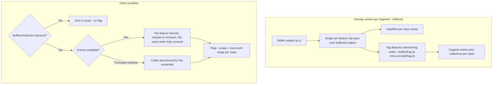

# Buffered overlay_area: overlap flagging and error bounds

## Problem

`overlay_area` with `bufferDistanceKm` buffers each fragment's subject independently. Adjacent fragments (within a sketch split by geography, or between sketches in a collection) produce overlapping buffered subjects, and `combineMetricsForFragments` blindly sums per-class areas ([metrics.ts L1375-1382](packages/overlay-engine/src/metrics/metrics.ts)) — double counting source area in the buffer-overlap zone. Canonical use case: the Land Use table ("land use within 1 km").

## Key geometric insight (what makes this cheap)

Fragments are orthogonal. For disjoint fragments A and B, `buffer(A,d) ∩ buffer(B,d)` is always contained in A's **collar**: `buffer(A,d) − erode(A,d)` (the band within distance d of A's boundary). Each fragment can therefore compute, in isolation:

- per-class area inside its collar → a hard **upper bound** on its possible contribution to overcount
- per-feature entries (`__oidx`, class, clipped area, full feature area) restricted to collar-intersecting features → **tight bounds** at combine time

For a feature f appearing in k fragments with clipped areas a₁..aₖ and total area A_f, the true contribution is in `[max(aᵢ), min(Σaᵢ, A_f)]`. Naive sum uses Σaᵢ, so per-feature overcount is bounded and summable into a per-class error range.

## Canonical use case: ocean sketches vs land features

MPAs and similar ocean sketches contain no land-use area; **all** class area comes from the buffer zone, which lies inside the collar by definition. Consequences that shape this design:

- The collar-area fallback bound degenerates to ~"up to 100%" (collarArea ≈ total). It stays as a last resort, but **per-feature entries are the primary mechanism**, not a refinement.
- Entries are unusually effective here: small land parcels near shore are typically *fully covered* by every buffer that reaches them (`aᵢ = A_f` for all i), so the bound collapses to a point — the combiner can compute an **exact corrected value** for those features, not just a range. Expect flagged results to often carry tight or zero-width error bars.
- Since the unbuffered fragment interior contributes nothing, a separate interior fast-path clip is wasted work. When buffered, run a **single per-feature clip pass** over the whole buffered subject, deriving both the headline per-class areas and the entries from the same pass.

Terrestrial/other buffered sketches (secondary case) behave coherently under the same scheme — entries just cover a smaller share of the total, and truncation falls back to the collar bound, which is meaningful there because the interior dominates.

## Data structure (per buffered fragment metric, per class)

Stored under a reserved `__overlap` key inside `OverlayAreaMetric.value` (numbers-only index signature preserved by skipping `__`-prefixed keys at all iteration sites):

```ts
type OverlayAreaOverlapInfo = {
  bufferKm: number;
  bbox: [number, number, number, number]; // buffered subject bbox
  classes: {
    [classKey: string]: {
      collarArea: number; // km² of this class inside the collar (fallback bound)
      // Compact parallel arrays instead of tuple objects. A feature fully
      // covered by this buffer (a === A_f) omits its featureArea entry
      // (encoded as 0/absent), halving the common case.
      oidx?: number[];
      area?: number[];
      featureArea?: number[]; // 0 = fully covered (featureArea === area)
      entriesTruncated?: boolean;
    };
  };
};
```

Size: bbox + one number per class + capped compact parallel arrays. Because the canonical case puts *all* contributing features in the collar, the cap needs headroom: budget ~2,000 entries per fragment metric shared across classes (three numbers each ≈ tens of KB worst case, typically far less since fully-covered features omit `featureArea`). Over cap → `entriesTruncated`, keep the largest-area entries (they dominate the error), and the residual falls back to the collar bound. No geometry stored.

## Computation flow



## Changes

### 1. overlay-engine types + combine ([packages/overlay-engine/src/metrics/metrics.ts](packages/overlay-engine/src/metrics/metrics.ts))

- Add `OverlayAreaOverlapInfo` type; document the `__overlap` reserved key on `OverlayAreaMetric`.
- `combineMetricsForFragments` case `overlay_area`:
  - Skip `__`-prefixed keys in `combineGroupedValues`.
  - Single metric → passthrough (strip `__overlap`, no flag).
  - Multiple buffered metrics: bbox pairwise test; if no intersection → exact. Otherwise compute per-class `overcountMin`/`overcountMax` from shared-`__oidx` entries; when a feature is fully covered in every fragment it appears in (the common ocean-vs-land case), min == max and the correction is exact. Truncated residual adds a pairwise `min(collarArea)` term to `overcountMax` only.
  - Emit combined metadata: `{ flagged, fragmentsInvolved: string[], perClass: { [key]: { overcountMin, overcountMax } } }`. When `overcountMin === overcountMax` for every flagged class, the combiner also exposes exact corrected totals so the UI can display them instead of a range.
- New helper accepting subjects (fragment hash → sketches) to classify scope: pairs sharing a sketch id = `within-sketch`, else `between-sketches`. Called from `combineMetricsBySource` in [ClassTableRows.ts](packages/client/src/reports/widgets/ClassTableRows.ts) where subject info exists.
- Unit tests: collar bound math, per-feature bound math, clamping (`Σaᵢ > A_f`), truncation fallback, no-buffer passthrough, empty-erode edge case (fragment thinner than 2d → collar = whole buffer).

### 2. Worker: collar computation ([packages/overlay-worker/src/overlay-worker.ts](packages/overlay-worker/src/overlay-worker.ts), [OverlayEngineBatchProcessor.ts](packages/overlay-engine/src/OverlayEngineBatchProcessor.ts), [clipBatch.ts](packages/overlay-engine/src/clipBatch.ts))

- In the `overlay_area` case, when `bufferDistanceKm > 0` and subject is a fragment:
  - Replace the union-based clip with a **single per-feature clip pass** over the buffered subject (reuse `calculatedClippedOverlapSizePerFeature` machinery + `__oidx`). Headline per-class areas are the sums of per-feature clipped areas — same numbers, one pass. In the canonical ocean-sketch case there is no interior to fast-path anyway.
  - Compute collar = `buffer(subject, d) − buffer(subject, −d)` (turf; empty negative buffer → collar = whole buffer). Features whose clip intersects the collar (bbox pre-test, then intersect) get entries; per-feature `featureArea` computed only when the clip is partial (fully-covered features encode 0).
  - Record `collarArea` per class; cap entries (largest-area first) and set `entriesTruncated` when over cap.
  - Attach `__overlap` to the metric value. Always compute when buffered (fragment metric rows are cached by hash and may later serve multi-fragment collections).
- Line sources: same logic with lengths (km).

### 3. Client: warning UI

#### What a planner needs to understand

A person using a land-use-within-1km table to compare MPA alternatives needs four things, in decreasing order of importance:

1. **Direction of error.** Buffered double counting only ever *overstates*. Every warning should say "may be overestimated", never a vague "may be inaccurate" — a planner can still safely use a flagged number as an upper bound.
2. **Magnitude.** "Up to 4%" is actionable; a bare warning icon is not. When bounds are exact (the common ocean-vs-land case), there is nothing to warn about at all — show the corrected number.
3. **Cause and scope.** Within-sketch overlap is a pure analysis artifact (fragment splitting) the user cannot act on — frame it as an accuracy note. Between-sketch overlap is real planning information: the same coastal village sits within 1 km of two different MPAs. Name the sketches involved (pattern already exists in `SketchOverlapHint`) and state the interpretation: *the collection total counts area near any sketch once; individual sketch rows each count their own nearby area, so sketch rows can sum to more than the total.*
4. **Consistency.** Same amber `ExclamationTriangleIcon` + Radix tooltip vocabulary as [ColumnStatsWarning.tsx](packages/client/src/reports/widgets/ColumnStatsWarning.tsx), so buffered `column_values` and `overlay_area` warnings read as one system.

#### Silence guarantee (the expected common case)

In practice sketches are usually sparse and geography splits (e.g. nearshore vs offshore) usually put the split line farther from land than the buffer distance. The design must render **nothing** — no icon, footnote, or tooltip — unless double counting is actually possible. Two independent gates enforce this:

1. Buffered bboxes disjoint → exact, no flag (single-fragment sketches short-circuit even earlier).
2. Bboxes intersect but no shared `__oidx` across fragments (with complete entries) → `overcountMin = overcountMax = 0` → no flag. Adjacent buffers overlapping *each other* is irrelevant; only reaching the *same features* matters. An offshore fragment whose buffer never touches land has empty land-use entries and stays silent.

Additionally, shared features fully covered by every buffer (the common genuine-overlap case) are corrected exactly and also stay silent. The only path to a warning without real double counting is `entriesTruncated` + intersecting bboxes, where the collar fallback cannot prove absence — hence the generous cap. Unit tests must assert the silent outcome for gates 1 and 2 and the exact-correction case.

#### Displayed value policy

The displayed value is `naiveSum − overcountMin` (the tightest defensible upper estimate). When bounds are zero-width this *is* the exact deduplicated value and no warning appears. When bounds have width, the warning discloses the residual range. The raw naive sum is never shown; it only exists in metadata/exports.

#### Inventory of affected surfaces

- **[OverlappingAreasTable.tsx](packages/client/src/reports/widgets/OverlappingAreasTable.tsx) — main class rows** (canonical land-use card). Per-row amber icon beside the Area cell when that class has residual uncertainty > 0.5% of its value. Tooltip content: "May be overestimated by up to X% due to overlapping buffer zones. Actual area is between {low} and {high}." plus a scope line — within-sketch: "Caused by how sketch geometry is subdivided for analysis."; between-sketches: "The 1 km buffers of {Sketch A} and {Sketch B} overlap; shared features are counted once in this total."
- **OverlappingAreasTable — card-level footnote.** When any row is flagged, one footer line below the table (visible when printed, unlike tooltips): "Some areas near buffered boundaries could not be fully deduplicated and may be overestimated by up to X% (shown per row)." When corrections were exact everywhere, no footnote — the numbers are simply right.
- **OverlappingAreasTable — % Within column.** The denominator is the *unbuffered* class total inside the geography, while a buffered numerator includes area outside the sketch (and possibly outside the geography), so >100% is legitimate. Extend the existing `OverlapDebugTooltip` (currently fires at >105%) with a buffered-specific explanation: "This sketch's 1 km buffer reaches {class} area beyond the sketch itself, so the percentage can exceed 100%." This is an interpretation note, not an error state — no amber icon.
- **OverlappingAreasTable — per-sketch expanded rows** (collections, via [sketchContributions.ts](packages/client/src/reports/widgets/collection/sketchContributions.ts)). Each sketch row is its own per-sketch combine, so within-sketch dedup applies there too. Between-sketch overlap surfaces as a hint on the sketch row reusing the `SketchOverlapHint` component with new copy: "Buffer overlaps with {names}. Together these rows may total more than the collection value above." `sketchContributionsForClassTableRow` gains buffered-overlap partner detection from the combine metadata (today `hasOverlap` only reflects shared unbuffered fragments).
- **[InlineMetric.tsx](packages/client/src/reports/widgets/InlineMetric.tsx) — `overlay_area` presentation.** Shows the combined `value["*"]` inline in prose; apply the same displayed-value policy and append the same amber icon + tooltip (InlineMetric already renders `ColumnStatsWarning` for column stats — follow that placement). Tooltip: "May be overestimated by up to X% due to overlapping buffer zones (actual: {low}–{high})."
- **InlineMetric — `geography_overlay_area` presentation: unaffected.** Single geography-subject metric, never combined across fragments, never buffered. No warning; note this in the inventory so nobody adds one.
- **CSV export — [classTableWidgets.export.ts](packages/client/src/reports/widgets/exports/exporters/classTableWidgets.export.ts) (`exportOverlappingAreasTable`).** Exports must not silently disagree with the on-screen table. `overlapAreaSqKm` becomes the displayed (corrected-upper) value; add columns `overlapAreaMinSqKm` (naive − overcountMax), `overlapAreaMaxSqKm` (naive − overcountMin, equals `overlapAreaSqKm`), and `accuracyNote` (empty, `"deduplicated"`, or `"may be overestimated up to N%"`). Per-sketch export rows carry the same columns.
- **CSV export — [inlineMetrics.export.ts](packages/client/src/reports/widgets/exports/exporters/inlineMetrics.export.ts).** Same treatment for the `overlay_area` presentation row.
- **Unaffected, verified no changes needed:** `ReportCard.tsx`, `ReportTaskLineItem.tsx`, `ReportMetricsProgressDetails.tsx`, `MetricSuggestedFixes.tsx` (progress/admin surfaces, don't render class values); `metricExtractors.ts` `extractOverlayAreaForGroupFromMetric` only needs the `__`-key skip from the iteration audit.

#### Shared warning component

Add `BufferedOverlapWarning` alongside `ColumnStatsWarning` (same file directory, same visual language): props `{ overcountMin, overcountMax, total, scope: "within-sketch" | "between-sketches" | "both", partnerSketchNames?: string[], formatters }`. Renders nothing when `overcountMax === overcountMin` (exact) or `overcountMax / total < 0.005`. All strings via `t()` in the `reports` namespace.

### 4. Client: buffer distance control

- Add a Buffer distance control to `OverlappingAreasTableTooltipControls` wiring `parameters.bufferDistanceKm` (mirrors the existing buffer control used by count/column_values widgets and the InlineMetric Buffer button) so the canonical Land Use "within 1 km" card is actually configurable.
- Audit `value` iteration sites (`getClassKeys`, exporters in [overlappingAreas exporters](packages/client/src/reports/widgets/exports)) to skip `__`-prefixed keys.

### 5. Explicitly out of scope

- Stored per-fragment metric rows keep the naive per-class sums (correction happens at combine time on the client; bounds are metadata). Merging fragments before buffering is rejected: it would break fragment-level metric caching/dedup.
- No geometry retained in metric rows.

## Accuracy / cost summary

- Exact "no overlap" determination when buffered bboxes don't intersect (most single-fragment sketches short-circuit before that).
- Canonical ocean-sketch case: fully-covered land features yield exact corrections (zero-width bounds), not just ranges; the UI can show corrected values.
- Graceful degradation: truncated entries fall back to the collar-area bound — weak in the canonical case (collar ≈ everything), which is why the entry cap is sized generously and largest-area entries are kept.
- Extra worker cost when buffered: per-feature clipping replaces the union clip (one pass, no separate collar pass) + two buffer ops for the collar test.
- Extra storage: O(classes) numbers + capped parallel arrays, typically a few KB per fragment metric.
