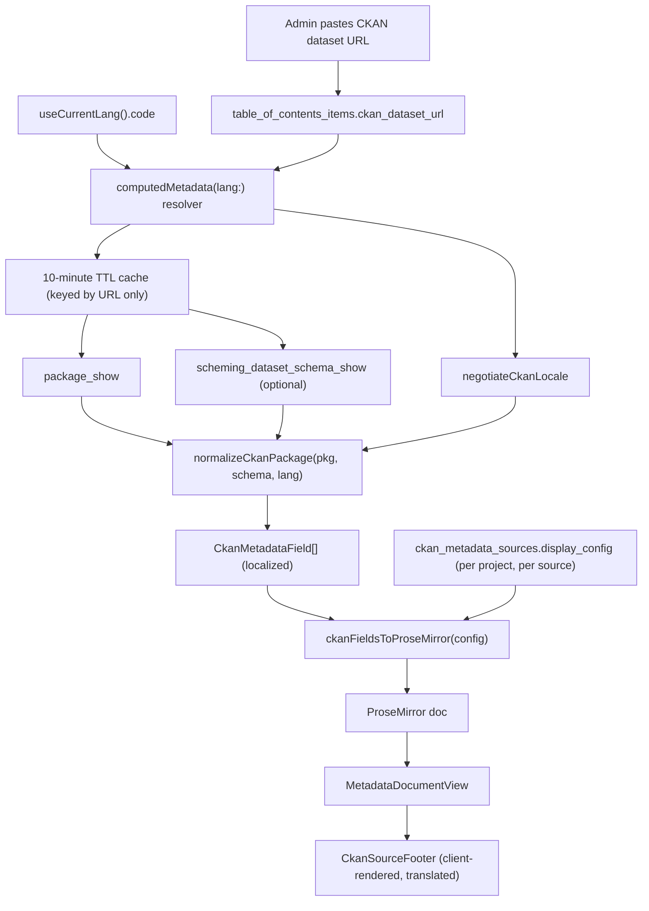

# CKAN Metadata Integration

## Goal

When an admin pastes a CKAN dataset URL onto a layer, SeaSketch renders that layer's metadata by fetching the CKAN record at view time, normalizing it (using the publisher's `ckanext-scheming` schema when available), and generating a ProseMirror document for the existing metadata modal. The generated document is never editable — CKAN is authoritative — matching the existing ArcGIS "dynamic service metadata" mode.

## Why this fits the existing architecture

SeaSketch already has this exact shape. [`packages/api/src/plugins/computedMetadataPlugin.ts`](packages/api/src/plugins/computedMetadataPlugin.ts) resolves `TableOfContentsItem.computedMetadata` server-side, returning the stored ProseMirror JSON in `table_of_contents_items.metadata` when present, and otherwise fetching ArcGIS REST JSON and synthesizing a document:

```21:71:packages/api/src/plugins/computedMetadataPlugin.ts
        computedMetadata: async ({ id }, args, context, info) => {
          ...
          if (item.metadata) {
            return item.metadata;
          } else if (item.dataLayerId) {
            ...
            switch (type) {
              case "arcgis-vector":
```

The admin editor already knows how to lock itself out when metadata is externally managed ([`OverlayMetadataEditor.tsx`](packages/client/src/admin/data/OverlayMetadataEditor.tsx), lines 276-332). CKAN becomes a new branch in that resolver plus a new reason for the editor to lock.



## Findings that shape the design

Verified against the live MaPP records from the ChatGPT session (all five resolve):

- `open.canada.ca` runs CKAN 2.10.8 with `ckanext-scheming` + `fluent`. `scheming_dataset_schema_show?type=dataset` returns 51 field definitions with bilingual labels and full choice lists (~161KB). This is what turns `frequency: "as_needed"` into "As Needed"/"Au besoin" and `topic_category: ["boundaries"]` into "Boundaries". Schema quality is the single biggest lever on output quality.
- The schema also exposes `sidebar_show_fields` — the portal's own curated display list. This is the best available seed for default field selection.
- `catalogue.data.gov.bc.ca` also has scheming (type `bcdc_dataset`, 26 fields) but with **plain-string labels** rather than fluent dicts, and entirely different field names. Good second fixture to prove genericity.
- Translations are pervasive and free: field labels (`{"en": "Maintenance and Update Frequency", "fr": "Fréquence d'entretien et de mise à jour"}`), choice labels (`as_needed` to "As Needed"/"Au besoin"), and values (`notes_translated`, `title_translated`, `keywords`) all ship in the same responses. Making the request language-aware costs one argument and yields a fully localized document.
- Real-world normalization hazards found in the actual records: fluent dicts with machine-translation variants (`{"en": [...], "fr-t-en": [...]}`); JSON-encoded **strings** for `contact_information`, `distributor`, and `spatial`; a sentinel `time_period_coverage_start` of `"0001-01-01 00:00:00"` that must be suppressed; `notes` is **Markdown** (`__Regional District__`); `organization.title` is a pipe-joined bilingual string (`"Government of British Columbia | Gouvernment de la Colombie-Britannique"`); 4-6 resources per record.
- CORS is permissive on these hosts but `open.canada.ca` returns 403 to `OPTIONS` preflight and sets `max-age=30`. Server-side fetching (as decided) avoids depending on that entirely.

## Data model

New migration work goes in [`packages/api/migrations/current.sql`](packages/api/migrations/current.sql), which is currently empty.

**Project-scoped source config** — follows the `offline_tile_settings` pattern from [`packages/api/migrations/committed/000148.sql`](packages/api/migrations/committed/000148.sql):

```sql
create table ckan_metadata_sources (
  id int generated always as identity primary key,
  project_id int not null references projects(id) on delete cascade,
  base_url text not null,            -- normalized, e.g. https://open.canada.ca/data/en
  dataset_type text not null default 'dataset',
  title text,                        -- seeded from CKAN status_show site_title
  display_config jsonb not null default '{}'::jsonb,
  created_at timestamptz not null default now(),
  unique(project_id, base_url)
);
comment on table ckan_metadata_sources is '@simpleCollections only';
grant select, insert, update, delete on table ckan_metadata_sources to seasketch_user;
alter table ckan_metadata_sources enable row level security;
create policy ckan_metadata_sources_admin on ckan_metadata_sources
  using (session_is_admin(project_id)) with check (session_is_admin(project_id));
```

Rows are created lazily the first time an admin links a layer to a base URL not yet known to the project. Expose on `projects` via a `projects_ckan_metadata_sources(p projects)` computed function, mirroring `projects_polygon_overlays_for_geography` in [`000438.sql`](packages/api/migrations/committed/000438.sql).

`display_config` is the **only** place field selection lives. There is no per-layer override, which keeps the model simple: a source is configured once and every layer in the project pointing at that source renders consistently.

**Layer-level column** on `table_of_contents_items` — exactly one:

- `ckan_dataset_url text` — the fully-qualified record link the admin pastes (not a bare UUID, per the requirement)

The source is resolved at read time by matching the URL's base against `ckan_metadata_sources.base_url` for the layer's project, so there is no foreign key to keep in sync and nothing extra to copy on publish.

Extend `table_of_contents_items_uses_dynamic_metadata()` (schema.sql ~23689) to also return true when `ckan_dataset_url is not null`, so the editor lock-out already wired into `OverlayMetadataEditor` applies automatically.

**Mandatory copy-list update** (per AGENTS.md). The one new column must be added to the hard-coded insert lists in:

- `publish_table_of_contents` — schema.sql 18011-18054, last redefined in [`000439.sql`](packages/api/migrations/committed/000439.sql)
- `copy_table_of_contents_item` — schema.sql 7449-7493, same migration

Use `hide_arcgis_rest_link` in `000439.sql` as the worked example — it is a single-column addition to both lists, structurally identical to this one. No triggers.

Minor known gap to note but not fix: the generated `has_metadata` column stays false for CKAN-linked layers (same as ArcGIS dynamic layers today). It is only consumed by a "(no metadata)" label in [`OverlayStableIdPicker.tsx`](packages/client/src/formElements/OverlayStableIdPicker.tsx), so it is cosmetic.

## Transform library

New standalone package **`packages/ckan-metadata`**, kept out of `packages/metadata-parser` — that package is scoped to parsing sidecar metadata from uploaded layers (FGDC/ISO 19139 XML), which is a different job with a different lifecycle.

Model it on [`packages/overlay-engine`](packages/overlay-engine), the cleanest recent example of a pure, well-tested library package consumed by the API: CommonJS, `composite: true` tsconfig emitting to `dist/`, `vitest.config.ts` with `globals: true` and `environment: "node"`, and tests in `__tests__/` with a `fixtures/` subdirectory. Wiring is three steps, all following how `overlay-engine` is already hooked up:

- add `"packages/ckan-metadata"` to the `packages` array in [`lerna.json`](lerna.json)
- add the dependency to `packages/api/package.json` (alongside `"overlay-engine": "^1.0.0"` at line 127)
- add `{ "path": "../ckan-metadata" }` to the `references` array in `packages/api/tsconfig.json` (next to `../overlay-engine` at line 75)

The package emits plain ProseMirror JSON objects, so it needs no `prosemirror-model` dependency at runtime — only `markdown-it`.

```
packages/ckan-metadata/src/
  parseCkanUrl.ts        # dataset URL -> { baseUrl, datasetId, apiRoot, locale }
  locale.ts              # negotiateCkanLocale, resolveFluent
  types.ts               # CkanMetadataField, CkanDisplayConfig, CkanSchema
  normalize.ts           # normalizeCkanPackage(pkg, schema?, opts)
  discoverFields.ts      # source-level field universe for the config UI
  markdownToProseMirror.ts
  toProseMirror.ts       # ckanFieldsToProseMirror(fields, config, opts)
  index.ts
```

Core intermediate representation, kept deliberately between the CKAN JSON and the document:

```ts
export interface CkanMetadataField {
  id: string; // "notes", "organization", "frequency", "extras.foo"
  label: string; // resolved for the requested locale
  value: unknown;
  displayValue?: string | string[];
  type:
    | "markdown"
    | "text"
    | "date"
    | "url"
    | "email"
    | "list"
    | "keyvalue"
    | "repeating";
  group?: string; // "Overview" | "Dates" | "Attribution" | "Other" | "Resources"
  source: "core" | "schema" | "extra";
  recommended: boolean; // seeds default checkbox state
  technical: boolean; // hidden from the picker unless "show all" is on
}
```

Normalization rules, each driven by a real observed case:

- **Fluent values** (`title_translated`, `notes_translated`, `keywords`): resolved through `negotiateCkanLocale` (see below).
- **Fluent labels**: scheming labels are `{en, fr}` on open.canada.ca but plain strings on BC. Handle both, then fall back to `humanize(field_name)`.
- **Choice codes to labels**: look up `choices[].value`, honoring the `replaces` alias array (e.g. `subject` maps legacy `"AG"` to `agriculture`). Choice labels are themselves fluent and get the same locale treatment.
- **JSON-encoded strings**: attempt `JSON.parse` when a string value starts with `{` or `[` (`contact_information`, `distributor`, `spatial`).
- **Dates**: strip a trailing `" 00:00:00"`; treat `0001-01-01` and `9999-12-31` as empty; render localized.
- **Empty**: omit `null`, `""`, `[]`, `{}`.
- **Composites**: synthesize `license` from `license_title` + `license_url`, `temporal_coverage` from the start/end pair, `organization` from `organization.title` (splitting the `" | "` bilingual join), and a `source_record` link.
- **Technical suppression list**: `id`, `name`, `state`, `private`, `owner_org`, `creator_user_id`, `num_resources`, `num_tags`, `relationships_as_subject`, `relationships_as_object`, `type`, `isopen`, `ready_to_publish`, `imso_approval`, `display_flags`, `file_id`, `short_key`, `revision_id`.
- **Default `recommended` set**: fields named in the schema's `sidebar_show_fields`, unioned with a core allowlist (`notes`, `organization`, `license`, `date_published`, `date_modified`, `frequency`, temporal coverage, `keywords`). Resources default off.
- **No-schema fallback**: `humanize("temporal_coverage")` to "Temporal coverage", type inferred from the value shape.

**Field universe for the config UI.** Because configuration is now source-level rather than per-record, the picker must list fields a source _can_ have, not just the ones populated in whichever record the admin happens to be previewing. `discoverCkanFields(schema, sampleRecord)` returns:

- when scheming is available, the schema's declared `dataset_fields` — all 51 on open.canada.ca, 26 on BC — which is exactly the right universe for a source-level decision
- otherwise, the union of keys and `extras` discovered across sampled records, with a note in the panel when a newly previewed record surfaces a field the config has never seen

At render time, a configured field that is empty for a given record is simply omitted, so one config degrades cleanly across records with differing completeness.

**Markdown**: `notes` is Markdown. Use `markdown-it` with `html: false` (so embedded HTML is escaped, not injected) and `linkify: true`, mapping the token stream to the node types the metadata schema actually supports — `paragraph`, `heading`, `bullet_list`/`ordered_list`/`list_item`, `blockquote`, `code_block`, `hard_break`, and `em`/`strong`/`code`/`link` marks. Everything else degrades to plain text.

**Document layout** produced by `ckanFieldsToProseMirror`, chosen to read as a friendly summary rather than a machine dump:

1. `heading` level 1 — dataset title
2. Description as prose blocks (from Markdown)
3. Short scalar fields as a single bullet list of `**Label:** value` items, avoiding a wall of H3s
4. Multi-value fields (keywords, topic category) as nested bullet lists
5. Resources, when enabled, as a bullet list of links

Deliberately, the document contains **no SeaSketch-authored prose** — every label in it comes from CKAN or the scheming schema, and is therefore already localized by the publisher. The "view the original record" affordance is a client-rendered footer instead (see below), so its wording goes through normal `Trans` translation rather than needing a server-side string table.

## Language and localization

CKAN carries translations for both field values and field labels, so a language-aware request produces a genuinely localized document rather than an English one with a translated shell around it.

**Request plumbing.** Add an optional argument to the existing field: `computedMetadata(lang: String)`. This follows the established precedent of `searchOverlays(lang:)`, which the client drives from `useCurrentLang().code`:

```22:32:packages/client/src/dataLayers/useOverlaySearchState.ts
  const currentLanguage = useCurrentLang();
  const searchResults = useSearchOverlaysQuery({
    ...
      lang: currentLanguage.code,
```

Because Apollo includes field arguments in its cache key, passing `lang` as a variable makes the metadata modal re-resolve automatically when the user switches language — no manual refetch, no cache invalidation. The argument is optional and ignored on the stored-metadata and ArcGIS branches, so the other three operations that select `computedMetadata` keep working unchanged.

**Code negotiation.** SeaSketch language codes and CKAN fluent keys do not line up. `packages/client/src/lang/supported.ts` uses `EN` (uppercase), `es`, `pt-br`, `zh-Hans`, `fr-be`, `CHK`; CKAN uses `en`, `fr`, and machine-translation variants like `fr-t-en`. A `negotiateCkanLocale(requested, availableKeys, schema)` helper resolves in this order:

1. Case-insensitive exact match (`EN` matches `en`)
2. Base-language match (`pt-br` matches `pt`, `fr-be` matches `fr`)
3. A machine-translation variant of the requested language (`fr-t-en` for a `fr` request) — accepted, but only after human translations are exhausted
4. `schema.form_languages[0]`, then `en`, then the first available key

The same helper serves three consumers: fluent field values, scheming field labels, and scheming choice labels.

**Caching is locale-independent.** `package_show` and `scheming_dataset_schema_show` both return every language inline, so the 10-minute TTL cache stays keyed by request URL only and localization happens after the cache read. One cached fetch serves all viewers regardless of language.

**Source link locale.** `open.canada.ca` scopes its paths by locale (`/data/en/...` vs `/data/fr/...`). `parseCkanUrl` captures any locale path segment so the footer link can point at the record page in the viewer's language, falling back to the URL exactly as the admin stored it when no locale segment is recognizable.

**Admin preview.** The source configuration panel gets a small language switcher so an admin can check how the output reads in each of the project's `supportedLanguages` before saving.

## Fixtures and tests

Add `packages/ckan-metadata/__tests__/` with a `fixtures/` directory and a `scripts/refresh-fixtures.ts` that re-downloads them, so fixtures are reproducible rather than hand-edited. Capture:

- The five MaPP records from the ChatGPT session: Natural Resource Districts `0bc73892-e41f-41d0-8d8e-828c16139337`, Crown Tenures `3544ad91-0cf2-4926-a08a-bfe42d9a031d`, Surveyed Parcels `61d0864e-d795-4d20-8aa0-718f9fd6fb5f`, Regional Districts `d1aff64e-dbfe-45a6-af97-582b7f6418b9`, Municipalities `e3c3c580-996a-4668-8bc5-6aa7c7dc4932`
- `scheming_dataset_schema_show?type=dataset` from open.canada.ca
- One `catalogue.data.gov.bc.ca` record plus its `bcdc_dataset` schema (different field names, plain-string labels)
- One record from a CKAN instance without scheming, to lock in the fallback path

Test coverage:

- `parseCkanUrl` against dataset page URLs, API URLs, trailing slashes, locale path segments, and non-CKAN URLs
- `negotiateCkanLocale` against the real SeaSketch code list, covering `EN` to `en`, `pt-br` to `pt`, `fr` preferring a human `fr` over `fr-t-en`, and an unsupported code such as `CHK` falling through to `form_languages[0]`
- Snapshot the normalized `CkanMetadataField[]` for each fixture, with and without the schema, in both `EN` and `fr`, asserting specifically that `as_needed` renders as "As Needed" and "Au besoin", `0001-01-01` is dropped, `contact_information` parses, and `fr-t-en` is not chosen for an `EN` viewer
- Snapshot the generated document per fixture per language
- A structural validation test that every generated document round-trips through a ProseMirror schema built from `prosemirror-schema-basic` + `addListNodes` (devDependencies), catching invalid node output
- Per AGENTS.md, type guards over the untrusted CKAN JSON take `unknown` and get explicit `null`/`undefined`/non-object tests

## API wiring

New `packages/api/src/ckan/fetcher.ts`:

- 10-minute TTL cache keyed by request URL, covering both `package_show` and `scheming_dataset_schema_show`, with in-flight request deduplication (mirroring `inFlightRequests` in `ArcGISRESTServiceRequestManager`) and a bounded entry count given the 161KB schema payloads
- Serve the stale entry if a refetch fails, so CKAN downtime degrades gracefully
- Because the URL is admin-supplied and fetched by the server, enforce: HTTPS only, reject loopback/private/link-local addresses, request timeout, and a response size cap

Extend the existing resolver in `computedMetadataPlugin.ts` to accept the new `lang` argument and to check `ckan_dataset_url` **before** the ArcGIS branch (CKAN wins over any stored `metadata`, per the "always dynamic when a URL is provided" requirement). Config lookup is a single query: parse the URL's base and select the matching `ckan_metadata_sources` row for the layer's project, falling back to built-in defaults when no row exists yet.

New query in the same plugin (or a sibling `ckanPlugin.ts`) to power the admin UI, since the browser should not be fetching arbitrary CKAN hosts:

```graphql
ckanDatasetPreview(url: String!, config: JSON, lang: String): CkanDatasetPreview
```

returning `baseUrl`, `datasetId`, `siteTitle`, `datasetTitle`, `availableLanguages`, `schemaAvailable`, the discovered `fields` (for the checkbox list), and the generated `document` (for live preview). One round trip drives both halves of the dialog, and re-running it with a different `lang` powers the preview language switcher.

## Client

Per AGENTS.md, all operations go in `.graphql` files under [`packages/client/src/queries/`](packages/client/src/queries) and types come from `npm run graphql:codegen` — never hand-edited.

**Language variable.** Four operations in [`DraftTableOfContents.graphql`](packages/client/src/queries/DraftTableOfContents.graphql) select `computedMetadata` — `GetMetadata` (871), `UpdateMetadata` (900), `UpdateMetadataFromXML` (928), and `LayerMetadataChanges` (1294) — consumed by four components: `TableOfContentsMetadataModal.tsx`, `OverlayMetadataEditor.tsx`, `TableOfContentsMetadataEditor.tsx`, and `LayerMetadataRevisionModal.tsx`. Add `$lang: String` to each and pass `useCurrentLang().code` at every call site.

**Source footer.** Add `CkanSourceFooter.tsx` next to [`EsriRestUrlFooter.tsx`](packages/client/src/dataLayers/EsriRestUrlFooter.tsx) and render it from `MetadataModal` and the admin editor wherever `EsriRestUrlFooter` is rendered today. It shows the CKAN site title and a "View original record" link, using `Trans` so the chrome is translated by SeaSketch's own i18n rather than being baked into the generated document.

**Layer metadata tab.** Extend [`OverlayMetadataEditor.tsx`](packages/client/src/admin/data/OverlayMetadataEditor.tsx) with a single `MetadataFooterSetting` row ("Link to an external metadata record") containing a URL input, sitting alongside the existing "Use dynamic service metadata" and "Show ESRI REST URL" rows. When a URL is set, the existing `usingDynamicMetadata` lock kicks in automatically and the overlay message gets a CKAN-specific variant. The locked editor already shows the generated document, so the layer tab doubles as the per-layer preview with no extra UI.

Below the input, a short line notes which fields are shown and links through to the project's source settings — no per-layer configuration.

**Project-level panel.** All field configuration lives here. Add a `ckan-metadata` sub-route under `/admin/data`, following the `download-settings` precedent in `TableOfContentsEditor.tsx` (menubar radio item ~646-670, view switch ~101-118) and using [`DataDownloadSettingsPanel.tsx`](packages/client/src/admin/data/DataDownloadSettingsPanel.tsx) as the layout template. It lists the project's CKAN sources with the number of layers using each, and opens a configuration view with:

- Grouped checkbox list (Overview / Dates / Attribution / Other / Resources) over the source's field universe, seeded from `recommended`
- Drag-to-reorder and per-field label override
- A sample-record switcher listing the layers that use this source, so the admin can sanity-check the config against several records
- A preview language switcher limited to the project's `supportedLanguages`
- Live preview rendered with the real [`MetadataDocumentView`](packages/client/src/dataLayers/MetadataDocumentView.tsx)

Saving writes `ckan_metadata_sources.display_config` and immediately changes every layer in the project using that source, so the panel should say so plainly.

All user-visible strings use `Trans`/`t` with an appropriate namespace.

## Verification

Watch the **Client devserver** and **GraphQL:codegen** terminal tasks for compile errors during client work, then `npm run lint` in `packages/client`. Run `vitest` in `packages/ckan-metadata`. Switch the project language with a CKAN-linked layer's metadata modal open and confirm the labels and values change without a manual refresh. Change a source's field selection and confirm every layer using that source updates. Confirm the copy-list change by publishing a project containing a CKAN-linked layer and duplicating that layer, checking that `ckan_dataset_url` survives both.
