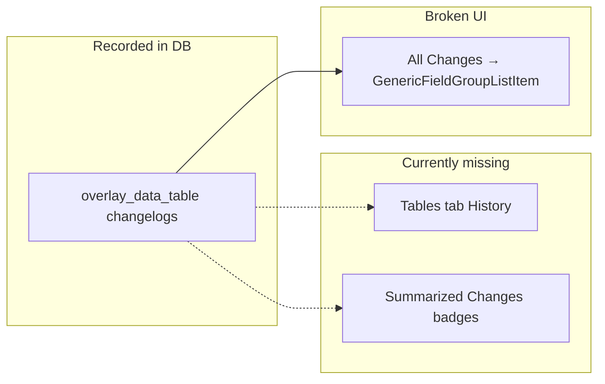

# Data Table Changelog UI

## Problem

Data table events are recorded correctly in the DB (`entity_type = 'overlay_data_table'`, field groups `data_table:*`, summaries with `{name, version}`, `meta.table_of_contents_item_id`) via [`000429.sql`](packages/api/migrations/committed/000429.sql), but the client never queries or renders them properly:



- **Tables tab:** no history query at all ([`DataTablesEditor.tsx`](packages/client/src/admin/data/overlayDataTables/DataTablesEditor.tsx))
- **All Changes:** falls through to [`GenericFieldGroupListItem.tsx`](packages/client/src/admin/changelogs/fieldGroups/GenericFieldGroupListItem.tsx) → `"updated DATA_TABLE_CREATED"`
- **Summarized Changes:** [`publishChangelogSummary.ts`](packages/client/src/admin/data/publishChangelogSummary.ts) filters `entityType === "table_of_contents_items"` only, so data-table logs never attach to layer rows

## 1. API: expose data-table changelogs for a layer

Add a PostGraphile computed column on `table_of_contents_items` in [`packages/api/migrations/current.sql`](packages/api/migrations/current.sql):

```sql
create or replace function table_of_contents_items_data_table_change_logs(item table_of_contents_items)
  returns setof change_logs
  language sql stable security definer as $$
    select * from change_logs
    where entity_type = 'overlay_data_table'
      and net_zero_changes = false
      and (meta->>'table_of_contents_item_id')::int = item.id
    order by last_at desc;
  $$;
-- grant + @simpleCollections only comment (match 000414.sql pattern)
```

Extend [`LayerSettingsChangeLog`](packages/client/src/queries/DraftTableOfContents.graphql) **or** add a dedicated query `DataTableChangeLog($id, $first)` on `tableOfContentsItem.dataTableChangeLogs(first: $first) { ...ChangeLogDetails }`. Prefer a **separate query** so Settings-tab history stays unchanged per your preference.

Run `graphql:codegen`.

## 2. Tables tab: dedicated History section

Create [`DataTablesChangeLogList.tsx`](packages/client/src/admin/changelogs/DataTablesChangeLogList.tsx) modeled on [`LayerSettingsChangeLogList.tsx`](packages/client/src/admin/changelogs/LayerSettingsChangeLogList.tsx):

- Query `dataTableChangeLogs` for the TOC item id
- Paginate with same page sizes / “View full history” pattern
- Render via existing [`ChangeLogListItem`](packages/client/src/admin/changelogs/ChangeLogListItem.tsx) (no `itemTitle` needed — user is already on that layer)
- Return `null` when empty (before any tables exist)

Mount at the bottom of [`DataTablesEditor.tsx`](packages/client/src/admin/data/overlayDataTables/DataTablesEditor.tsx), below `RelatedDataTables`, when `enableDataTables && dataTableJoinColumn`.

Add refetch helper (e.g. `dataTableChangeLogRefetchQueries(tocItemId)`) and wire into data-table mutations in [`RelatedDataTables.tsx`](packages/client/src/admin/data/overlayDataTables/RelatedDataTables.tsx) and upload completion refetch paths so History updates after upload/rename/delete/replace/rollback.

## 3. Field-group renderers (All Changes + Tables tab)

Add shared helpers in [`fieldGroups/dataTableSummary.ts`](packages/client/src/admin/changelogs/fieldGroups/dataTableSummary.ts):

- `tocItemIdFromMeta(meta)` — parse `table_of_contents_item_id`
- `tableLabel(from/to summary, meta)` — `"name (vN)"` from `{name, version}`

Add five list-item components following existing patterns:

| Component                             | Pattern                                                                                                                                      | Example copy                                   |
| ------------------------------------- | -------------------------------------------------------------------------------------------------------------------------------------------- | ---------------------------------------------- |
| `DataTableCreatedFieldGroupListItem`  | [`FolderCreatedFieldGroupListItem`](packages/client/src/admin/changelogs/fieldGroups/FolderCreatedFieldGroupListItem.tsx)                    | uploaded data table **swath-short (v1)**       |
| `DataTableReplacedFieldGroupListItem` | [`LayerUploadedFieldGroupListItem`](packages/client/src/admin/changelogs/fieldGroups/LayerUploadedFieldGroupListItem.tsx) replacement branch | replaced **swath-short** v1 → v2               |
| `DataTableRenamedFieldGroupListItem`  | [`LayerTitleFieldGroupListItem`](packages/client/src/admin/changelogs/fieldGroups/LayerTitleFieldGroupListItem.tsx)                          | renamed **old** → **new** (v2)                 |
| `DataTableDeletedFieldGroupListItem`  | [`LayerDeletedFieldGroupListItem`](packages/client/src/admin/changelogs/fieldGroups/LayerDeletedFieldGroupListItem.tsx)                      | deleted **swath-short (v1)**                   |
| `DataTableRollbackFieldGroupListItem` | new (CounterClockwise/Undo icon)                                                                                                             | rolled back **swath-short** to v1 (removed v2) |

Register all five in [`fieldGroups/index.ts`](packages/client/src/admin/changelogs/fieldGroups/index.ts) for `ChangeLogFieldGroup.DataTable*`.

**Publish modal context:** extend `titleForChangeLog()` in [`PublishTableOfContentsModal.tsx`](packages/client/src/admin/data/PublishTableOfContentsModal.tsx) to resolve parent layer title when `entityType === "overlay_data_table"` via `meta.table_of_contents_item_id` + existing `itemTitleById` map (shows layer name above the entry in All Changes, matching TOC entries).

## 4. Summarized Changes: roll up under parent layers

Update [`publishChangelogSummary.ts`](packages/client/src/admin/data/publishChangelogSummary.ts):

1. After building `byEntity` from TOC logs, **merge** `overlay_data_table` logs whose `meta.table_of_contents_item_id` matches a draft TOC item
2. Layers with **only** data-table changes since last publish should appear in **Updated** (not dropped)
3. Add badge key `"dataTables"` to `PublishBadgeKey` + `PUBLISH_BADGE_ORDER` (after `"downloads"` or near `"source"`)
4. Map all five `DATA_TABLE_*` field groups → `"dataTables"` in `FIELD_GROUP_TO_BADGE`
5. Include merged logs in `changeCount`, `lastChangeAt`, and `editors` aggregation

Add badge label in [`PublishSummarizedChangesPanel.tsx`](packages/client/src/admin/data/PublishSummarizedChangesPanel.tsx) (`t("data tables")`).

Add popover body in [`PublishBadgeDetailContent.tsx`](packages/client/src/admin/data/publishBadgeDetails/PublishBadgeDetailContent.tsx) — list each event with human-readable action + table name/version (reuse `dataTableSummary` helpers). No modal deep-link needed initially.

## 5. Verification

- **Tables tab:** upload, rename, replace, delete, rollback → entries appear in Tables History with correct icons/copy
- **Publish → All Changes:** same entries styled properly; parent layer title shown
- **Publish → Summarized Changes:** affected layers show a **data tables** badge; popover lists individual table events; change counts include table operations
- **Settings tab:** unchanged (no data-table entries mixed in)
- Run `npm run lint` in `packages/client`

## Out of scope (noted)

- Changelog entries for `enableDataTables` / `dataTableJoinColumn` toggles (not recorded in DB today)
- Fix for replacement upload changelogs missing `editor_id` when completed by background worker (`complete_overlay_data_table_upload` uses `session.user_id` only for replace path in `000429.sql`) — separate bug if you notice missing replace entries
