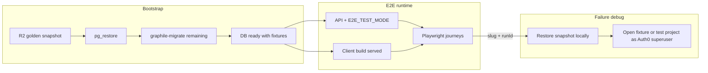

# Integration Testing Implementation Plan

This file is a working sketch for implementation. The decision record is the [2026 development-environment campaign](../../design-docs/dev-environment/README.md), in particular [integration testing](../../design-docs/dev-environment/integration-testing.md) and the [strategy](../../design-docs/dev-environment/strategy.md). Refresh this sketch when Phase 1 starts. Leave the campaign folder as an archive when that campaign ends.

The phase numbers below predate the strategy. Map them as follows: sketch phases 0 and 1 are strategy Phase 1 (smoke on the current toolchain); sketch phase 2 is strategy Phase 3 (access journeys); sketch phase 3 is strategy Phase 5 (agent recipe). Strategy Phase 2 (Node LTS, workspaces, and the post-deploy production probe) and Phase 4 (client build) sit between those.

Where this sketch conflicts with the record, the record wins. Known conflicts: test-mode tokens are signed by the API's own JWKS keys under a test-only issuer, and Auth0 Management calls are faked in test mode; the snapshot is never built from a production dump; the production probe starts in strategy Phase 2, not Phase 5.

## Locked decisions

- **Runner:** Playwright in a new `packages/e2e` package (Cypress kept only as scenario inventory until Phase 2 backlog is extracted, then removed/archived).
- **Auth (automated):** Env-gated `E2E_TEST_MODE` on the API — no Auth0 ROPC in PR CI. Developers continue using canonical Auth0 as superusers for manual inspection.
- **Golden DB:** `pg_dump` custom-format snapshot (schema+data, includes `graphile_migrate` bookkeeping) on **Cloudflare R2**, restored into the existing PostGIS Docker container — **not** a pre-baked Postgres Docker image. Bootstrap = pull → restore → apply only newer migrations.
- **Tenancy:** Each journey (or parallel worker) owns one or more uniquely slugged projects; never mutate shared fixture projects during tests.

### Why dumps over golden Docker images

You already run Postgres via Docker ([`packages/api/docker-compose.yml`](packages/api/docker-compose.yml) → `underbluewaters/postgres-13-postgis-3.1`). The choice is whether the *golden state* is a **data artifact** (dump) or a **baked database image** (PGDATA inside an image).

| | Dump → existing PostGIS container | Pre-baked Postgres Docker image |
|--|--|--|
| Cold start | Start empty PG + `pg_restore` (typically tens of seconds for a curated fixture DB) | Container start with data already in PGDATA (often faster) |
| Storage | Fits R2 naturally; compressed custom format; arch-agnostic | Wants a container registry (GHCR/Docker Hub); awkward on R2; need amd64+arm64 builds for CI vs Apple Silicon |
| Delta migrations | Restore → `graphile-migrate migrate` for commits after manifest | Same host-side migrate step still required once the repo advances past the image tag |
| Compose / volumes | Keep current image + named/anonymous volume; restore is explicit | Easy footgun: a named volume on `/var/lib/postgresql/data` **hides** baked PGDATA and you boot empty |
| Refresh workflow | Dump + upload; aligns with existing `db:backup` mental model | Multi-stage Docker build (start PG, load data, commit) or `docker commit` — slower and fragile |
| Debug / inspect | `pg_restore -l`, copy dump between machines, restore into any matching PostGIS | Must run the image; harder to diff contents |
| Coupling | Engine image stays thin; data versioned separately via manifest | Couples PostGIS base version, roles, and fixture data into one artifact |

**Recommendation: dumps.** The main win of images (slightly faster CI boot) is secondary to R2 fit, multi-arch simplicity, avoiding the Postgres volume footgun, and reusing the container you already run. If restore time ever becomes a CI bottleneck, add a **cached local Docker volume** after first restore (or a later optional GHCR image) without changing the source-of-truth artifact on R2.



---

## Phase 0 — Turn-key DB bootstrap + golden snapshot

**Goal:** A new machine (or CI job) gets a useful SeaSketch DB in minutes without replaying ~432 migrations from scratch, including data-library machinery, templates, JWKS, and shared fixture projects.

### 0.1 Snapshot format and scripts

**Artifact = dump, runtime = existing PostGIS container.** Do not publish a `seasketch-db-golden` image for Phase 0–1.

Replace the “data-only after full migrate” path for _this_ use case with a dedicated golden snapshot pipeline (keep existing [`db-backup.sh`](packages/api/scripts/db-backup.sh) / [`db-restore.sh`](packages/api/scripts/db-restore.sh) for personal salvage dumps).

New scripts under [`packages/api/scripts/`](packages/api/scripts/):

| Script                                        | Purpose                                                                                                                                                                                                            |
| --------------------------------------------- | ------------------------------------------------------------------------------------------------------------------------------------------------------------------------------------------------------------------ |
| `db-snapshot-create.sh`                       | From a known-good local DB: `pg_dump` **custom format, full DB** (public + `graphile_migrate` + roles-safe flags). Write sidecar `manifest.json` (`migrationFilename`, `createdAt`, `gitSha`, `contents` summary). |
| `db-snapshot-restore.sh`                      | Against running `seasketch_db` container: drop/recreate `seasketch` → `pg_restore` snapshot → `db:fresh-setup` → `graphile-migrate migrate` (applies only commits after snapshot).                                                                           |
| `db-snapshot-pull.sh` / `db-snapshot-push.sh` | Sync `latest.dump` + `manifest.json` to/from R2 via S3-compatible API (`@aws-sdk/client-s3` already in API deps; endpoint = R2).                                                                                   |

npm scripts on [`packages/api/package.json`](packages/api/package.json): `db:snapshot:create`, `db:snapshot:restore`, `db:snapshot:pull`, `db:snapshot:push`, `db:bootstrap` (= pull if needed + restore).

**Manifest example:**

```json
{
  "version": 1,
  "migration": "000432.sql",
  "createdAt": "2026-07-24T18:00:00Z",
  "gitSha": "abc123",
  "fixtureProjects": ["demo-public", "demo-admin", "demo-survey"]
}
```

### 0.2 R2 storage

- Dedicated bucket (e.g. `seasketch-dev-snapshots`), private.
- Object layout: `db-golden/latest.dump`, `db-golden/latest.manifest.json`, plus immutable `db-golden/archive/{date}-{migration}.dump`.
- Credentials via env (`R2_ACCOUNT_ID`, `R2_ACCESS_KEY_ID`, `R2_SECRET_ACCESS_KEY`, `R2_SNAPSHOT_BUCKET`) documented in [`ENV.md`](ENV.md) / `.env.template`; CI uses GitHub Actions secrets.
- Push is maintainer-only (documented); pull is the default for every developer.

### 0.3 Snapshot contents (curated once, then refreshed)

Build the first golden DB from a healthy local (or carefully sanitized) source, then prune/add until it contains:

1. **Migration-seeded platform data** (already in migrations): `superuser` project, form element types, sketch/survey templates, `data_sources_buckets`, default basemap wiring.
2. **JWKS row(s)** — start API once (`rotateKeys`) before snapshot so invite signing works without a race.
3. **Data library TOC items** required by geography/clipping (`DAYLIGHT_COASTLINE`, `MARINE_REGIONS_*`, etc. on `superuser`) — today these are the main migrate-only gap.
4. **Shared fixture projects** (listed, stable slugs, owned by `seasketch|root` / accessible to Auth0 superusers):
   - `demo-public` — public listed project with a couple layers + simple sketch class
   - `demo-admin` — admins-only project for access-control demos
   - `demo-survey` — project with a published survey (incl. one spatial/SAP path if feasible)
   - Expand later as Phase 2 needs examples

Document: tests must **not** mutate these slugs; they are for humans/agents. Parallel tests create `e2e-{worker}-{runId}-…` projects (slug ≤ 24 chars).

### 0.4 Developer UX

- Update [`README.md`](README.md) + [`ENV.md`](ENV.md): after `db:start` + env, run `npm run db:bootstrap` in `packages/api` (pull + restore + migrate delta).
- Optionally add a VS Code task after `db:start` that runs bootstrap when no DB/manifest present (non-destructive prompt).
- Document “I need a clean slate”: `db:snapshot:restore` (local cached dump) vs full reset.
- Document periodic refresh: after a batch of migrations land, maintainer runs create → push; CI/devs pull on next bootstrap.

### 0.5 Failure / debug workflow (shared with E2E)

Document in Phase 0 so Phase 1 can rely on it:

1. Note failing test’s `projectSlug` + `runId` from Playwright output.
2. `db:snapshot:restore` (or keep the CI DB if local).
3. Log in with Auth0 as superuser → open `/[slug]` (test project may still exist if teardown skipped; for CI artifacts, optionally dump the project slug + GraphQL export on failure).
4. For invite bugs: read `invite-emails-e2e/` (renamed from Cypress path).

**Phase 0 exit criteria:** New clone → Docker up → `db:bootstrap` → API + client start → superuser can open `demo-public` map without manual SQL.

---

## Phase 1 — Playwright harness + smoke tests + CI

**Goal:** Full infrastructure for integration tests with a tiny `@smoke` suite proving the loop.

### 1.1 Package layout

```text
packages/e2e/
  package.json
  playwright.config.ts
  README.md
  support/
    auth.ts          # E2E_TEST_MODE login → storageState
    graphql.ts       # typed helpers against local API
    db.ts            # hard-delete project, read invite files
    projects.ts      # createProject with unique slug
  journeys/
    smoke/
      public-project.spec.ts
      admin-login-map.spec.ts
  fixtures/
    users.json       # seeded E2E users (DB subs), not Auth0 passwords
```

### 1.2 `E2E_TEST_MODE` API support

Extend patterns from [`IS_CYPRESS_TEST_ENV`](packages/api/src/invites/sendEmail.ts):

- Rename/generalize to `E2E_TEST_MODE` (keep Cypress alias temporarily if needed).
- When enabled (and not production):
  - Invite emails written to `invite-emails-e2e/`
  - `POST /e2e/login` (or GraphQL mutation) exchanges `{ email | sub }` + shared secret for Auth0-shaped tokens **or** injects session the SPA accepts via Playwright `addInitScript` / `storageState`
- Seed E2E users in golden snapshot (or `globalSetup`) with known `sub`s matching fixture file.
- Client: small test hook so Playwright does not depend on `"Cypress" in window` bypass in [`useAccessToken`](packages/client/src/useAccessToken.ts) — prefer minting tokens the normal Auth0 cache shape understands, or a dedicated `E2E_TEST_MODE` client path behind `REACT_APP_E2E_TEST_MODE`.

Security: hard-require secret + refuse when `NODE_ENV=production` / missing flag.

### 1.3 Playwright config

- `webServer` or CI-started processes: API on `:3857`, client via `serve -s build` on `:3000` (match old Cypress CI pattern in commented [`unit-tests.yml`](.github/workflows/unit-tests.yml)).
- `globalSetup`: ensure DB bootstrapped (CI: pull snapshot → restore); assert manifest migration ≤ repo head.
- Workers: parallel by default; each test creates its own project(s).
- On failure: screenshot, trace, video; attach `projectSlug`.
- Tags: `@smoke` for PR job.

### 1.4 Initial smoke journeys (3)

1. Anonymous opens `/demo-public` → map shell visible.
2. E2E user logs in → opens a freshly created public project → map shell.
3. E2E admin creates project via GraphQL helper → visits admin UI smoke path (project settings or sketch class list).

### 1.5 CI job

New job in [`.github/workflows/unit-tests.yml`](.github/workflows/unit-tests.yml) (or `e2e.yml`):

1. Postgres + Redis services (same images as unit tests).
2. `db:snapshot:pull` + restore (R2 credentials from secrets) — **not** full migrate-from-zero.
3. Apply migration delta.
4. Build/start API with `E2E_TEST_MODE=true`.
5. Build/serve client.
6. `playwright test --grep @smoke`.
7. Upload `playwright-report/` + traces on failure.

Keep existing API/client Jest jobs unchanged.

### 1.6 Local E2E commands

- `packages/e2e`: `npm test` / `npm run test:smoke` / `npm run test:ui`.
- README: prerequisite `db:bootstrap` + API/client running (or config `webServer`).

**Phase 1 exit criteria:** PR CI runs `@smoke` against R2 snapshot + delta migrations; locally, `test:smoke` passes; failed run produces reviewable trace/screenshots.

---

## Phase 2 — High-priority journey catalog + regression suite

**Goal:** Exhaustive _priority_ backlog (not every feature), then implement as Playwright journeys with project isolation.

### 2.1 Extract backlog

Mine:

- [`packages/client/cypress/integration/2-onboarding/onboarding.spec.js`](packages/client/cypress/integration/2-onboarding/onboarding.spec.js) BDD scenarios
- Existing Cypress smokes (project listing, survey creation, user onboarding)
- Product risk areas (sketching, surveys/SAP, invites/access control, data layers/table, reports)

Produce `packages/e2e/JOURNEYS.md` — numbered checklist with: slug prefix, seed needs, `@tag`, screenshot checkpoints, L1-vs-L2 note (API Jest vs browser).

### 2.2 Priority tiers (implement in order)

**P0 — Access & onboarding**

- Public project from listing / direct URL
- Admins-only gate + admin entry
- Invite-only: anonymous denied; signed-in member enters
- Invite link → new user path (using `E2E_TEST_MODE` email file) → confirmed
- Access request → admin approve → enter

**P1 — Core authoring**

- Survey: create/publish/respond (one non-spatial + one SAP/spatial)
- Sketch: create/edit/save simple polygon
- Project admin: basemap/sketch class smoke

**P2 — Data & reports**

- Toggle hosted layer; data table open/filter smoke
- Report widget happy path on fixture or seeded project

Each journey: unique project slug, GraphQL/SQL arrange, UI act/assert, hard-delete teardown (reuse idea from [`deleteProject.js`](packages/client/cypress/support/deleteProject.js)), screenshots at 2–4 named steps.

### 2.3 Parallelism conventions

- Slug helper: `e2e${worker}${n}` style within 24-char limit.
- Never write to `superuser`, `demo-*`.
- Shared Auth0/E2E users OK; isolation is by project membership.
- Optional: Playwright projects/shards by tag in CI once suite grows.

### 2.4 Cypress retirement

After P0 journeys are green: archive/delete `packages/client/cypress`, remove root Cypress deps, delete commented CI jobs, fix README claims.

**Phase 2 exit criteria:** P0+P1 journeys green in CI (full suite nightly or on `main`; `@smoke` subset on PR); `JOURNEYS.md` is the source of truth; Cypress gone.

---

## Phase 3 — Agent recipe + lights-out review loop

**Goal:** Agents know exactly what tests to add and humans/agents can review via artifacts.

### 3.1 Normative docs

- [`packages/e2e/AGENTS.md`](packages/e2e/AGENTS.md) — recipe (when to add L1 vs L2, journey template, tags, screenshot requirements, teardown, forbidden patterns).
- Cursor rule (e.g. `.cursor/rules/e2e-journeys.mdc`) pointing at that file for client/API user-facing changes.
- Short pointer from root [`AGENTS.md`](AGENTS.md).

### 3.2 Required PR artifacts for journey changes

- Updated/new journey under `journeys/`
- `@tag` classification
- Playwright HTML report or attached step screenshots in PR body
- Seed assumptions listed
- Explicit out-of-scope for L1

### 3.3 Factory workflow

Document for Sentry/issue autofix:

1. Prefer failing journey first (or extend existing).
2. Fix product code.
3. Keep journey in the PR; CI `@smoke` or relevant tag must pass.
4. Debug via Phase 0 restore + project slug from logs.

### 3.4 Snapshot hygiene for agents

- Agents may `db:snapshot:pull` / restore; **must not** `db:snapshot:push` unless a human-labeled “refresh golden snapshot” task.
- If a feature needs new shared demo data, open a separate snapshot-refresh PR (create → push → bump docs).

**Phase 3 exit criteria:** Agent-facing recipe merged; one example “feature + journey” PR demonstrating the review path; autofix runbook linked from `AGENTS.md`.

---

## Cross-cutting constraints

- **Slug uniqueness + hard delete** — GraphQL `deleteProject` is soft-delete and keeps slug; tests use SQL hard delete.
- **Don’t replay full migrations in CI/dev steady-state** — snapshot + delta only; periodic snapshot refresh after migration batches.
- **External assets** — prefer fixture layers that use public/stable URLs or already-hosted library objects; document Mapbox token needs for basemap tiles in E2E.
- **API Jest remains the breadth layer** — browser suite stays thin and high-value.

---

## Suggested sequencing / ownership

| Phase | Primary deliverable                                      | Approx. effort          |
| ----- | -------------------------------------------------------- | ----------------------- |
| 0     | R2 snapshot pipeline + bootstrap docs + fixture projects | 1–2 weeks               |
| 1     | `packages/e2e` + E2E auth + 3 smokes + CI                | 1 week                  |
| 2     | JOURNEYS.md + P0/P1 implementation + Cypress removal     | 2–4 weeks (AI-assisted) |
| 3     | AGENTS.md + Cursor rule + example PR                     | 2–3 days                |

Phase 0 and 1 can overlap slightly (harness developed against local snapshot once `db:snapshot:create` exists), but CI should not enable until R2 pull works.
