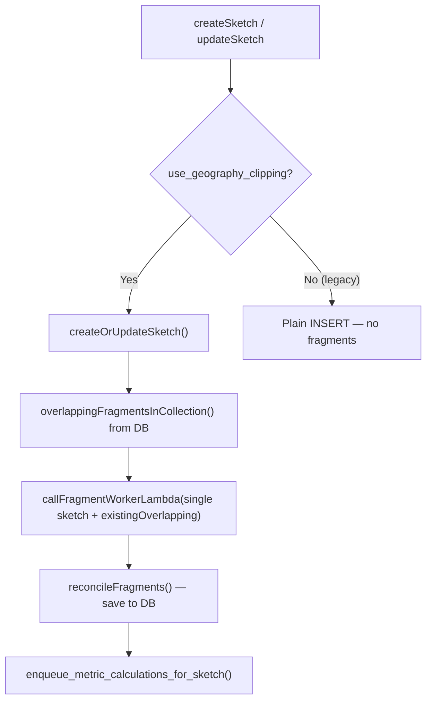
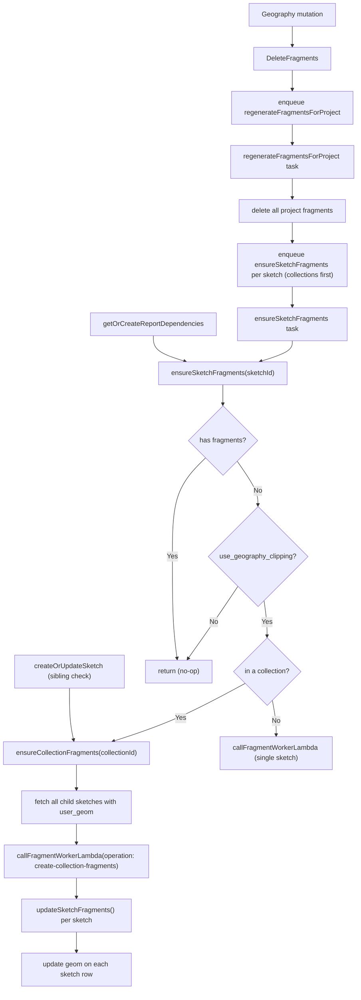

# On-Demand Collection Fragment Generation

## System State Today

The existing `[fragment-worker` Lambda](packages/fragment-worker/src/handler.ts) (`packages/fragment-worker/`) is invoked synchronously from `[sketches.ts](packages/api/src/sketches.ts)` via `callFragmentWorkerLambda()` during `createOrUpdateSketch`. It handles **one sketch at a time**:



For legacy projects that are now switching to geography clipping, sketches were saved without fragments. The trigger points below cover when fragments may be missing and need to be generated synchronously.

## Reporting Configuration: Legacy, New, and Transition

To support migrating from seasketch/geoprocessing and services-based clipping to the new geography-fragments and report builder, sketch classes get a second setting alongside the existing geography-clipping flag:

- `**use_geography_clipping**` (existing) — When true, the new clipping and fragment pipeline is used for create/update; all reporting uses the new report builder and fragments.
- `**preview_new_reports**` (new) — When true and `use_geography_clipping` is false, the **primary** clipping path stays legacy (geoprocessing services); the new report builder is available **only to admins** so they can verify reports before full cutover.

**Three mutually exclusive options** in the admin sketch-class settings (replacing the current single "Enable New Reporting System" toggle):

| Option                                                  | use_geography_clipping | preview_new_reports | Behavior                                                                                                                                                                                                                                                                                                                      |
| ------------------------------------------------------- | ---------------------- | ------------------- | ----------------------------------------------------------------------------------------------------------------------------------------------------------------------------------------------------------------------------------------------------------------------------------------------------------------------------- |
| **Use seasketch/geoprocessing reports**                 | false                  | false               | Geoprocessing Framework services clip and report; no fragments, no new report builder.                                                                                                                                                                                                                                        |
| **Use the new reporting system**                        | true                   | —                   | Graphical report builder and geography-based fragments for everyone; create/update use fragment pipeline.                                                                                                                                                                                                                     |
| **Transition from geoprocessing to new Report builder** | false                  | true                | Geoprocessing used for preprocessing and reporting for all users. New report builder and fragment-based reports available to **admins only**; admins get a right-click "Preview New Reports" action on sketches/collections to open and verify the new reports (fragments generated on demand when an admin loads a preview). |

**Implementation implications:**

- **Database:** Add `preview_new_reports boolean NOT NULL DEFAULT false` to `sketch_classes`; expose on GraphQL (e.g. `previewNewReports`).
- **API sketchingPlugin:** Create/update sketch logic is unchanged: only when `use_geography_clipping` is true do we run the fragment path; when `preview_new_reports` is true alone, we keep using legacy preprocessing and no fragments on save.
- **API:** No server-side access control for preview reports; the "Preview New Reports" entry point is client-only (context menu visible only to admins). When an admin does open the preview, the existing report-dependencies path runs and calls `ensureSketchFragments`; that function must treat "should generate fragments?" as `use_geography_clipping OR preview_new_reports` so preview loads still generate fragments on demand.
- **Client admin UI:** In `[SketchClassForm.tsx](packages/client/src/admin/sketchClasses/SketchClassForm.tsx)`, replace the single "Enable New Reporting System" switch with a "Preprocessing and Reporting Settings" block and three radio options (copy from the user's wording). Persist via existing `ToggleSketchClassGeographyClipping`-style mutation plus a new mutation or patch field for `preview_new_reports`.
- **Client sketch context menu:** In `[SketchUIStateContextProvider.tsx](packages/client/src/projects/Sketches/SketchUIStateContextProvider.tsx)` (where `getMenuOptions` builds "View Reports"), when the selected sketch's class has `preview_new_reports` and not `use_geography_clipping`, and the user is an admin, add a "Preview New Reports" context menu item that opens the new report builder for that sketch (same flow as "View Reports"). Hide this item for non-admins (client-only; no server-side lockout). When `use_geography_clipping` is true, keep showing "View Reports" for everyone.

## The Core Challenge: Collections Require Whole-Collection Processing

A sketch inside a collection cannot be fragmented in isolation — its geometry must be de-overlapped against all siblings. So the primitive needed in all four scenarios is:

> "Given a sketch ID, if it lacks fragments and uses geography clipping, generate fragments for it **and all its siblings** (if it's in a collection), then store them."

## Two-Phase Parallelism in the Lambda

The existing `handleCreateFragments` in `[handler.ts](packages/fragment-worker/src/handler.ts)` calls `clipToGeographies` which internally:

1. Calls `createFragments` (geography clipping — I/O bound, parallelizable across sketches via `Promise.all`)
2. Calls `eliminateOverlap` (stateless overlap decomposition — O(n²) CPU, but can be run once across all sketches)

A new `handleCreateCollectionFragments` operation can exploit this:

```typescript
// Phase 1: parallel geography clipping for all sketches
const allFragmentSets = await Promise.all(sketches.map((s) => createFragments(prepareSketch(s.feature), geographies, clippingFn)));
// Tag each set with __sketchIds
const allSketchFragments = allFragmentSets.flatMap((frags, i) =>
  frags.map((f) => ({
    ...f,
    properties: { ...f.properties, __sketchIds: [sketches[i].id] },
  })),
);
// Phase 2: single overlap elimination pass
const collectionFragments = eliminateOverlap(allSketchFragments, []);
// Group back by sketch ID for the API to store
return groupFragmentsBySketchId(collectionFragments, sketchIds);
```

This replaces N sequential Lambda calls with 1 call that parallelizes all FGB reads internally. The Lambda is already configured with 2 min timeout and 10GB RAM (`FragmentWorkerLambdaStack.ts`), which is appropriate.

## Changes Required

### 1. `packages/fragment-worker/src/handler.ts` — New collection operation

Add `CreateCollectionFragmentsPayload` and `handleCreateCollectionFragments`:

```typescript
export interface CreateCollectionFragmentsPayload {
  operation: "create-collection-fragments";
  sketches: Array<{ id: number; feature: Feature<any> }>;
  geographies: GeographySettings[];
  geographiesForClipping: number[];
}

export interface CreateCollectionFragmentsResult {
  success: boolean;
  fragmentsBySketchId?: Record<number, FragmentResult[]>;
  error?: string;
}
```

### 2. `packages/fragment-worker/src/lambda.ts` — Route the new operation

```typescript
if (event.operation === "create-collection-fragments") {
  return await handleCreateCollectionFragments(event);
}
```

### 3. `packages/api/src/sketches.ts` — Two new shared functions

`**ensureCollectionFragments(collectionId, projectId, pgClient)**`

- Fetches all child sketches with `user_geom` (skip those without geometry / sub-collections)
- Fetches `GeographySettings[]` and `geographiesForClipping` for the sketch class (same DB query used in `createOrUpdateSketch`)
- Invokes Lambda with `operation: "create-collection-fragments"`
- For each sketch in `fragmentsBySketchId`: clears old fragments (full deletion scope) and calls `updateSketchFragments()`
- Updates `geom` column on each sketch row (the union of its new fragments)

`**ensureSketchFragments(sketchId, projectId, pgClient): Promise<string[]>**`

- Calls `get_fragment_hashes_for_sketch(sketchId)` — if non-empty, **returns hashes immediately** (fast path, no generation needed)
- Resolves `use_geography_clipping` and `preview_new_reports` from the sketch class — if both are false, returns `[]` (no fragment path for legacy-only classes; preview path is gated by report access so we only get here when at least one is true)
- Resolves parent collection via `get_parent_collection_id`
- If in a collection → `ensureCollectionFragments(collectionId, ...)`, then returns the hashes for `sketchId` from the result
- If standalone → invokes existing single-sketch Lambda path, returns the resulting fragment hashes
- **Return type `string[]`** — always the current fragment hashes for `sketchId`, whether freshly generated or already stored

### 4. Three Trigger Points

**Trigger A — `getOrCreateReportDependencies` and `draftReportDependencies` (`[reportsPlugin.ts](packages/api/src/plugins/reportsPlugin.ts)`)**

Replace the `getFragmentHashesForSketch` call with `ensureSketchFragments`, which subsumes it:

```typescript
// Before:
const fragments = sketchId ? await getFragmentHashesForSketch(sketchId, pool) : [];

// After:
const fragments = sketchId ? await ensureSketchFragments(sketchId, projectId, pgClient) : [];
```

`ensureSketchFragments` returns hashes on the fast path (fragments already exist) without an extra round-trip, and generates + returns them if they were missing. `getFragmentHashesForSketch` is no longer called in this path.

**Trigger B — `createOrUpdateSketch` (`[sketches.ts](packages/api/src/sketches.ts)`)**

After resolving `collectionId` and before fetching `overlappingFragmentsInCollection`, check if any collection siblings are missing fragments:

```typescript
if (collectionId) {
  const { rows } = await pgClient.query(
    `select id from sketches where collection_id = $1 and id != $2
     and not exists (select 1 from sketch_fragments where sketch_id = sketches.id)
     and geom is not null`,
    [collectionId, sketchId ?? -1],
  );
  if (rows.length > 0) {
    await ensureCollectionFragments(collectionId, projectId, pgClient);
  }
}
```

This prevents the current sketch's overlap elimination from running against incomplete fragment data.

**Trigger C — Geography configuration change (`[GeographyPlugin.ts](packages/api/src/plugins/GeographyPlugin.ts)`)**

When a geography's clipping layers are mutated (create, update, delete geography):

1. Delete all `sketch_fragments` rows (and orphaned `fragments`) for sketch classes in the project whose geographies changed
2. Optionally (behind a feature flag or env var): enqueue a single `regenerateFragmentsForProject` job:

```typescript
await addJob("regenerateFragmentsForProject", { projectId }, { jobKey: `regenerate-fragments:${projectId}` });
```

### 5. `packages/api/tasks/ensureSketchFragments.ts` — New graphile-worker task

The per-sketch background job. Acts as a no-op if fragments already exist (the fast path in `ensureSketchFragments`):

```typescript
export default async function ensureSketchFragmentsTask(payload: { sketchId: number; projectId: number }, helpers: Helpers) {
  await helpers.withPgClient(async (client) => {
    await ensureSketchFragments(payload.sketchId, payload.projectId, client);
  });
}
```

Jobs are enqueued with:

- `jobKey: \`fragments:sketch:${sketchId}` — prevents duplicate jobs for the same sketch
- `queueName: "sketch-fragments"` — places the job on a dedicated serial queue, separate from metric calculations, data uploads, and other task types

### 6. `packages/api/tasks/regenerateFragmentsForProject.ts` — New graphile-worker task

Orchestrates a full project-wide fragment regeneration after geography config changes:

```typescript
export default async function regenerateFragmentsForProject(payload: { projectId: number }, helpers: Helpers) {
  await helpers.withPgClient(async (client) => {
    // Step 1: Delete sketch_fragments rows for this project, capturing the
    // dereferenced hashes so we can clean up now-orphaned fragments efficiently.
    const { rows: deletedRefs } = await client.query(
      `
      delete from sketch_fragments
      where sketch_id in (
        select s.id from sketches s
        join sketch_classes sc on sc.id = s.sketch_class_id
        where sc.project_id = $1
      )
      returning fragment_hash
    `,
      [payload.projectId],
    );

    // Step 2: Delete fragments that were just dereferenced and are no longer
    // referenced by any remaining sketch_fragments row. We only look at hashes
    // we actually deleted, avoiding a full-table scan on fragments.
    if (deletedRefs.length > 0) {
      const hashes = deletedRefs.map((r: any) => r.fragment_hash);
      await client.query(
        `
        delete from fragments
        where hash = any($1::text[])
          and not exists (
            select 1 from sketch_fragments sf
            where sf.fragment_hash = fragments.hash
          )
      `,
        [hashes],
      );
    }

    // Step 4: Fetch all sketches ordered so collections come first.
    // Child sketches will be no-ops once their parent collection is processed.
    const { rows } = await client.query(
      `
      select s.id
      from sketches s
      join sketch_classes sc on sc.id = s.sketch_class_id
      where sc.project_id = $1
        and sc.use_geography_clipping = true
        and s.geom is not null
      order by
        case when sc.geometry_type in ('COLLECTION', 'FILTERED_PLANNING_UNITS')
          then 0 else 1 end asc,
        s.id asc
    `,
      [payload.projectId],
    );

    // Step 5: Enqueue one ensureSketchFragments job per sketch on the
    // serial "sketch-fragments" queue, preserving collection-first ordering
    for (const row of rows) {
      await helpers.addJob(
        "ensureSketchFragments",
        { sketchId: row.id, projectId: payload.projectId },
        {
          jobKey: `fragments:sketch:${row.id}`,
          queueName: "sketch-fragments",
        },
      );
    }
  });
}
```

**Queue design**: All `ensureSketchFragments` jobs share the `"sketch-fragments"` named queue. Graphile-worker processes named queues with a concurrency of 1, so jobs execute sequentially in enqueue order without blocking other task types. Because collections are enqueued before their children, each collection is fully processed — Lambda called, all child fragments stored — before any child's job dequeues, making child jobs cheap no-ops. The serial queue also naturally rate-limits Lambda invocations without additional throttling.

## Flow Summary



## What Existing Functions Can Be Reused

- `overlappingFragmentsInCollection` — not needed for collection-from-scratch; still used in the normal `createOrUpdateSketch` path
- `reconcileFragments` — still used in `createOrUpdateSketch` for the incremental case; collection-from-scratch bypasses it and calls `updateSketchFragments` directly
- `getFragmentsForSketch` / `getFragmentHashesForSketch` — used in `ensureSketchFragments` as the existence check
- `updateSketchFragments` — directly reused in `ensureCollectionFragments` for storing results
- `callFragmentWorkerLambda` — reused for the standalone-sketch path; extended for the collection path

## Performance Expectations

- Single standalone sketch: ~1–3s (existing Lambda path, unchanged)
- Small collection (5–15 sketches): ~2–5s (one Lambda call, FGB reads parallelized internally)
- Medium collection (30–50 sketches): ~5–15s (still one Lambda call; `decomposeFragments` O(n²) is the bottleneck)
- Large collection (100+ sketches): may exceed 5s; consider chunking or accepting the latency for the first report request after migration

The Lambda has a 2-minute timeout and 10GB RAM — collections up to ~100 sketches should be feasible.

---

## Manual Tests for Legacy-to-New-Reporting Migration

These tests cover all four trigger scenarios using a project that was created under the old clipping/geoprocessing system (sketches have `geom` but no `sketch_fragments` rows) and has now been configured with geographies and `use_geography_clipping = true`.

### Setup

Before running any tests, prepare a test project with the following state:

- At least one sketch class that will use the new reporting path: either `use_geography_clipping = true` (full new) or `preview_new_reports = true` with `use_geography_clipping = false` (transition; admins only). The class must have a configured geography for fragment generation.
- Several existing sketches saved under the old system: `geom IS NOT NULL` but no rows in `sketch_fragments` for these sketches
- A mix of:
  - Solo sketches (no `collection_id`)
  - At least two collections, each with 3+ child sketches
  - At least one collection whose children have overlapping geometries

You can verify the "no fragments" precondition with:

```sql
select s.id, s.name from sketches s
join sketch_classes sc on sc.id = s.sketch_class_id
where sc.project_id = <id>
  and sc.use_geography_clipping = true
  and not exists (select 1 from sketch_fragments sf where sf.sketch_id = s.id);
```

---

### Test 1 — Report requested for a solo sketch with no fragments

**Steps:**

1. Confirm a solo legacy sketch has no `sketch_fragments` rows
2. Open the sketch and request its report (triggers `getOrCreateReportDependencies`)

**Expected:**

- The report request does not immediately error or return empty metrics
- Fragments are generated synchronously before the response returns
- `sketch_fragments` rows now exist for the sketch
- The report loads with populated metrics
- Response time is within ~1–3 seconds

---

### Test 2 — Report requested for a sketch inside a collection with no fragments

**Steps:**

1. Confirm a collection and all its children have no `sketch_fragments` rows
2. Open any single child sketch and request its report

**Expected:**

- `ensureSketchFragments` detects the sketch is in a collection and calls `ensureCollectionFragments`
- Fragments are generated for **all children** in the collection, not just the requested sketch
- `sketch_fragments` rows exist for every child after the response returns
- For children with overlapping geometries, the fragments correctly split along overlap boundaries (verify with a geometry viewer or DB query on fragment `sketch_ids`)
- The report loads with correct metrics
- The second request for any sibling sketch returns instantly (fast-path no-op)

---

### Test 3 — Report requested for the collection sketch itself (not a child)

**Steps:**

1. Confirm the collection sketch row has no `sketch_fragments` rows
2. Open the collection and request its report (sketchId = the collection's row id)

**Expected:**

- `ensureSketchFragments` is called with the collection's own sketch ID
- It detects `use_geography_clipping = true` and that the sketch is itself a collection type
- Fragments are generated for all its children
- Metrics aggregate correctly across all children

---

### Test 3b — Transition mode: admin "Preview New Reports", hidden for non-admin

**Steps:**

1. Set a sketch class to **Transition** (preview_new_reports = true, use_geography_clipping = false); ensure sketches have no fragments.
2. As an **admin**, right-click a sketch and choose "Preview New Reports"; confirm the new report builder opens and fragments are generated on demand.
3. As a **non-admin**, open the same project and sketch; confirm there is no "Preview New Reports" context option and that the primary report remains the legacy geoprocessing report.

**Expected:**

- Admins see "Preview New Reports" in the context menu when the sketch class is in transition mode.
- Clicking it loads the new report and triggers `ensureSketchFragments`; fragments appear and metrics load.
- Non-admins do not see the preview action (client hides it); primary report flow is unchanged.

---

### Test 4 — Sketch edited while siblings in the collection have no fragments (Trigger B)

**Steps:**

1. Confirm a collection has children without fragments
2. Edit (update geometry) one child sketch via `updateSketch` mutation — this triggers `createOrUpdateSketch`

**Expected:**

- Before processing the updated sketch, `ensureCollectionFragments` is called for the whole collection
- All siblings receive fragments
- The updated sketch then goes through the normal incremental `createOrUpdateSketch` path on top of the now-populated sibling fragments
- No fragments from the edited sketch's pre-edit geometry bleed into the results
- `geom` on all child sketches is updated

---

### Test 5 — Geography configuration changed, background regeneration runs (Trigger C)

**Steps:**

1. Confirm several sketches have existing `sketch_fragments` rows (run some previous tests first)
2. Modify the project's geography (e.g. update a clipping layer's CQL2 filter or swap a clipping layer)
3. Observe the graphile-worker queue (query `graphile_worker.jobs` or watch server logs)

**Expected:**

- All `sketch_fragments` rows for the project are deleted immediately after the mutation
- Orphaned `fragments` rows with no remaining `sketch_fragments` references are also deleted
- A single `regenerateFragmentsForProject` job appears in the graphile-worker queue
- When processed, it enqueues `ensureSketchFragments` jobs on the `"sketch-fragments"` queue — collections first, then child sketches
- Jobs run sequentially on the `"sketch-fragments"` queue without blocking `calculateSpatialMetric` or other task types
- After all jobs complete, all sketches have new `sketch_fragments` rows reflecting the updated geography
- Old `spatial_metrics` that depended on the now-deleted fragment hashes are invalidated or absent (verify no stale metric rows reference the old hashes)

---

### Test 6 — Fast-path: sketch already has fragments (no-op)

**Steps:**

1. After Test 1 or 2 has run (so fragments exist), open the same sketch's report again

**Expected:**

- `ensureSketchFragments` returns immediately without invoking the Lambda
- Report loads with no additional delay
- No new rows appear in `sketch_fragments` (row count unchanged)

---

### Test 7 — Legacy sketch class (no geography clipping) is unaffected

**Steps:**

1. Open a sketch whose `sketch_class.use_geography_clipping = false` and request its report

**Expected:**

- `ensureSketchFragments` detects `use_geography_clipping = false` and returns `[]` immediately
- No Lambda invocation occurs
- No `sketch_fragments` rows are created
- The report falls back to whatever the legacy reporting path provides (or shows no metrics, depending on implementation)

---

### Test 8 — Overlapping geometry correctness check

**Steps:**

1. Create (or use existing) two sketches in a collection where sketch A and sketch B have significant geometric overlap
2. Trigger fragment generation (e.g. via a report request)
3. Query the resulting fragments:

```sql
select hash, sketch_ids, st_area(geometry::geography) as area_m2
from fragments f
join sketch_fragments sf on sf.fragment_hash = f.hash
where sf.sketch_id in (<id_A>, <id_B>)
order by array_length(sketch_ids, 1) desc;
```

**Expected:**

- Fragments in the overlap zone have `sketch_ids = [id_A, id_B]` (both sketches)
- Fragments outside the overlap zone have `sketch_ids = [id_A]` or `[id_B]` only
- The sum of area of fragments with `sketch_ids = [id_A]` equals the total area of sketch A clipped to the geography (within rounding)
- No fragment geometry overlaps another fragment geometry (verify with `ST_Intersects` check)
