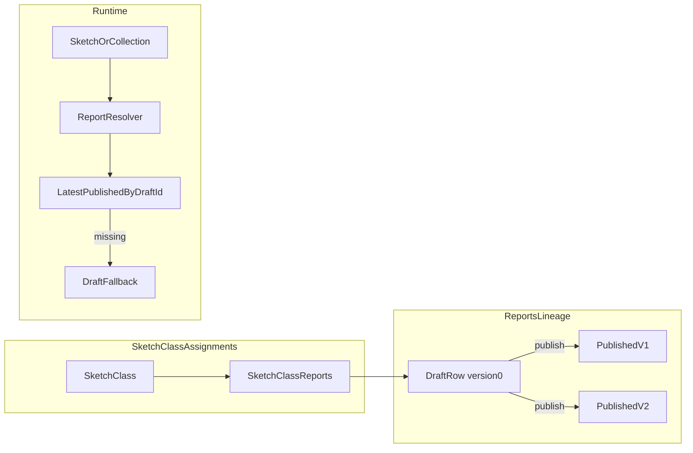

# Project-Level Reports Plan

## Goals

- Move report authoring from sketch-class tabs to a dedicated project Reports area.
- Support reusable report assignment across multiple sketch classes.
- Keep one canonical draft per report lineage and immutable published snapshots with retained history.
- Perform a single coordinated cutover (DB + API + client) while preserving existing project data.
- De-risk cutover with a production-safe client-only Phase 1 that re-roots report UI/state around `reportId`.

## Proposed Schema (Simplified)

- Extend existing `reports` table with lineage/version metadata:
  - `title text` (admin-visible report name)
  - `version int not null default 0`
  - `draft_id int null references reports(id)`
- Add constraint to enforce draft-id-nullability semantics:
  - `draft_id is null` only when `version = 0`
  - for published rows (`version > 0`), `draft_id` must be set
- Add `sketch_class_reports` assignment table:
  - `sketch_class_id int not null references sketch_classes(id)`
  - `draft_report_id int not null references reports(id)`
  - `is_primary boolean not null default true`
- Add indexes/uniques:
  - unique lineage version: `(draft_id, version)` (for non-null `draft_id`)
  - one primary assignment per sketch class
  - optional guard: one row per `(sketch_class_id, draft_report_id)`

## Delivery Phases

1. **Phase 1 (Client-only hardening release)**  
   Refactor report contexts/queries to use `reportId` as the primary anchor (plus `sketchId` where runtime dependencies require subject context), minimizing dependence on sketch-class-rooted data loading in React.
2. **Phase 2 (Schema + API cutover)**  
   Apply schema changes (`reports` lineage fields + `sketch_class_reports`), backfill data, and switch server/runtime resolution to assignment + lineage.
3. **Phase 3 (Legacy removal)**  
   Remove all code references to `sketch_classes.report_id`/`draft_report_id`; optionally keep columns briefly for rollback, then drop.

## Phase 1 Scope (Client-only Confidence Deployment)

- Refactor context entry points so report rendering/editing loads report structure by `reportId` directly when possible.
- Reduce `BaseReportContext` dependence on `sketchClassId`; split concerns into:
  - report-content context (`reportId`)
  - subject/sketch context (`sketchId`)
  - project/reporting layer context (project/report dependent)
- Update query usage in:
  - [`/Users/cburt/src/@seasketch/next/packages/client/src/reports/context/BaseReportContext.tsx`](/Users/cburt/src/@seasketch/next/packages/client/src/reports/context/BaseReportContext.tsx)
  - [`/Users/cburt/src/@seasketch/next/packages/client/src/projects/Sketches/SketchReportWindow.tsx`](/Users/cburt/src/@seasketch/next/packages/client/src/projects/Sketches/SketchReportWindow.tsx)
  - [`/Users/cburt/src/@seasketch/next/packages/client/src/admin/sketchClasses/SketchClassReportsAdmin.tsx`](/Users/cburt/src/@seasketch/next/packages/client/src/admin/sketchClasses/SketchClassReportsAdmin.tsx)
  - related operations in [`/Users/cburt/src/@seasketch/next/packages/client/src/queries/SketchClassAdmin.graphql`](/Users/cburt/src/@seasketch/next/packages/client/src/queries/SketchClassAdmin.graphql)
- Preserve idle-time report prefetch behavior (or improve it) in [`/Users/cburt/src/@seasketch/next/packages/client/src/projects/ReportPublishedDataPrefetch.tsx`](/Users/cburt/src/@seasketch/next/packages/client/src/projects/ReportPublishedDataPrefetch.tsx):
  - continue warming report context before report-open interaction
  - align prefetch targets with `reportId`-rooted context loading
  - maintain current dedupe/fingerprinting behavior to avoid extra network churn
- Keep behavior unchanged and avoid DB schema changes in this phase.
- Deploy to production as an isolated confidence release.

## Backend/API Workstreams

- Add migration SQL in [`/Users/cburt/src/@seasketch/next/packages/api/migrations/current.sql`](/Users/cburt/src/@seasketch/next/packages/api/migrations/current.sql) with:
  - `reports.title`, `reports.version`, `reports.draft_id`
  - `sketch_class_reports`
  - constraints/indexes for lineage and primary assignment
- Rewrite `publish_report` in [`/Users/cburt/src/@seasketch/next/packages/api/schema.sql`](/Users/cburt/src/@seasketch/next/packages/api/schema.sql):
  - publish clones draft content into new immutable `reports` row
  - sets `draft_id` to canonical draft row
  - increments version from max lineage version
  - does not delete historical published rows
- Replace or remove `create_draft_report` semantics:
  - either create standalone draft lineage row (`version = 0`)
  - or ensure existing draft row can be reused idempotently
- Update report dependency logic in [`/Users/cburt/src/@seasketch/next/packages/api/src/plugins/reportsPlugin.ts`](/Users/cburt/src/@seasketch/next/packages/api/src/plugins/reportsPlugin.ts):
  - draft-vs-published determination based on lineage/version
  - runtime resolver follows assignment -> latest published (fallback to draft when needed)
- Update GraphQL schema surface for:
  - project reports listing
  - create/delete draft lineages
  - assign/unassign primary report per sketch class
  - publish lineage and view version history
- Remove legacy field reliance in backend code paths and SQL functions:
  - eliminate logic that reads/writes `sketch_classes.report_id` / `draft_report_id`
  - replace any helper functions that infer draft state from those fields

## Frontend/Admin Workstreams

- Add top-level Reports route in admin navigation:
  - [`/Users/cburt/src/@seasketch/next/packages/client/src/admin/AdminApp.tsx`](/Users/cburt/src/@seasketch/next/packages/client/src/admin/AdminApp.tsx)
  - [`/Users/cburt/src/@seasketch/next/packages/client/src/admin/AdminRouter.tsx`](/Users/cburt/src/@seasketch/next/packages/client/src/admin/AdminRouter.tsx)
- Build Reports management page (list + editor entry), reusing current editor shell from [`/Users/cburt/src/@seasketch/next/packages/client/src/admin/sketchClasses/SketchClassReportsAdmin.tsx`](/Users/cburt/src/@seasketch/next/packages/client/src/admin/sketchClasses/SketchClassReportsAdmin.tsx) and [`/Users/cburt/src/@seasketch/next/packages/client/src/reports/ReportEditor.tsx`](/Users/cburt/src/@seasketch/next/packages/client/src/reports/ReportEditor.tsx).
- Update sketch class admin to assign primary report lineage in [`/Users/cburt/src/@seasketch/next/packages/client/src/admin/sketchClasses/SketchClassForm.tsx`](/Users/cburt/src/@seasketch/next/packages/client/src/admin/sketchClasses/SketchClassForm.tsx).
- Update runtime report selection from direct `sketchClass.reportId` lookup to assignment + lineage resolver:
  - [`/Users/cburt/src/@seasketch/next/packages/client/src/projects/Sketches/SketchUIStateContextProvider.tsx`](/Users/cburt/src/@seasketch/next/packages/client/src/projects/Sketches/SketchUIStateContextProvider.tsx)
  - [`/Users/cburt/src/@seasketch/next/packages/client/src/projects/ReportPublishedDataPrefetch.tsx`](/Users/cburt/src/@seasketch/next/packages/client/src/projects/ReportPublishedDataPrefetch.tsx)
  - related GraphQL queries in [`/Users/cburt/src/@seasketch/next/packages/client/src/queries/SketchClassAdmin.graphql`](/Users/cburt/src/@seasketch/next/packages/client/src/queries/SketchClassAdmin.graphql) and [`/Users/cburt/src/@seasketch/next/packages/client/src/queries/ProjectMetadata.graphql`](/Users/cburt/src/@seasketch/next/packages/client/src/queries/ProjectMetadata.graphql).
- Remove client/query usage of legacy sketch-class report pointers entirely before branch completion.

## Phase 1 Exit Criteria

- No behavior regressions in report runtime/editing UX.
- Context/query architecture uses `reportId` as canonical report content identifier in client state flow.
- Idle-time prefetch still primes report-open path effectively (no noticeable first-open latency regression).
- Production deployment succeeds without DB migration.
- Follow-up schema cutover PR can focus on data model/API changes with lower UI-state risk.

## Draft/Published + Versioning Rules (First Cut)

- One mutable draft row per lineage (`version = 0`).
- Publish creates new immutable row with incremented version and shared `draft_id`.
- Runtime uses latest published for end users.
- If no published rows exist for lineage, resolver falls back to draft.
- Keep historical published versions queryable/read-only.

## Future-Expansion Hooks (Design Now, Defer UX)

- Assignment table allows non-primary types later (e.g., supplemental reports).
- Add optional visibility policy fields for future ACL-controlled supplemental reports.
- Keep runtime resolver API shape flexible (`primary`, `supplemental[]`) while implementing only primary in first cut.

## Data Translation Rules

- Existing `sketch_classes.draft_report_id` becomes canonical lineage draft where present.
- If class has only `report_id`, create/derive draft lineage row (`version = 0`) and map prior published row into lineage with `draft_id` and `version >= 1`.
- Create one `sketch_class_reports` primary assignment per sketch class to canonical draft lineage.
- Derive initial `title` from first report tab/title heuristics when missing.

## Validation Plan

- DB migration tests: constraint validity, lineage uniqueness, backfill correctness.
- API tests: publish version increments, assignment resolution, draft fallback behavior, permissions.
- UI tests: report list/edit/publish flows, sketch class assignment, runtime rendering for sketch + collection subjects.
- Regression checks: existing projects migrate cleanly and reports render as expected post-cutover.
- Static verification: repository-wide search confirms no feature-branch code references `sketch_classes.report_id` / `draft_report_id` after cutover.
- Phase 1 validation: client-only release verifies report-id-rooted contexts under production load before schema/API migration.
- Prefetch validation: idle scheduler/fingerprint logic still suppresses redundant queries while warming required report context.
