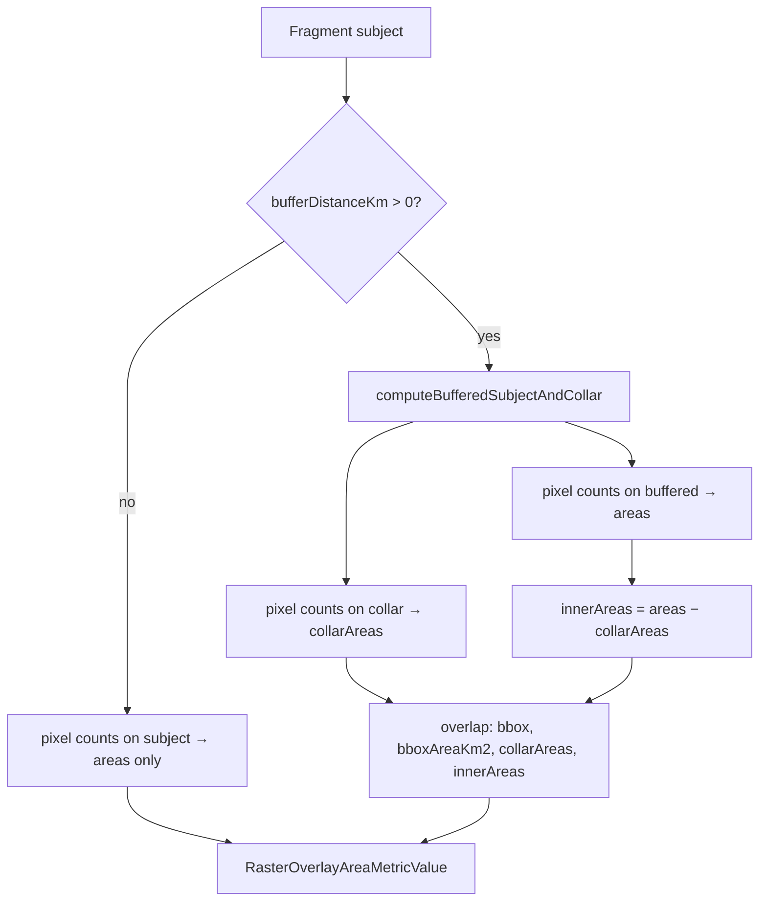

# RasterAreaCaptured Widget + raster_overlay_area Metric

## Decision summary

- **New metric type `raster_overlay_area`**, computed in the overlay worker. Auto-VRM is fragment-local and discarded by `combineRasterBandStats`, so area must be converted to km² at calculation time. New type ⇒ new dependency hashes; existing `raster_stats` rows stay untouched.
- **Nested value shape** (not flat like `overlay_area`): `areas` map plus optional audit fields and nested `overlap` metadata for buffering. Nesting keeps class totals as plain numbers while leaving room for collar/combine payloads without reserved `__` keys mixed into the map.
- **No `excludedValues` parameter.** GeoBlaze already drops nodata. Hiding/excluding class keys such as `0` is a **client/row** concern (`s:excluded`, row settings), not part of the metric contract or hash.
- **Categorical mode:** `parameters.groupBy === "value"` ⇒ per-class keys from rounded pixel values; omit `groupBy` ⇒ only `"*"`.
- **Buffering:** reuse `bufferDistanceKm` + collar/bbox geometry from buffered `overlay_area`, but **without per-feature `oidx`**. Uncertainty uses a **documented proportional estimate** from (inner vs collar habitat) × (bbox overlap intensity), with hard geometric ceilings. Silence when potential overlap is nil/tiny; explainable tooltips only for sketch pairs whose collars both hit the source.
- **Independent fixtures:** expected km² from a GDAL/`rio` one-off script (not overlay-engine), committed as JSON for regression tests.

## Locked TypeScript contract

All of this lands in [`packages/overlay-engine/src/metrics/metrics.ts`](packages/overlay-engine/src/metrics/metrics.ts) (and is re-exported from [`packages/overlay-engine/src/index.ts`](packages/overlay-engine/src/index.ts)).

### Metric type + value

```ts
export type MetricType = "total_area" | "overlay_area" | "count" | "presence" | "presence_table" | "column_values" | "raster_stats" | "distance_to_shore" | "raster_overlay_area";

/**
 * Per-class area totals in km².
 * - "*" = all valid pixels in the subject (nodata already excluded by geoblaze).
 * - When dependency.parameters.groupBy === "value", additional keys are
 *   String(Math.round(pixelValue)) for each distinct value present.
 */
export type RasterOverlayAreaAreas = {
  [classKey: string]: number;
};

/**
 * Fragment-only metadata when bufferDistanceKm > 0 on a fragment subject.
 * Aggregate-only (no oidx): rasters have no feature identity.
 *
 * Geometry fact (same as overlay_area): for disjoint fragments A,B,
 * buffer(A,d) ∩ buffer(B,d) ⊆ collar(A). Buffered interiors are pairwise
 * disjoint; only collar pixels can double-count.
 *
 * Identity: areas[k] === innerAreas[k] + collarAreas[k] (within float error).
 */
export type RasterOverlayAreaOverlapInfo = {
  bufferKm: number;
  /** Bounding box of the buffered subject (WGS84). */
  bbox: [number, number, number, number];
  /** Geodesic area of `bbox` as a polygon (km²). Used for overlap intensity. */
  bboxAreaKm2: number;
  /** Per-class area (km²) inside the collar. */
  collarAreas: RasterOverlayAreaAreas;
  /** Per-class area (km²) inside the eroded interior (= areas − collar). */
  innerAreas: RasterOverlayAreaAreas;
};

/**
 * One source-positive buffered pair that contributes to uncertainty.
 * "Source-positive" = both collars have habitat for at least one class
 * (bbox-only overlap with empty collars is ignored — who cares).
 */
export type RasterOverlayAreaOverlapPair = {
  /**
   * Fragment identity / sketch ids are OPTIONAL because
   * combineMetricsForFragments only receives Pick<Metric, "type" | "value">.
   * The engine combine fills pair indexes + numbers; a separate helper
   * (attachRasterOverlayAreaOverlapScope, mirroring
   * classifyOverlayAreaOverlapScope) is called client-side with full metrics
   * (subjects) to fill hashes/sketch ids for tooltips.
   */
  fragmentHashA?: string;
  fragmentHashB?: string;
  /** Sketch ids from each fragment subject (for collection tooltips). */
  sketchIdsA?: number[];
  sketchIdsB?: number[];
  /** Indexes into the combined fragment array (stable across combine). */
  indexA: number;
  indexB: number;
  /** Geodesic area (km²) of bboxA ∩ bboxB. */
  bboxOverlapKm2: number;
  /**
   * λ = bboxOverlapKm2 / min(bboxAreaA, bboxAreaB), clamped to [0, 1].
   * Fraction of the smaller buffered bbox that overlaps the other.
   */
  overlapIntensity: number;
  perClass: {
    [classKey: string]: {
      collarA: number;
      collarB: number;
      /** U = min(collarA, collarB) — hard geometric ceiling for this pair. */
      hardMax: number;
      /** Ê = U × λ — proportional estimate (uniform collar-habitat assumption). */
      estimate: number;
    };
  };
};

/**
 * Combine-time result. Omitted entirely when there are no source-positive
 * intersecting pairs (exact sum — user must not see warnings).
 *
 * Display: shown value = naiveSum − overcountMin (= naive; min is 0).
 * Error bar: [naiveSum − overcountMax, naiveSum − overcountMin].
 * Central explainable estimate: overcountEstimate (tooltip copy).
 *
 * Warning gate (widget): show BufferedOverlapWarning-style UI only when
 * overcountEstimate / naiveSum ≥ 10% for that class (not merely hardMax).
 * Tiny λ ⇒ silence even if collars are large.
 */
export type RasterOverlayAreaOverlapCombineResult = {
  flagged: boolean;
  scope?: "within-sketch" | "between-sketches" | "both";
  /** Sketches that participate in ≥1 source-positive overlapping pair. */
  partnerSketchIds?: number[];
  fragmentsInvolved?: string[];
  /** Per-pair detail for sketch-level explanatory tooltips. */
  pairs: RasterOverlayAreaOverlapPair[];
  perClass: {
    [classKey: string]: {
      overcountMin: number; // always 0 without pixel identity
      overcountMax: number; // aggregated hard ceiling (see method doc)
      overcountEstimate: number; // aggregated proportional estimate
      naiveSum: number;
      collarSum: number; // Σ collarAreas across fragments
      innerSum: number; // Σ innerAreas across fragments
    };
  };
};

export type RasterOverlayAreaMetricValue = {
  areas: RasterOverlayAreaAreas;
  /** Resolved VRM for this calculation, or null when disabled. Audit only. */
  vrm?: [number, number] | null;
  /** Source raster EPSG. Audit only. */
  epsg?: number;
  /**
   * Fragment rows: RasterOverlayAreaOverlapInfo when buffered.
   * Combined rows: RasterOverlayAreaOverlapCombineResult when residual/overcount
   * bounds were computed. Omitted for unbuffered exact sums.
   */
  overlap?: RasterOverlayAreaOverlapInfo | RasterOverlayAreaOverlapCombineResult;
};

export type RasterOverlayAreaMetric = OverlayMetricBase & {
  type: "raster_overlay_area";
  value: RasterOverlayAreaMetricValue;
};

// Metric union + MetricTypeMap gain raster_overlay_area → RasterOverlayAreaMetric
```

Type guards (same defensive pattern as `isOverlayAreaOverlapInfo`):
`isRasterOverlayAreaOverlapInfo`, `isRasterOverlayAreaOverlapCombineResult`, plus helpers `getRasterOverlayAreaOverlapInfo` / `getRasterOverlayAreaOverlapCombineResult` / `getRasterOverlayAreaDisplayedClassValue`.

### MetricDependencyParameters (additions / docs only)

No new parameter field for exclusions. Document raster-specific use of existing fields:

```ts
export type MetricDependencyParameters = {
  /**
   * Vector metrics: attribute name to group by.
   * raster_overlay_area: set to "value" to group by rounded pixel value;
   * omit for a single "*" total only.
   */
  groupBy?: string;

  // ...existing includedColumns, valueColumn, maxResults, maxDistanceKm,
  // sourceHasOverlappingFeatures, sketchClasses unchanged...

  /**
   * Buffer distance (km) around the subject. Used by overlay_area,
   * column_values, count, presence*, and raster_overlay_area.
   * For raster_overlay_area on fragment subjects, enables collar overlap
   * metadata (RasterOverlayAreaOverlapInfo). Geography subjects never
   * attach overlap metadata (same gate as overlay_area).
   */
  bufferDistanceKm?: number;

  /**
   * Virtual resampling for raster_stats and raster_overlay_area.
   * @default "auto" for fragment subjects, false for geography subjects
   */
  vrm?: false | "auto" | number;
};
```

Example dependencies the widget will insert:

```ts
// Categorical (substrate):
{ type: "raster_overlay_area", subjectType: "fragments", stableId, parameters: { groupBy: "value", vrm: "auto" } }
{ type: "raster_overlay_area", subjectType: "geographies", stableId, parameters: { groupBy: "value", vrm: false } }

// Ungrouped binary/continuous presence area (mangroves as single total):
{ type: "raster_overlay_area", subjectType: "fragments", stableId, parameters: { vrm: "auto" } }
{ type: "raster_overlay_area", subjectType: "geographies", stableId, parameters: { vrm: false } }

// Optional buffer (admin tooltip), hashed via existing bufferDistanceKm:
{ ..., parameters: { groupBy: "value", bufferDistanceKm: 1, vrm: "auto" } }
```

## Buffering / uncertainty model (documented method)

This section is the source of truth for implementation comments + tooltip copy.

### Why buffering creates error

Unbuffered fragments are pairwise disjoint ⇒ per-key sum of `areas` is exact.

With `bufferDistanceKm > 0`, each fragment is expanded. Sibling buffers can cover the same ground, so summing fragment totals **double-counts** habitat in `buffer(A) ∩ buffer(B)`.

Geometry (same collar theorem as `overlay_area`):

- Collar = `buffer(subject,d) − erode(subject,d)` (whole buffer if erode empty)
- `buffer(A) ∩ buffer(B) ⊆ collar(A)` (and ⊆ collar(B))
- Therefore **inner** habitat (`areas − collarAreas`) never double-counts across fragments
- Only **collar** habitat can be overcounted; overcount for a pair/class is exactly the class area in `collarA ∩ collarB` (unknown without a third raster pass on the intersection)

### Fragment production



Worker path mirrors buffered `overlay_area` in [`overlay-worker.ts`](packages/overlay-worker/src/overlay-worker.ts). Geography subjects may buffer geometry but **never** attach `overlap`.

### Combine: proportional estimate

Inputs: fragment values with `overlap: RasterOverlayAreaOverlapInfo`, plus fragment `subject` (for sketch ids / scope).

**Step 0 — silence gates (do these first):**

1. Fewer than 2 fragments with overlap info → ordinary per-key sum; **omit** combine `overlap`.
2. Build candidate pairs whose buffered bboxes intersect (`bbox` overlap test).
3. Drop any pair that is not **source-positive** for any class: for class `k`, require `collarA[k] > ε` and `collarB[k] > ε` (ε ≈ 0, or a tiny km² floor). Pure spatial bbox overlap with empty collars on the layer → **ignore** (no habitat at risk).
4. If no source-positive pairs remain → ordinary sum; **omit** combine `overlap`. User sees nothing about uncertainty.

**Step 1 — per source-positive pair:**

Let `I = area_km2(bboxA ∩ bboxB)` (bbox corners as a polygon; geodesic/`@turf/area`).

```
λ = clamp(I / min(bboxAreaKm2_A, bboxAreaKm2_B), 0, 1)
```

`λ` is “what fraction of the smaller buffered extent overlaps the other.” Cheap, explainable, no collar geometry required.

For each class `k` with both collars &gt; ε:

```
U  = min(collarA[k], collarB[k])     // hard ceiling (geometry)
Ê  = U × λ                            // proportional estimate
```

**Assumption (state in tooltips):** habitat in each collar is treated as spatially uniform across that fragment’s buffered bbox. Then the share of each collar that can sit in the bbox overlap is ≈ λ, so shared habitat ≈ `U × λ`. True overcount is always in `[0, U]`; `Ê` is the explainable central estimate inside that range.

**Step 2 — aggregate pairs → perClass** (avoid overstating multi-fragment triples):

For each class `k`:

```
naiveSum   = Σ areas[k]
collarSum  = Σ collarAreas[k]
innerSum   = Σ innerAreas[k]          // == naiveSum − collarSum
overcountMin = 0
overcountMax = max_over_pairs(U_k)    // hard ceiling used for error-bar high side
overcountEstimate = max_over_pairs(Ê_k)  // same pairwise-max pattern as overlay_area truncation residual
```

Cap both max and estimate at `min(naiveSum, collarSum)` (cannot overcount more collar than exists).

Using **max** over pairs (not sum) keeps 3-way bbox clusters from inventing impossible stacked overcount. Document this choice next to the code.

**Step 3 — flagged + partners:**

- `flagged` = any class with `overcountEstimate / naiveSum ≥ 0.10`
- `pairs` = full per-pair records with `indexA`/`indexB` (for tooltips)
- Engine combine (`combineMetricsForFragments` path) has **no subjects**, so it emits pairs with indexes + numbers only. Client code (which has full metrics, like `ClassTableRows.ts` does for overlay_area at line ~512) calls `attachRasterOverlayAreaOverlapScope(combined, metricsWithSubjects)` to fill `fragmentHashA/B`, `sketchIdsA/B`, `partnerSketchIds`, and `scope` — restricted to pairs that survived Step 0.

**Step 4 — displayed values:**

- Table cell = `naiveSum − overcountMin` (= naive)
- Error bar / tooltip range = `[naiveSum − overcountMax, naiveSum]`
- Tooltip also states estimate: “about `overcountEstimate` km² may be double-counted”

### UX rules (non-negotiable)

1. **No overlap metadata, no warning, no copy** when silence gates fire — including “bboxes touch but collars empty on this layer.”
2. **Warning icon** only when `overcountEstimate / naiveSum ≥ 10%` (extend [`BufferedOverlapWarning`](packages/client/src/reports/widgets/BufferedOverlapWarning.tsx) or a thin raster-specific wrapper that gates on estimate, not raw hardMax). HardMax still feeds the numeric range so the bar stays honest when λ is high.
3. **Sketch-level tooltips** (collection expand / partner chips): list partner sketch names from `pairs` where that sketch appears and `estimate > 0` for the row’s class. Copy shape:

   > “Buffers of _A_ and _B_ overlap (λ = 25% of the smaller buffer extent). Of collar habitat at risk (U = 0.04 km²), an estimated 0.01 km² may be counted twice. Interior captures cannot double-count.”

4. Admin `BufferDistanceField` blurb: buffers pull in habitat outside the sketch; when neighboring sketches’ buffers overlap on this layer, totals may include a small double-count — we’ll flag it only when the estimated overlap is material.

### Worked micro-example (for unit tests)

- Fragments A,B; class `"1"`
- `areas: 10` each, `collarAreas: 2` each, `innerAreas: 8` each → `naiveSum = 20`, `collarSum = 4`, `innerSum = 16`
- `bboxAreaA = bboxAreaB = 100`, `bboxOverlap = 25` → `λ = 0.25`
- `U = min(2,2) = 2`, `Ê = 2 × 0.25 = 0.5`
- Display 20; range 18–20; estimate 0.5 (2.5% of naive) → **no warning** (&lt; 10%)
- Same with `collarAreas: 8` each → `U = 8`, `Ê = 2`, estimate 10% of 20 → **warn**; partners A,B named in tooltip

If collars are `{ "1": 0 }` on B → pair dropped → no `overlap` on combine result.

## Area math + calculation rules

Per fragment (and per collar pass):

`areaKm2(class) = pixelCount(class) × mX × mY / (xVrm × yVrm) / 1e6`

`mX`/`mY` from existing [`groundPixelDimensionsMeters`](packages/overlay-engine/src/rasterStats.ts); VRM from `resolveVrm` — same as `calculateRasterStats`.

Calculation rules (implementation-binding):

- **Per-value pixel counts are an internal mechanism only — no histogram output.** Geoblaze's `stats` call is the one-pass way to get per-value counts (its `histogram` stat). Read those exact raw counts, convert to km², and discard them; the metric stores only `areas`. Never use `downsampleHistogram(…, 200)` (that condensed histogram is a `raster_stats` display artifact and would corrupt class counts). `"*"` comes from the `count` stat (valid pixels).
- **Class keys:** `String(Math.round(value))`; merge counts of values that collide after rounding (Float32 sources).
- **Class-key cap:** `MAX_RASTER_OVERLAY_AREA_CLASSES = 32` distinct keys when `groupBy: "value"`. Exceeding it throws at calculation time (surfaces as a dependency resolution error) — grouping a continuous raster by value is a misconfiguration, not something to silently truncate. Slash commands only offer grouping when `RasterInfo.presentation` is categorical.
- **Band 0 only.** Multi-band rasters are already gated out by the slash-command layer (`rasterBandCount > 1` unsupported); the engine throws if asked anyway.
- **Buffered passes share one VRM.** Resolve VRM once (from the buffered subject) and use it for both the buffered-subject pass and the collar pass, so `innerAreas = areas − collarAreas` is consistent. Clamp each `innerAreas[k]` at ≥ 0 (resampling jitter).
- **% of geography** (widget): naive fragment total ÷ geography total; with buffering this can exceed 100% — display as computed, no clamping (tooltip explains buffers extend beyond the sketch).

## Independent GDAL fixtures (before / beside JS tests)

Goal: expected outputs generated **outside** overlay-engine, then JS unit tests assert against committed JSON.

### Assets

| Role                                                     | URL / path                                                               |
| -------------------------------------------------------- | ------------------------------------------------------------------------ |
| Mangrove raster (EPSG:6933, ~24.46 m, Float32, nodata 0) | `http://uploads.seasketch.org/testing-mangroves-2020.tif`                |
| Mangrove sketch                                          | copy into repo from `~/Downloads/Mangrove-bordering-sketch.geojson.json` |
| Substrate raster (EPSG:3857, ~37.85 m, Byte thematic)    | `http://uploads.seasketch.org/testing-substrate-classes.tif`             |
| Substrate sketch                                         | copy into repo from `~/Downloads/Substrate-Test.geojson.json`            |

Tooling on this machine: `gdalinfo` / `gdalwarp` / `rio` available; system `python3` lacks `osgeo`, so the one-off script should use **`rio` + GDAL CLI** (or a documented venv with rasterio). Live under something like [`packages/overlay-engine/scripts/generate-raster-overlay-area-fixtures.sh`](packages/overlay-engine/scripts/generate-raster-overlay-area-fixtures.sh) (not part of CI).

### Reference procedure (unbuffered, VRM off)

1. Reproject sketch to raster CRS (`ogr2ogr` / `rio`).
2. `gdalwarp -cutline … -crop_to_cutline -dstnodata …` (or `rio mask`) to clip.
3. Count pixels per class (`rio` / `gdalinfo -hist` / `gdal_calc`); treat raster nodata as invalid.
4. Convert counts → km²:
   - **Mangroves (EPSG:6933, equal-area):** `count × pixelWidth × pixelHeight / 1e6` (native CRS meters are geodesic-equivalent here).
   - **Substrate (EPSG:3857):** use geodesic ground-pixel size at sketch centroid (same approach as `groundPixelDimensionsMeters`) so fixtures match the JS formula; document that naive Web Mercator `res²` will disagree.
5. Write JSON fixtures, e.g. `packages/overlay-engine/__tests__/fixtures/raster-overlay-area/mangroves-2020-bordering.json`:

```json
{
  "sourceUrl": "http://uploads.seasketch.org/testing-mangroves-2020.tif",
  "sketch": "mangrove-bordering-sketch.geojson.json",
  "epsg": 6933,
  "vrm": false,
  "groupBy": null,
  "expected": { "areas": { "*": 0.01 } },
  "toleranceKm2": 0.005,
  "notes": "Screenshot UI showed 0.01 km² for 2020; verify during fixture generation"
}
```

Substrate fixture includes `groupBy: "value"` and a map of class → km² (whatever distinct values fall in the sketch). Tolerance looser for 3857.

### Buffered mangrove fixture (end-to-end collar validation)

Third fixture validating the fragment-level buffered path against GDAL ground truth:

1. Buffer the mangrove sketch by 1 km with `ogr2ogr ... -dialect sqlite -sql "SELECT ST_Buffer(geometry, ...)"` (in EPSG:6933 meters so the distance is true) — and erode by −1 km for the collar (`buffered − eroded` via SQLite `ST_Difference`).
2. Clip + count valid pixels for buffered geometry → expected `areas["*"]`; same for collar geometry → expected `collarAreas["*"]`; `innerAreas["*"]` = difference.
3. Fixture `mangroves-2020-bordering-buffered.json` with `bufferDistanceKm: 1` and all three expected values plus the expected buffered `bbox`.
4. Note in fixture: turf's planar-ish `buffer` (engine) vs SpatiaLite geodesic buffer differ slightly — tolerance sized accordingly (a few % of the collar area), since the point is validating the collar pass wiring, not buffer-algorithm parity.

### What the JS tests assert

- `calculateRasterOverlayArea` within fixture tolerance (VRM off first; optional second case with explicit VRM if useful).
- Buffered mangrove fixture: fragment value has `areas`, `overlap.collarAreas`, `overlap.innerAreas`, `overlap.bbox`, `overlap.bboxAreaKm2` matching GDAL expectations within tolerance; identity `areas ≈ inner + collar` holds.
- `combineRasterOverlayAreaMetrics` (synthetic, no GDAL): empty → `{ areas: { "*": 0 } }`; unbuffered per-key sum; bbox-disjoint → omit overlap; bbox-intersect but empty collars → omit overlap; source-positive pair → `λ`, `Ê = U·λ`, `overcountMax = U`, silence when `Ê/naive < 10%`, warn/`flagged` at ≥ 10%; partner sketch ids only on source-positive pairs.

## Implementation sketch (after types + fixtures)

1. **Engine:** `calculateRasterOverlayArea` in [`rasterStats.ts`](packages/overlay-engine/src/rasterStats.ts) or sibling `rasterOverlayArea.ts`; `combineRasterOverlayAreaMetrics` + `combineMetricsForFragments` case; export from index.
2. **Worker / API:** new case beside `raster_stats` (reproject, auth, VRM defaults, buffer/collar); enum in [`migrations/current.sql`](packages/api/migrations/current.sql); `keepHistogram` in [`reportsPlugin.ts`](packages/api/src/plugins/reportsPlugin.ts).
3. **Client rows:** categorical path in [`ClassTableRows.ts`](packages/client/src/reports/widgets/ClassTableRows.ts) from `RasterInfo.bands[0].stats.categories` + legend labels/colors; skip `s:excluded` keys in the **table**, not in the metric.
4. **Widget:** `RasterAreaCapturedTable.tsx` modeled on `RasterProportionTable` + `OverlappingAreasTable` — area via `UnitSelector`, `% of geography`, `BufferDistanceField`, estimate-gated overlap warning (extend `BufferedOverlapWarning` or wrapper), collection expand with **pair-aware partner sketch tooltips** from `overlap.pairs`, extractor in [`sketchContributions.ts`](packages/client/src/reports/widgets/collection/sketchContributions.ts).
5. **Wiring / exports:** [`widgets.tsx`](packages/client/src/reports/widgets/widgets.tsx) + exporter under `exports/exporters/`. Also add a human-readable label for the new type in `metricTypeLabel` ([`ReportMetricsProgressDetails.tsx`](packages/client/src/reports/ReportMetricsProgressDetails.tsx)) and confirm [`hydrateSpatialMetrics.ts`](packages/client/src/reports/utils/hydrateSpatialMetrics.ts) passes the nested value through untouched.

## Verification

- Fixture-backed overlay-engine tests (mangrove ~screenshot 0.01 km²; substrate multi-class).
- Combine/buffer unit tests with synthetic collar metadata.
- Client lint via Client devserver / `npm run lint` in `packages/client`.
