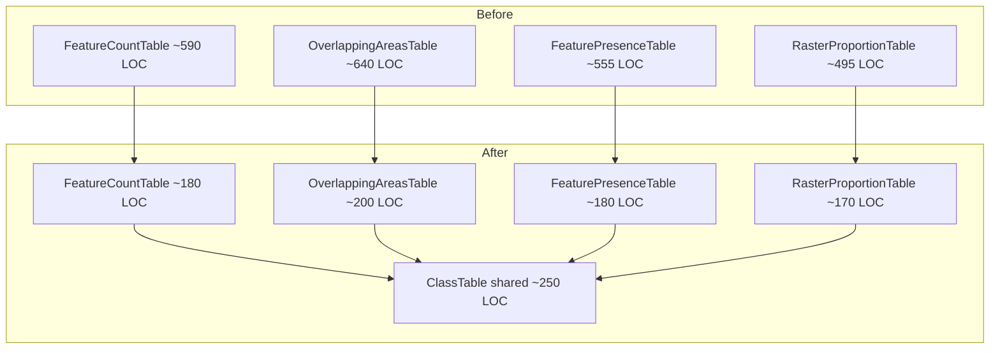
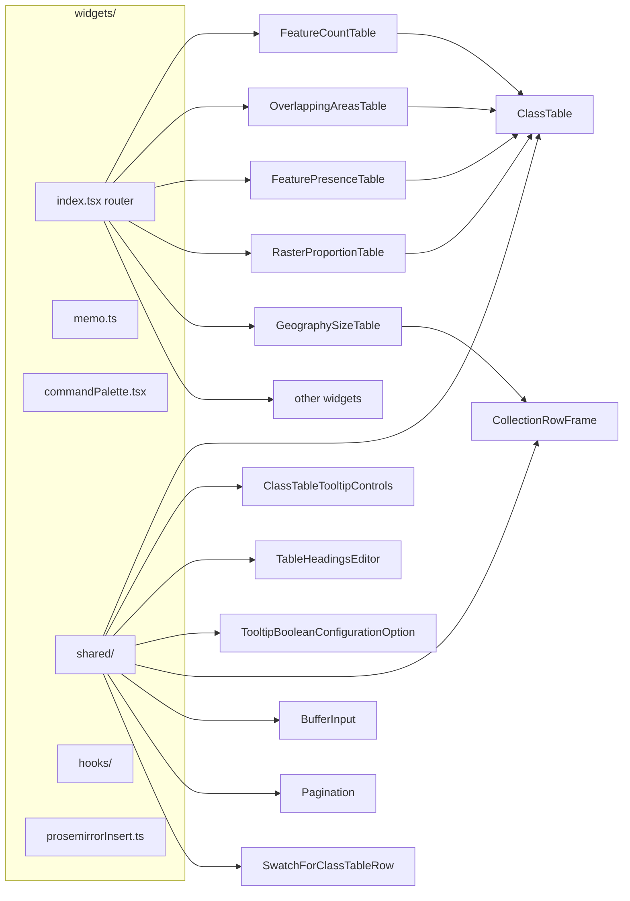

# Report Widgets Review & Refactor Plan

## Scope guardrails (from user)

- Do NOT change widget visual output.
- Do NOT change the statistics/numbers produced (they've been validated against legacy system).
- Refactors must be behavior-preserving; verify by running existing tests and by spot-checking with the committed Samoa fixture (`packages/client/src/reports/widgets/testData/samoa-example.json`).

---

## Findings (grouped by severity)

### Concrete bugs / correctness

1. **FeatureCountTable sorts by stable-id-prefixed key, not label.** In [`FeatureCountTable.tsx:148`](packages/client/src/reports/widgets/FeatureCountTable.tsx) the "name" sort is:

```ts
rows = rows.sort((a, b) => a.key.localeCompare(b.key));
```

Peer widgets correctly sort on `a.label.localeCompare(b.label)` ([`OverlappingAreasTable.tsx:176`](packages/client/src/reports/widgets/OverlappingAreasTable.tsx), [`RasterProportionTable.tsx:147`](packages/client/src/reports/widgets/RasterProportionTable.tsx)). Because `key = "${sourceStableId}-${groupByKey|'*'}"`, rows are grouped by source ID first, giving a confusingly stable but not alphabetical order. This **is** an output change, so we flag and confirm with user before switching to `label` (treat as opt-in).

2. **`dedupeCompleteSpatialMetrics` JSDoc lies.** [`collection/dedupeMetrics.ts`](packages/client/src/reports/widgets/collection/dedupeMetrics.ts) says "keep latest complete," but the implementation returns `completed.find((m) => m.id === id)` — i.e. the _first_ occurrence per id, not the latest. Meanwhile [`ClassTableRows.ts:448`](packages/client/src/reports/widgets/ClassTableRows.ts) tie-breaks geography metrics with `Number(b.id) - Number(a.id)` (highest id wins). Two places, two contradictory rules, both undocumented in the broader README. Fix: decide on the single rule ("highest numeric id") and align both. Add tests for the tie-break.

3. **`combineMetricsBySource` throws on missing groupBy attribute.** [`ClassTableRows.ts`](packages/client/src/reports/widgets/ClassTableRows.ts) throws `"Attribute <name> not found in geostats layer"`. That bubbles out of `useMemo` and crashes the entire widget (and potentially the card). A user-configurable grouping should degrade gracefully (surface a soft error via the existing `errors` channel). Same pattern for the five `throw new Error("Primary geography not found.")` sites ([`FeatureCountTable.tsx:126`](packages/client/src/reports/widgets/FeatureCountTable.tsx), [`OverlappingAreasTable.tsx:153`](packages/client/src/reports/widgets/OverlappingAreasTable.tsx), [`FeaturePresenceTable.tsx:107`](packages/client/src/reports/widgets/FeaturePresenceTable.tsx), [`RasterProportionTable.tsx:123`](packages/client/src/reports/widgets/RasterProportionTable.tsx), [`InlineMetric.tsx` x5](packages/client/src/reports/widgets/InlineMetric.tsx)).

4. **`ClassRowSettingsPopover.tsx:268` uses `setTimeout(() => onUpdateSettings(newSettings), 1)`** to work around a state race with `onUpdateAllDependencies`. This is brittle and should be either documented or replaced with a proper ordered update (e.g. single transaction or a callback after dependency commit). Investigate and either remove the timeout or justify it in a comment.

5. **`classTableRowKey` has latent collision.** Format `${stableId}-${groupByKey || "*"}` collides if a stable id or a groupBy value contains `-` or literally `*`. Several settings (`excludedRowKeys`, `customRowLabels`, `rowLinkedStableIds`) key off this. Fix: switch to a delimiter-safe encoding (e.g. `JSON.stringify([stableId, groupByKey])`), with a migration helper for legacy settings. Non-trivial — gated on whether any current reports rely on the legacy format (check schema migrator).

### Technical debt / dead code / noise

6. **`widgets.tsx` is 2021 lines, multi-responsibility.** It contains: the widget router (2 switch statements), `buildReportCommandGroups` (~850 lines), memoization HOC + debug instrumentation, shared controls (`TableHeadingsEditor`, `TooltipBooleanConfigurationOption`, `OverlayLayerInfo`, `OverlayProcessingStatus`, `ProcessForReportingFooter`), Apollo-style hooks, ProseMirror insertion helpers, and two dead functions. Split into:
   - `widgets/index.tsx` — re-exports & the two router switches
   - `widgets/memo.ts` — `memoWidget`, `widgetPropsAreEqual` (+ replace `JSON.stringify` with a shallow/structural compare; see #10)
   - `widgets/commandPalette.tsx` — `buildReportCommandGroups` and its many per-widget insertion helpers
   - `widgets/shared/TableHeadingsEditor.tsx`
   - `widgets/shared/TooltipBooleanConfigurationOption.tsx`
   - `widgets/shared/OverlayLayerInfo.tsx` / `OverlayProcessingStatus.tsx` / `ProcessForReportingFooter.tsx`
   - `widgets/hooks/useOverlayProcessingStatus.ts` / `useOverlayAuthorInfo.ts`
   - `widgets/prosemirrorInsert.ts` — `insertInlineMetric`/`insertBlockMetric`

7. **Dead code in `widgets.tsx`.** `groupByForStyle` (line 352) and `labelColumnForGeostatsLayer` (line 392) are never referenced outside the file, never exported. Delete.

8. **Debug console noise.** `DEBUG_WIDGET_MEMO = false` guards a dev-only instrumentation path ([`widgets.tsx:105-216`](packages/client/src/reports/widgets/widgets.tsx)), but the code is committed, readable, and emits emoji-prefixed `console.warn/log` when the flag is flipped. Replace with a small `debugLog.ts` utility that no-ops in production (`process.env.NODE_ENV !== "development"`), or remove `withMountLogging`+`debugPropsEqual` entirely (they were used to chase a perf bug and are now noise).

9. **34 `eslint-disable-next-line i18next/no-literal-string` suppressions in `widgets.tsx` alone.** Most are inside `buildReportCommandGroups` (command labels, descriptions, search terms). These are user-facing strings rendered in the slash-command palette — they should use `t()`. Audit and translate; add a CI check to prevent regressions in the widgets folder.

10. **`widgetPropsAreEqual` compares objects via `JSON.stringify`.** Quadratic-ish cost on every render for every widget. For `componentSettings` / `dependencies` / `alternateLanguageSettings`, a targeted `shallowEqual` at the top level plus `isEqual` (or a small inline deep-equal) is ~5x faster and avoids the `try/catch` fallback. Replace with `dequal/lite` (already candidate for dependency) or a 30-line local `deepEqual`. Benchmark with the Samoa fixture before/after.

11. **`as any` for geostats layers in 7+ files.** [`ClassRowSettingsPopover.tsx:367-369`](packages/client/src/reports/widgets/ClassRowSettingsPopover.tsx), [`IntersectingFeaturesList.tsx`](packages/client/src/reports/widgets/IntersectingFeaturesList.tsx), [`ColumnStatisticsTable.tsx`](packages/client/src/reports/widgets/ColumnStatisticsTable.tsx), [`ColumnValuesHistogram.tsx`](packages/client/src/reports/widgets/ColumnValuesHistogram.tsx), [`ClassTableRows.ts`](packages/client/src/reports/widgets/ClassTableRows.ts). Extract a single helper:

```ts
function getFirstGeostatsLayer(
  source: OverlaySource,
): GeostatsLayer | undefined {
  const l = (source.geostats as { layers?: unknown[] } | null)?.layers?.[0];
  return isGeostatsLayer(l as GeostatsLayer) ? (l as GeostatsLayer) : undefined;
}
```

12. **`samoa-example.json` is 89k lines (~3 MB).** Consumed via `require()` from every test that uses `samoaFixture.ts`. Options: (a) move to a gzipped file + `JSON.parse(fs.readFileSync(...))` in one cached loader, (b) trim to only the nodes actually used by tests, (c) gate behind an env flag for integration-style tests and split unit tests onto smaller synthetic fixtures. Lean towards (b) + (a).

### Duplicated structure — the biggest refactor win

13. **Four widgets re-implement the same table scaffold.** `FeatureCountTable`, `OverlappingAreasTable`, `FeaturePresenceTable`, and `RasterProportionTable` share essentially identical:

- Header row layout (uppercase labels, min-width columns, visibility-column presence test)
- Row mapping with `opacity-50` zero-state, `hover:bg-gray-50`, truncation handling
- `CollectionExpandableName` + per-sketch contributions sub-row rendering with `SketchOverlapHint`
- `Pagination` + `TablePaddingRows` integration
- `usePagination` + `useCollectionSketchExpand` wiring
- Tooltip controls composition (`UnitSelector`, `NumberRoundingControl`, `TableHeadingsEditor`, `ClassRowSettingsPopover`, sort/showZero toggles)

Proposal: introduce a `ClassTable` component (in `widgets/shared/ClassTable.tsx`) that takes:

- `rows: ClassTableRow[]` (with computed value/percent/etc. provided by the caller so the widget keeps control of math)
- `columns: ClassTableColumn[]` (header, width class, cell renderer, alignment)
- `collection: { expand, contrib, hint } | null`
- `pagination: ReturnType<typeof usePagination>`
- `emptyState`, `loading`

Each widget then shrinks to ~150-200 lines of pure data-shaping + column definitions. Expected LOC reduction: ~1500-1800 lines across the 4 files, and every pixel of layout continues to come from one source. This is the single most leveraged refactor in the system.



14. **`GeographySizeTable` parallels the class-table structure but with geographies as rows.** Don't force it onto `ClassTable` (different subject model), but extract the shared row-rendering primitives (`CollectionRowFrame`, `SketchContributionRow`) so both systems share the collection expansion visuals.

15. **Tooltip controls toolbars are inconsistent.** Many widgets repeat `<UnitSelector> <NumberRoundingControl> <TableHeadingsEditor> <ClassRowSettingsPopover>` in different orders with subtly different prop wiring. Introduce `<ClassTableTooltipControls>` for the common 80% and let each widget pass widget-specific extras (e.g. presence presentation selector, sort selector).

### UX / accessibility / i18n

16. **`window.prompt()` for buffer distance input** in [`FeatureCountTable.tsx:489`](packages/client/src/reports/widgets/FeatureCountTable.tsx), [`FeaturePresenceTable.tsx:425`](packages/client/src/reports/widgets/FeaturePresenceTable.tsx), [`IntersectingFeaturesList.tsx:358`](packages/client/src/reports/widgets/IntersectingFeaturesList.tsx). These block the JS thread, can't be translated, look alien against the Radix UI chrome, and don't support unit switching. Replace with a small `<BufferInput>` popover (number input + unit dropdown) that uses the existing `UnitSelector` conventions. Since this is a tooltip-controls (admin-only) affordance, it's not a user-facing output change.

17. **`OverlapDebugTooltip` may show developer-grade JSON to admins.** Check content. Behind `percent > 1.05` only, but if it shows fragment ids and raw metric payloads, guard behind a dev flag or the existing `showCalcDetails` affordance.

18. **`Pagination.tsx` has a few untranslated strings.** Spot-check `aria-label="Pagination"` etc. and wrap via `t(...)` where visible to users.

### Testing gaps

19. No tests for:

- `buildReportCommandGroups` — 850 lines of dispatch logic with zero coverage
- `widgetPropsAreEqual` (behavior regression risk when we change it in #10)
- `combineMetricsBySource` edge cases (multiple duplicates, empty metrics, missing geostats)
- Any rendered widget smoke test (one integration-style test per widget using the Samoa fixture)
- `classTableRowKey` collision scenarios

20. Tests that already exist (`ClassTableRows.test.ts`, `collection/*.test.ts`, `IntersectingFeaturesList.test.ts`, `prosemirror/reportBodySchema.test.ts`) are good seeds but don't cover the shared scaffolding we're about to extract.

---

## Architecture target



---

## Verification strategy

For each PR batch below:

1. Run `jest` in `packages/client` (existing suite must stay green).
2. Add a golden-output test per refactored widget: render against the Samoa fixture and snapshot the DOM. The snapshots become the contract that "output does not change."
3. Manual QA checklist (in the PR description): load a report with each widget type, expand a collection row, switch units, change number rounding, change column labels, exclude a row, toggle a layer. Reuse the current reports in the dev env.
4. Before merging the `ClassTable` consolidation, compare bundle size via `craco build --stats` and verify it trends down.

---

## Open questions to decide during execution

- For #1 (FeatureCountTable sort), confirm we should align with peers (change output from sort-by-key to sort-by-label) since the user said outputs are correct — this would be the only intentional behavior change and we'll flag it in the PR.
- For #5 (`classTableRowKey` collision), check whether any existing saved reports rely on the current encoding. If yes, add migration; if no (e.g. groupBy is recent), just switch.
- For #17 (`OverlapDebugTooltip`), confirm intended audience (admins only vs. end users).
