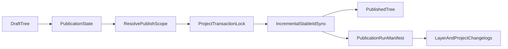

# Selective Overlay Publishing

Administrators edit only the draft overlay list. Today, [publish_table_of_contents](packages/api/schema.sql) deletes every published TOC row and recopies the entire draft tree. This feature adds two complementary operations:

- **Publish one layer or folder** from the item context menu, without publishing other draft work.
- **Pause publishing** on a layer or folder so a normal project publish skips it and leaves the last public version unchanged.

UX below is settled. Review it in the live Samoa admin app at `/samoa/admin/data`. Throwaway mocks to replace during implementation:

- [MockPublishTableOfContentsItemModal.tsx](packages/client/src/admin/data/MockPublishTableOfContentsItemModal.tsx)
- [MockPausedLayersNotice.tsx](packages/client/src/admin/data/MockPausedLayersNotice.tsx)
- [MockLayerPublishedHistoryEvent.tsx](packages/client/src/admin/changelogs/MockLayerPublishedHistoryEvent.tsx)

`MOCK_SELECTIVE_PUBLISHING` currently blocks the real project-publish mutation so demos cannot ship the full list by accident. Remove that guard when the backend is ready.

## Product semantics

- A paused item that already exists publicly stays frozen at its last published version. A paused item that was never published stays absent.
- A normal project publish skips paused items and their descendants. It does not delete those public snapshots.
- **Publish this folder** publishes the complete subtree, including unchanged children, so the public folder structure stays consistent. The confirmation warns that descendant pauses will be cleared; confirming resumes those items and includes them.
- **Publish this layer** publishes only that layer’s current draft (cartography, popups, metadata, access control, and related layer settings). Other overlay-list changes stay in draft.
- A child under a paused ancestor cannot silently publish around that pause. Administrators publish or resume the paused branch first.
- `projects.table_of_contents_last_published` remains the timestamp of the latest publish run. It is no longer the sole “what is still unpublished” boundary after selective publishes.

## Settled UX

Match existing admin chrome: Radix context menus without trailing icons, the shared [Modal](packages/client/src/components/Modal.tsx), summarized-change pills from [PublishSummarizedChangesPanel.tsx](packages/client/src/admin/data/PublishSummarizedChangesPanel.tsx), and changelog rows from [ChangeLogTimelineItem.tsx](packages/client/src/admin/changelogs/ChangeLogTimelineItem.tsx).

### Context menu

Add plain-text items to [TableOfContentsItemAdminMenuItems.tsx](packages/client/src/admin/data/TableOfContentsItemAdminMenuItems.tsx), same treatment as Edit / Duplicate / Delete:

- `Publish this layer...` / `Publish this folder...`
- `Pause publishing...` / `Resume publishing...` (pause is set here; resume is also available from the project Publish screen)

Do not add icons to these menu items.

### Individual publish confirmation

Opened from the context menu. Title and primary button:

- Layer: **Publish individual layer**
- Folder: **Publish folder**

Body:

- Item title plus a one-line scope sentence.
- Two-row include/exclude list: check for what will publish, minus for what will not. Layer copy: “All draft modifications to this layer, such as cartography, popups, metadata, and access control settings.” Folder copy: the complete subtree, including unchanged layers. Both state that other overlay-list changes remain in draft.
- Folder only: amber warning that pauses inside the folder will be cleared and those descendants will be included going forward.

Confirming does not run a full-list publish.

### Project Publish screen

Keep the existing Summarized / All / Unresolved Comments tabs and added/updated/removed cards.

After those cards, show a collapsible paused-items card ([MockPausedLayersNotice.tsx](packages/client/src/admin/data/MockPausedLayersNotice.tsx)):

- Title: “N paused layers will not be published”
- Body: “Existing public versions of these layers will remain unchanged while publication is paused.”
- Each row: pause icon, title, “Paused by {name}”, and the same change pills used on summarized rows (cartography, metadata, interactivity, and so on). No “Stays in draft” pill.
- Hovering the pause icon shows a Radix tooltip: “Resume publishing for this layer.” Clicking it opens a confirm dialog (Resume publishing / Keep paused). Confirming removes the item from the paused set for this publish.

### Layer / folder history

In [LayerSettingsChangeLogList.tsx](packages/client/src/admin/changelogs/LayerSettingsChangeLogList.tsx), an individual publish is a normal timeline event with the editor’s name and avatar:

> **{Name}** published this layer individually, outside a full overlay list publish

Use the existing published-event icon treatment. No extra status pill. Pause and resume are also ordinary timeline events, not edits to cartography or metadata.

## Architecture

Today’s full replace cannot freeze paused snapshots. Publish must become incremental by `stable_id`.

- Add a project advisory lock around every publish run.
- Persist pause on draft TOC rows only (`publish_paused` or equivalent). Do not copy the flag onto published rows. Folder pause applies to the subtree via `path`.
- Keep published rows whose `stable_id` is outside the current scope or paused. Delete-and-recopy only the rows in scope (published rows are immutable today).
- Record each run in a publication manifest (mode, root scope, actor, published / skipped-paused / deleted / failed). Do not stuff thousands of IDs into changelog JSON.
- Reuse copy helpers from `publish_table_of_contents` and update the hard-coded column lists in that function and `copy_table_of_contents_item` per [AGENTS.md](AGENTS.md). Cover folders, moves, ACLs, cloned vs shared library sources, interactivity settings, overlay data tables, deletions, report `stable_id` references, and tiles ACL rewrite ([publishTilesAclPlugin.ts](packages/api/src/plugins/publishTilesAclPlugin.ts)).
- After a selective publish, `draft_table_of_contents_has_changes` stays true if unpublished (including paused) draft work remains.
- Tests: [changelogs.test.ts](packages/api/tests/changelogs.test.ts), [tableOfContentsItems.test.ts](packages/api/tests/tableOfContentsItems.test.ts), plus overlay-data-table and data-library publish tests.

## Changelog model

- Keep one project-level `layers:published` event, extended with mode (`full` | `layer` | `folder`), counts, and a publication-run id.
- Add TOC-item field groups for pause, resume, and individual publish. Record them as closed workflow events (no coalescing with edit groups such as `layer:title`).
- Use the manifest for “what this run published or skipped.” Do not emit a changelog row per skipped item.
- Replace time-window inference in `table_of_contents_items_related_publish_change_logs` with manifest membership. Update [DraftTableOfContents.graphql](packages/client/src/queries/DraftTableOfContents.graphql) and regenerate client types.

## Implementation notes

- Work in [packages/api/migrations/current.sql](packages/api/migrations/current.sql) only.
- Client GraphQL lives in `.graphql` files; do not edit `packages/client/src/generated/*` by hand.
- No `import type` in client code.
- User-visible strings need i18n (`admin:data`).
- Remove the mock components and `MOCK_SELECTIVE_PUBLISHING` once the real mutations exist.
