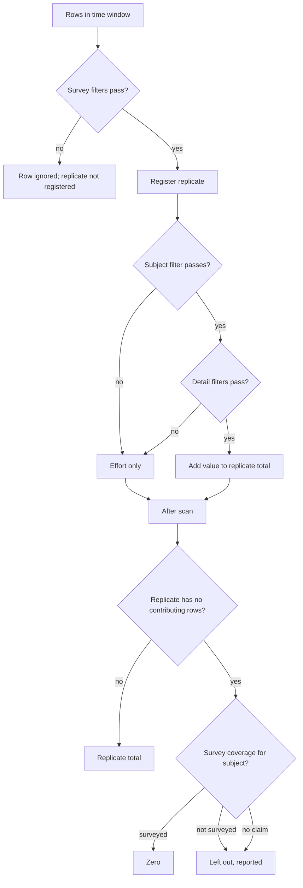

# Sparse tables, survey coverage, and a coherent lexicon

## Lexicon

This section is the contract. Every label, helper sentence, tooltip, DB column comment, and code doc comment in this plan uses these words and no synonyms. Code identifiers do not change; each term maps to its existing field.

### Core nouns

- **Data table**. A CSV attached to a layer, stored as parquet. Unchanged.
- **Feature**. One shape in the map layer that a table row joins to. Replaces "site" everywhere in admin copy. "Site" remains acceptable only where it is the literal column name the admin chose.
- **Join column**. The table column whose values match feature IDs. `joinColumn`, `overlayJoinColumn`. Unchanged, but the upload and join modals stop calling it "ID column" and "shared ID column".
- **Survey time**. When a row's observation happened, as `_when_start` / `_when_end`, derived from the table's **time settings**. `temporal`. The menu item and modal both become "Time settings" (today: "Temporal Coverage" / "Temporal coverage"). "Coverage" is reserved for survey coverage below.
- **Time step**. One bin on the timeslider at its current resolution. Replicates are grouped into time steps for the across-replicate calculation; they are never merged by one.
- **Value column**. A numeric column the map can show. `visualizationColumns`. Replaces "Data columns", "measurements", "measure", "map value".
- **Calculation**. How value-column numbers are combined for one feature. Across rows: mean, sum, min, max, count, median (`visualizationOps`). Across replicates: mean, sum, min, max only (`acrossReplicateOperations`; count and median are not offered because a replicate value has no row count or median of its own). Replaces "aggregation", "op", "operation" in UI. The legend aria label "Aggregation" becomes "Calculation".
- **Filter**. A user-facing condition on a column. `requiredFilterColumns`, `hiddenFilterColumns`, `filterColumnLabels`. Unchanged word.
- **Replicate**. One survey of one feature: the rows that share the same survey time, the same feature, and the same value of every replicate column. A transect swim, a quadrat, a camera drop, a station visit. `calculationMode = "replicates"`, `additionalReplicateIdentifiers`, `replicateLabel`. The survey time is the row's own time (`_when_start`, `_when_end`), not the timeslider bin. Two monthly quadrat visits are two replicates whether the slider shows months or years; a yearly view averages twelve replicates, a monthly view one. This is the word scientists and the monitoring notes already use, so the UI keeps it. The admin's chosen **replicate label** (transect, quadrat, camera, ...) is what map users see in the legend. **Engine change**: today the replicate key uses the slider bin; it must use the row time instead (see Filter classes).
- **Replicate columns**. The columns that, with the survey time and the join column, identify one replicate. `additionalReplicateIdentifiers`. Replaces "Replicate identifiers".
- **Within a replicate** / **Across replicates**. The two calculation stages. `withinReplicateOperations`, `acrossReplicateOperations`. Legend: "Showing mean of count per transect".
- **Subject**. What the table is observations _of_: a species, a debris category, a bird group. One **subject column** names it. New field (`subjectColumn text`) and the single source of truth. Organism enrichment (`organism.column`) is an optional layer on the subject column, not a second setting: the mutation requires `organism.column = subject_column` whenever `organism` is set, the Subjects and organisms modal reads the subject column instead of choosing one, and the migration backfills `subject_column` from `organism.column` for existing tables. Changing the subject column is refused while a coverage file, effort markers, or excluded values still reference the old column. Tables whose subject depends on another column (UPC `classcode` under `category`) make that other column a required survey filter, so the subject is read only inside the chosen category.
- **Detail columns**. Columns that describe one observation of a subject rather than the replicate: sex, size class, length. New field (`observationDetailColumns text[]`). Filtering on a detail column never removes a replicate that has any rows; it narrows which rows are reduced inside it. A replicate whose rows all fail the filter is empty and goes to the zero rule below.
- **Effort marker**. UI label: **"Nothing seen" rows**. A value in a subject or detail column that means "surveyed, nothing seen": `NO_ORG` in KFM fish, `NOSP` in beach BRUVs, `No Trash Present` in estuary trash. New field (`effortMarkerValues text[]`). A row carrying one registers its replicate and never contributes, and the value is hidden from filter choices.
- **Excluded value**. UI label: **Rows to ignore**. A value, in a named column, whose rows are left out of everything: not a replicate, not an observation, not effort. For recorded totals that would double-count their parts, such as `PeopleAll` beside `PeopBch` and `PeopSurf`. New field (`excludedValues jsonb`, `{ column: [values] }`). Distinct from a hidden filter (rows still count) and from an effort marker (rows register a replicate).
- **Survey columns**. Every other filterable column: campus, observer, depth, date parts. They describe the survey event. Filtering on one selects which replicates exist; a feature with none left is no data. Not stored; it is the complement of subject, detail, value, join, and time columns.
- **Survey coverage**. When, and for which subjects, a replicate was actually looked at. In the UI the setting is titled "When a subject is missing from a replicate" and its three options are phrased as what a missing row means. Internal names in parentheses:
  - **It was surveyed and none were seen** (all-surveyed, `coverageMode = "all_surveyed"`, default). Every replicate looked for every subject; a missing row is zero. Right for fully enumerated tables like CCFRP effort and for UPC.
  - **Nothing can be assumed** (rows-only, `coverageMode = "rows_only"`). A missing row is no data. Right for tables that record only what was seen, and for tables zero-populated before upload. Detail filters still keep any replicate that has rows, so on a zero-populated table a `sex=MALE` filter yields zero at female-only transects where today it yields no data.
  - **It depends on when and where** (explicit coverage, `coverageMode = "coverage_file"`, `coverageRemote text`). The admin uploads a **coverage file** of periods per subject and scope. Inside a period a missing row is zero; outside it the replicate is not surveyed and left out. Required for KFM, where campus start years differ.
- **Zero**, **No data**, **Not surveyed**. A replicate surveyed for a subject that saw none is **zero**, and only when the within-replicate calculation is sum; a mean, min, or max of nothing has no value, so that replicate is **left out** with the reason "no values". A feature with no replicates left after survey filters is **no data**. A replicate not surveyed for the subject is **not surveyed** and is left out. These phrases are the only ones the audit modal uses.

## Admin copy, final text

This is the copy to ship. Every string below is the label or helper as it will appear, in order, using the lexicon. Writing it into the components is a required step (see todo `copy`); no placeholder text survives. Strings in braces are interpolated. Section text is `admin:data`; legend and audit text is `homepage`.

### Gear menu

Display settings · Time settings · No-data values · Subjects and organisms · — · Download parquet · Upload new version · Delete table

### Display settings

Reader: a monitoring scientist or data manager who knows their survey but not SeaSketch. Every helper opens with what they have, then says what SeaSketch does with it. Sections appear in this order. Implementation notes for each setting are collected at the end of this section, not mixed into the copy.

**Display settings** (title)

**Name** — {input}
**Description** — Shown under the table name when someone picks a table to display. Two short lines.

**Value columns** — Which numeric columns can be shown on the map, such as `count` or `pct_cov`.
- ( ) Any numeric column
- ( ) Only these columns → checkbox list
- Save guard: Choose at least one column.

**How to turn rows into a map value** — Pick the one that matches how your table is laid out.
- ( ) **Each row is already a summary.** Every row that matches the filters counts as one sample. The map calculation runs straight across those rows: a mean is the mean of the rows for that site in the time shown. Choose this when each row is already a per-site value, such as a density per site per survey. If your rows are individual observations inside a transect or quadrat, choose the other option, or they will be averaged as if each were its own survey.
- ( ) **Rows are observations inside replicates.** Rows record individual observations, such as one fish of a given size, inside a transect, quadrat, camera drop, or similar unit. SeaSketch first combines the rows in each replicate, then calculates across replicates.

*Shown only for "Each row is already a summary":*

**Calculations** — Which summaries a map user can choose.
- ( ) Any calculation
- ( ) Only these → mean · sum · count · min · max · median
- Save guard: Choose at least one calculation.

*Shown only for "Rows are observations inside replicates":*

**What makes a replicate** — A replicate is one survey of one site: for example one transect swim, one quadrat, one camera drop. Rows that share the survey date, the site, and the columns you check here belong to the same replicate.
- Always included: Survey date · {join column}
- Check the columns that separate one replicate from another: [ ] zone [ ] transect [ ] level …
- Read-back, updates live: **A replicate is** one survey date, one {join column}, and one combination of {checked columns}. **Rows that differ only in** {unchecked filterable columns} **are part of the same replicate.**
- When nothing is checked: A replicate is one survey date at one {join column}.
- Timeslider note: If a site is surveyed more than once in the period shown on the timeslider, each survey is its own replicate.

**Call a replicate a…** — This word appears in the map legend, as in "mean of count per transect".
- replicate · transect · quadrat · station · camera · sample · Custom: {input}

**Subject column** — Which column names what was observed: a species code, a substrate type, a debris category. When a map user filters on it, SeaSketch counts only that subject inside each replicate. Replicates stay on the map; what happens to a replicate with no rows for that subject is decided by "When a subject is missing from a replicate" below.
- Single select.
- When organism enrichment exists: Species names and photos for this column are set up in Subjects and organisms. [Open]
- When the select is disabled: This column is used by {the coverage file / "nothing seen" rows / rows to ignore}. Clear those before changing it.
- Note: If the same code can appear under different kinds of measurement, such as a species listed under both cover and canopy, make that kind a required filter below so map users pick it first.

**Detail columns** — Which columns describe a single observation rather than the replicate: sex, size class, length. When a map user filters on a detail, every replicate stays on the map and only matching observations are counted. What a replicate with no matching observations becomes is decided by the two settings below.
- Checkbox list.
- Nothing is chosen for you. Columns that describe the whole survey, such as observer, depth, or program, should stay unchecked: filtering on them removes replicates that do not match.

**When a subject is missing from a replicate** — Your table may not have a row for every subject in every replicate. Choose what a missing row means.
- ( ) **It was surveyed and none were seen.** Every replicate looked for every subject. A missing row counts as zero. Choose this for surveys that record every taxon on a fixed list.
- ( ) **Nothing can be assumed.** SeaSketch does not fill in zeros for replicates it has no rows for. A replicate that does have rows, for any subject, still counts as surveyed. Choose this if the table only records what was seen, or if it already includes its own zero rows.
- ( ) **It depends on when and where.** Some subjects were only surveyed in certain years or by certain programs. Upload a coverage file that lists those periods. Inside a listed period a missing row counts as zero; outside it the replicate is left out of the calculation for that subject.
  - **Coverage file** — A JSON list of periods, one per subject and program. To make one, copy the three items below into an AI assistant along with your own sampling history, then upload what it produces. [Copy file format] [Copy column summary] [Copy instructions] [Upload coverage file]
  - Errors: Record {n}: {message}
  - After upload — **Coverage for {subject}**: {covered} replicates covered · {not surveyed} not surveyed · {outside} outside any listed period. Timeline by {scope column}.

**"Nothing seen" rows** — Some tables mark an empty survey with a placeholder value, such as `NO_ORG` or `No Trash Present`. List those values here so SeaSketch knows the replicate was surveyed and treats it as zero rather than dropping it. These values are hidden from map filters.
- {column}: {values} [Add]

**Rows to ignore** — Some tables include total rows alongside the rows they add up, such as `PeopleAll` next to `PeopBch` and `PeopSurf`. List those values here and SeaSketch leaves the rows out entirely so nothing is counted twice.
- {column}: {values} [Add]
- Note: These rows are not shown on the map, in filters, or in "Rows behind this value". For placeholders that mean "surveyed, nothing seen", use "Nothing seen" rows instead. A value cannot be in both lists.

**How each value column is calculated** — First inside a replicate, then across replicates.
- **{column}**
  - Inside each replicate: ( ) sum · ( ) mean · ( ) min · ( ) max
  - Across replicates, map users may choose: [ ] mean [ ] sum [ ] min [ ] max — One choice shows as fixed text in the legend.
  - Legend preview: Showing {calculation} of {column} per {replicate word}
  - **What a replicate with no matching observations becomes**, live from the choices above and "When a subject is missing":
    - sum + surveyed-and-none-seen: **Counts as 0.**
    - sum + nothing-can-be-assumed: **Counts as 0.** (A replicate is only known to exist when it has rows, so this is the same as above; the setting records that no further zeros should be inferred.)
    - sum + depends-on-when-and-where: **0 inside a listed period; left out outside one.**
    - mean / min / max, any coverage choice: **Left out. There is no {mean} of nothing.**

*Shown in both modes:*

**Filters** — Which columns map users can filter on.
- Table columns: Column · What filtering does · Required · Hidden · Label
- "What filtering does" values: **Chooses the subject** · **Narrows observations** · **Chooses replicates** · Map value · Date · Join column
- Helper: Filters that choose replicates remove sites with no matching replicate; those sites show no data. Filters on subjects and details keep every replicate and change what is counted inside it.
- Note after replicate columns change: Reindex this table to speed up time-range maps. [Reindex]

**Implementation notes for the copy above** (not shown to admins)
- Any/Only radios store as today: empty `visualizationColumns` / `visualizationOps` means any.
- "Survey date" is `_when_start`/`_when_end` from Time settings. Tables without time settings show "one {join column}" only.
- "What makes a replicate" writes `additionalReplicateIdentifiers`; "Call a replicate a…" writes `replicateLabel` / `replicateLabelCustom`.
- "When a subject is missing" maps to `coverageMode`: `all_surveyed`, `rows_only`, `coverage_file`. "Nothing seen rows" is `effortMarkerValues`. "Rows to ignore" is `excludedValues`.
- "Inside each replicate" sum/mean/min/max map directly to `withinReplicateOperations`. Across list is `acrossReplicateOperations`.
- Filter role labels map to subject / detail / survey / value / time / join as defined in the lexicon.
- Unchecked-column read-back lists filterable columns not in subject, detail, replicate, value, join, or time sets.

### Time settings

**Time settings** (title) — How rows are placed on the timeslider. Tabs: None · A date column · Year, month, day · Start and end. Body copy unchanged otherwise.

### No-data values

Unchanged.

### Subjects and organisms

**Subjects and organisms** (title) — If the subject column holds marine species, SeaSketch can add taxonomy from WoRMS and photos from iNaturalist so map users can filter by scientific or common name.
- Subject column: {locked chip} — Change it in Display settings.
- When no subject column is set: Choose a subject column in Display settings first. [Open Display settings]
- The former "Identity column" picker is removed. "Treat as", class CSV, roles, and "Classify taxa" remain as today and apply to the subject column.

### Join column and upload

Replace "ID column" and "shared ID column" with **join column** throughout. Upload intro: Attach a CSV of observations or measurements to this layer. Rows are matched to features by a join column, then stored as an optimized table.

### Legend

Showing {calculation} of {column} per {replicate word} · aria labels: Calculation · Value column

### Rows behind this value (audit modal)

The modal is the proof for one number. Every element below is populated from the engine's response for this feature and time selection, or from the same rows the map used. Nothing is generic prose; a PI should be able to reproduce the headline value from what is on screen.

**Rows behind this value** (title) · {table name}

**Header**: {Calculation} of {column} · {feature} · {time}. Sparkline unchanged.

**Filter chips**, grouped under short labels that match the admin filter table, each chip carrying the same phrase in its tooltip:
- Chooses replicates: {chip}… — tooltip: Sites with no matching replicate show no data.
- Chooses the subject: {chip}… — tooltip: Only this subject is counted inside each replicate.
- Narrows observations: {chip}… — tooltip: Only matching observations are counted; replicates are kept.
- From table settings: Ignored rows {column}: {values} · "Nothing seen" rows {values} — set by the table's administrator, not removable here.

**Pipeline strip**, one row of counted stages, each a number with a label, computed for this feature and time:
- {a} rows for this site → {b} after replicate filters → {c} replicates → {d} counted · {e} zero · {f} no value · {g} not surveyed → {result}
- Each stage is a hover target naming which rule produced it. `a` and the excluded count come from one extra aggregate the modal already knows how to issue (same query with exclusions inverted). `b` is `rowsMatched`. `c` through `g` are `replicatesSurveyed`, `count`, `replicatesZero`, `replicatesNoValue`, `replicatesNotSurveyed` from the engine response.

**Rows table** shows every registered row, not only contributing ones. New columns, always present in replicate mode:
- **Replicate** — letter, tooltip: One replicate is every row that shares {columns}. Default sort.
- **Counted** — one of: ✓ · Not this subject ({v}) · Not this detail ({v}) · "Nothing seen" row. From the raw response's `_contributes` plus which `v.*` filter failed, which the raw endpoint returns as `_excludedBy`.
- Per-replicate subtotal row, after the group: {Sum / Mean / Min / Max} of {column} = {value} · {terms} — when the replicate is empty: 0 — surveyed, none matched · Left out — no {mean / min / max} of nothing · Left out — not surveyed for {subject} between {start} and {end}. The coverage period that decided it is named.

**Synthetic replicate rows** for replicates that were registered but have no rows passing survey filters into the page (possible when `limit` truncates): one line per missing replicate stating its key values and its status, so the replicate count in the table matches the pipeline strip.

**Formula strip**, bottom, unchanged in form: ({terms}) / {n} = {result}. Each term is the replicate's letter on hover and scrolls to it. Zero replicates appear as `0` terms with their letters; left-out replicates are listed after the formula as "Left out: {letters}" so the denominator is visibly explained.

**"Each row is a summary" mode**: chips all sit under Chooses rows, plus From table settings; the pipeline strip is {a} rows for this site → {b} after filters → {c} with a value → {result}; the Counted column shows ✓ or No value; the formula strip is {sum} ÷ {count} = {result}.

**Coverage panel**, shown when the table uses "It depends on when and where" and a subject filter is active: **When {subject} was surveyed here** — {scope column} {scope value}: {start} to {end}; … — from the same coverage file the calculation used. If this site's {scope column} has no entry: No coverage listed for {scope value}, so its replicates are treated as not surveyed.

**Export CSV** includes Replicate, Counted, and the subtotal rows as marked lines, so the proof leaves with the data.

**Engine and API support required**: raw-row responses return `_contributes` and `_excludedBy` when `v.*` is present; aggregate responses return `replicatesSurveyed`, `replicatesZero`, `replicatesNoValue`, `replicatesNotSurveyed`, and, on request (`explain=1`), a `replicates` array of `{ key, status, reason, coverageInterval? }` for one join value so the modal can render synthetic rows and the coverage panel without recomputing coverage client-side. `explain=1` is only honored when the query has a single join-column equality filter.

### Code documentation

Doc comments on `overlay_data_tables` columns, `ParsedQuery`, `DataTableQuerySettings`, `DataTableVisualizationConstraints`, and `DataTableCalculationMode.tsx` are rewritten to open with the lexicon term and then name the code identifier, e.g. `-- Replicate columns. Code name: additional_replicate_identifiers.` A short `packages/client/src/dataLayers/DATA_TABLES_GLOSSARY.md` holds the lexicon so both packages cite one source.

## Filter classes and the zero rule

Rules the engine enforces:

- **Replicate key uses row time, not slider bin.** Today `execute.ts` keys replicates on `[stepKey, ...groupBy, ...replicateBy]`. It changes to `[_when_start, _when_end, ...groupBy, ...replicateBy]`. After the scan, each reduced replicate is assigned to every `when.step` bin its interval overlaps (same rule `stepsOverlappingInterval` applies to rows today), and the across calculation runs per `[stepKey, ...groupBy]`. A range query (`when` without `when.step`) pools every replicate overlapping the window. Replicate mode therefore requires `_when_*` columns; a table without time settings gets one replicate per feature per replicate-column combination. Existing tests in `replicateMode.test.ts` that assume one replicate per year still pass for KFM fish, where each transect is surveyed once a year; a new synthetic test covers the monthly case.
- Survey filters and the `when` window are the only filters that may prune row groups and the only ones passed to `matchIndexesInSpan`. They are sent as `q.*` today and stay `q.*`.
- Subject and detail filters are sent as a second list, `v.*` (value-gate), parsed by `params.ts` into `ParsedQuery.contributionFilters`, compiled by `compileFilters`, added to `neededColumns`, and applied per row after the replicate key is built.
- Empty replicates resolve after the scan. Registration is itself evidence of survey: a replicate with any row passing the survey filters exists. Then, for `within=sum`: under `all_surveyed` the replicate is zero; under `rows_only` it is zero too, because a registered replicate has rows, and the mode's only effect is that no replicate is invented where none has rows (which the engine cannot do anyway); under `coverage_file` it is zero inside a matching interval and `notSurveyed` outside. `within=mean|min|max` leave the empty replicate out regardless, reported as `replicatesNoValue`. The practical difference between `all_surveyed` and `rows_only` is therefore nil for replicate-mode queries with a subject filter, and the admin copy for "Nothing can be assumed" must say the choice matters only when a subject has no row in a replicate that also has no other rows, which cannot register. The setting is kept because it documents intent and because a future replicate roster could act on it. Coverage lookup keyed on the replicate's scope column values, the subject value from the active `v.*` subject filter, and interval overlap with the replicate's `_when_*`. When the subject filter is an `in` list, coverage is checked per value; a replicate is zero only if every selected subject was surveyed there, otherwise "not surveyed" with the offending value named in `explain`. Coverage is consulted only when a subject filter is active; with no subject filter an empty replicate under `sum` is zero (all observations of every subject were none), which is what effort marker rows already express.
- Response adds per-group `replicatesSurveyed`, `replicatesZero`, `replicatesNoValue`, `replicatesNotSurveyed` alongside `count`. `count` is the number of replicates that produced a value, zeros included. `combineSeriesSteps` weights a multi-step mean by `count`, so zero replicates carry weight and not-surveyed replicates do not; that is the pooled mean over surveyed replicates.
- Simple mode is unchanged: no registration step, no coverage, `v.*` rejected with 400.
- An effort row is any row whose subject or detail column value is in the configured **effort marker** list (`effortMarkerValues text[]`, default empty). It registers a replicate and never contributes, and the value is hidden from filter choices. KFM fish: `NO_ORG`. Beach BRUV: `NOSP`. Estuary trash: `No Trash Present`.
- Excluded values are applied as survey filters. The client prepends `q.{column}=neq.{value}` (or `not in`) for every configured exclusion to every query, aggregate and raw alike, so they prune row groups, run inside `matchIndexesInSpan`, and never diverge between the map and the audit modal. No engine branch is added. The settings mutation rejects a value that is both excluded and an effort marker. Filter value lists and subject choices omit excluded values; the column summary copied for the coverage prompt keeps them with `excluded: true`. The audit modal reports the excluded row count by issuing the same aggregate with the exclusion filters inverted.
- Registration requires at least one row. Zero-filling under all-surveyed or explicit coverage applies only to replicates that appear in the table. A replicate with no rows at all is invisible unless the table carries a "nothing seen" row for it. The "Nothing seen rows" helper text says this.

The raw-vs-aggregate invariant is restated: raw rows and aggregate select the same **registered** rows for identical `q.*` and `when.*`. `v.*` never changes selection. Raw output gains `_contributes` (boolean) and `_excludedBy` (`"subject" | "detail" | "effort" | null`) when `v.*` is present. Aggregate output accepts `explain=1` when exactly one join-column equality filter is present and returns a `replicates` array with each replicate's key values, status (`counted | zero | noValue | notSurveyed`), and the coverage interval that decided it. This is what the audit modal renders; it never recomputes coverage or registration client-side.

## Coverage file

Static JSON Schema at `packages/geostats-types/lib/dataTableCoverage.schema.json`, exported with a TS type and a runtime guard (`isDataTableCoverage`, takes `unknown`, tested for null/undefined/non-array/valid). Root is an array; each record has `scope` (object, may be empty), `subject` (object with exactly one key, the table's subject column), `start` (date string), optional `end` (date string or null). The object shape is kept, rather than a bare value, so the file names its column and stays readable on its own.

Post-parse validation in the upload path: every `scope` key is a survey column of the table; `subject` has exactly one key and it is the table's subject column; `end >= start`; no overlapping intervals for the same scope and subject; report offending record indexes. Warnings, not errors: subject values never observed; intervals outside the table's time range.

Stored at `{tablePath}/coverage.json` on R2 beside `data.parquet`. `overlay_data_tables.coverage_remote` points to it. The query worker loads it with the organism-index pattern (`stat` etag, in-memory Map, cap), not the uncached column-stats fetch. Index as `scopeKey -> subjectKey -> sorted intervals`.

Admin experience under "When a subject is missing from a replicate" > "It depends on when and where":

- **Schema** (copy button), **Column summary** (the existing column-stats JSON, copy button), **Prompt** (static text: what the file is, use only names and values from the column summary, one record per continuous surveyed interval, `end` null when ongoing; copy button). No per-table prompt assembly.
- Upload control; validation errors listed by record index.
- **Coverage preview** after upload: pick a subject value; show per scope value a timeline bar of surveyed intervals against the table's time range, plus counts of replicates covered / not surveyed / outside any interval for the current data. Uses a new `{tablePath}/coverage-preview` endpoint next to `temporal-preview`, so numbers come from the engine.

## Storage and reprocessing

- New `overlay_data_tables` columns in `current.sql`: `subject_column text` (backfilled once from `organism->>'column'` where present), `observation_detail_columns text[] not null default '{}'`, `coverage_mode text not null default 'all_surveyed'` check in (`all_surveyed`, `rows_only`, `coverage_file`), `coverage_remote text`, `effort_marker_values text[] not null default '{}'`, `excluded_values jsonb not null default '{}'` (object of column to string array; validated in the mutation). Extend `set_overlay_data_table_visualization_settings` and the three hard-coded insert lists (upload completion, `copy_table_of_contents_item_recursive`, publish). Changelog payload includes the new fields. Consistency checks in the mutation: `organism->>'column'`, when set, must equal `subject_column`; `subject_column` may not change while `coverage_remote` is set or while `effort_marker_values` / `excluded_values` reference it; `update_overlay_data_table_organism` and `create_overlay_data_table_organism_reprocess` take the column from `subject_column` rather than from input.
- `create_overlay_data_table_coverage_upload(table_id, filename, content_type)` follows `create_overlay_data_table_organism_reprocess`: presigned upload, `reprocess_of_overlay_data_table_id` set, handler validates and writes `coverage.json`, `complete_*` sets `coverage_remote`. Replace and reprocess carry `coverage_remote` forward like `source_parquet_remote`.
- Parquet layout: `clusterColumns` in `packages/data-tables-handler/src/clusterParquet.ts` gains the replicate columns after `_when_start`, and the COPY adds bloom filters on join and subject columns. Saving the Display settings modal does not reprocess. When replicate columns change, the modal shows a one-line note "Reindexing will make time-range maps faster" with a **Reindex** button that calls `create_overlay_data_table_reprocess` with a new `cluster_only` flag.
- Client: `DataTableQuerySettings.contributionFilters`, `buildDataTableQuerySearchParams` emits `v.*`, `MapContextManager.resolveDataTableVisualizationSettings` splits `dataTable.filters` by role using the table's subject and detail columns. `deriveDataTableCalculationRowsQuery` forwards `q.*` and `v.*` separately. Bookmarks keep storing one `filters` array; the split is derived at query time.

## Dataset configurations (from DataONE metadata)

Checked against the EML attribute definitions for the KFM (`doi:10.25494/P6/MLPA_kelpforest.12`), CCFRP, and beach/surf-zone packages. These are the expected admin settings; the migration and QA steps use them.

- **KFM fish**: replicate `zone`, `transect` (metadata: "unique transect replicate within each site, zone, and level"; level stays out so diver passes sum). Subject `classcode`. Details `sex`, `fish_tl`, `min_tl`, `max_tl`. Effort marker `NO_ORG`. Explicit coverage from the taxon table's `LOOKED{year}` columns, whose stated purpose is "so that zeros are not assigned to organisms that were not sampled"; scope `campus`, which changes at 21 sites over the series.
- **KFM swath**: replicate `zone`, `transect`. Subject `classcode`. Detail `size`. Explicit coverage, same taxon table (`sample_type = SWATH`).
- **KFM size frequency**: replicate `zone`, `transect`; rows recorded at site scale have both blank, and form one site-level replicate. The admin notes say so. Subject `classcode`. Detail `size`.
- **KFM UPC**: replicate `zone`, `transect`. Subject `classcode`. `category` as a required survey filter (metadata: "percent cover should be calculated for each category separately"), so the subject is read inside one category. Coverage all-surveyed. Value `pct_cov`, within `sum`.
- **CCFRP effort**: across rows. Every trip lists all 99 taxa with explicit zeros. `Common_Name` subject as required filter. Coverage setting has no effect.
- **Beach birds**: replicate columns none (one visit per row set). Subject `species_code`. Coverage: admin's choice; the metadata's "number of individuals of a species observed during a survey" supports all-surveyed. Monthly visits are separate replicates under a yearly view.
- **Beach BRUV**: replicate `bruv`. Subject `species_code`. Effort marker `NOSP`. Within `max`. Coverage all-surveyed.
- **Estuary BRUV** (notes): replicate `camerareplicate`, within `max`, subject `scientificname`.
- **Estuary trash** (notes): replicate `stationno`, `transect`, `quadrat`. Subject `debriscategory`. Detail `debrisitem`. Effort marker `No Trash Present`.
- **Beach visitors**: subject `visitor_code` as a required filter; excluded values `visitor_code: PeopleAll, DogsAll` (metadata: "PeopleAll: total of all people observed"). Coverage all-surveyed. Selecting `PeopBch` and `PeopSurf` together sums correctly once the totals are excluded. A total living in a different column, or across features, still needs reshaping before upload.

## Fixtures and tests

- Replace `fish-spul.parquet` and `fish-gull-e-2024-two-species.parquet` with subsets cut from `Fish Transects_v8.parquet` (raw), same sites and years, plus the `NO_ORG` rows those passes contain. Add `kfm-coverage.json` built from `MLPA_kelpforest_taxon_table.10.csv` for the four campuses and the subjects in the fixtures. Keep `upc-cover`, birds, beach BRUV, `bruv-maxn-frames`, and CCFRP as they are.
- Engine tests, each with a DuckDB oracle:
  - Gull Isle E 2024, `q.site`, `v.classcode=SPUL`, replicates = zone+transect, within sum: 12 replicates, mean equals DuckDB `AVG` over a `SUM ... GROUP BY zone, transect` that includes zero for transects with no SPUL rows.
  - `v.sex=MALE`: still 12 replicates; INMID 1 and INMID 2 contribute zero; mean equals DuckDB with `COALESCE(SUM(...) FILTER (WHERE sex='MALE'), 0)`.
  - `v.fish_tl=gte.30` behaves the same way.
  - `q.observer=<name from 2005>` with a 2020 window: zero registered replicates, group absent, `replicatesSurveyed` 0.
  - `q.campus=UCSB` on a UCSC site: group absent.
  - Coverage: an HSU subject with `LOOKED2014` false, 2014 window: replicates left out, `replicatesNotSurveyed` equals the DuckDB count of HSU passes that year; 2016 window: zeros.
  - `coverage_mode=rows_only`: a registered replicate with no matching rows is still zero under `within=sum` (same as `all_surveyed`); the two modes produce identical results on every fixture, and the test asserts that equality so the documented behavior cannot drift.
  - `within=mean` on `fish_tl` with a detail filter that empties a replicate: replicate left out, `replicatesNoValue` counts it, `count` excludes it.
  - Monthly quadrat fixture (synthetic): twelve visits to one quadrat in one year. Under `when.step=year` the group has `count` 12 and mean equals DuckDB `AVG` over the twelve visit sums; under `when.step=month` each bin has `count` 1. A range covering two years pools 24. A visit whose interval straddles a year boundary appears in both yearly bins.
  - No subject filter, `within=sum`, a `NO_ORG`-only pass: replicate registers with total zero.
  - Beach BRUV `NOSP` configured as an effort marker: a `NOSP`-only camera registers and is zero under `v.species_code=AARG` with all-surveyed coverage.
  - Excluded values, synthetic visitor fixture with `PeopBch`, `PeopSurf`, `PeopleAll` rows: with `visitor_code: [PeopleAll]` excluded, `v.visitor_code=in.(PeopBch,PeopSurf)` sum equals the `PeopleAll` value; without the exclusion and no subject filter the sum is double. Raw rows with the exclusion prepended omit the total rows, and the audit count of excluded rows matches DuckDB.
  - Mutation rejects a value listed in both `excluded_values` and `effort_marker_values`.
  - Mutation rejects `organism.column` that differs from `subject_column`, and rejects changing `subject_column` while a coverage file is attached; migration backfill sets `subject_column` for every existing table with organism identity.
  - `explain=1` on Gull Isle E 2024 `v.sex=MALE`: `replicates` has 12 entries, ten `counted`, two `zero` with reason `noMatchingObservations`; on the HSU 2014 coverage case each entry carries the interval or `notSurveyed`; `explain=1` without a single join equality is a 400.
  - Raw `_excludedBy` matches the first failing `v.*` stage for every non-contributing row; effort marker rows report `effort`.
- Client tests for the audit modal: pipeline strip numbers equal the engine response fields; the Counted column reason matches `_excludedBy`; a truncated page renders one synthetic line per missing replicate and the replicate count equals `replicatesSurveyed`; left-out letters under the formula equal `replicatesNoValue + replicatesNotSurveyed`; CSV export contains the Replicate and Counted columns and subtotal lines.
  - `NO_ORG` registers a replicate and never contributes; a `v.classcode=NO_ORG` request is rejected.
  - UPC on `upc-cover.parquet`: subject `classcode`, `q.category=COVER` as a survey filter, replicates zone+transect, coverage all-surveyed, `v.classcode=<a code absent from some transects>`: every transect with a cover row registers; absent ones are zero; mean matches DuckDB `AVG(COALESCE(cover, 0))` over all transects.
  - Raw rows with identical `q.*`/`when.*` are identical with and without `v.*`; `_contributes` marks the difference. `rawAggConsistency` extended accordingly.
- Client tests: filter-role split, `v.*` emission, coverage schema guard, legend sentence with the replicate label.
- Verification: `pmtiles-server` node-engine tests, client jest and lint, then in the admin UI on the KFM fish table: set replicate columns zone+transect, subject `classcode`, details `sex`, `fish_tl`, `min_tl`, `max_tl`, coverage file uploaded and previewed; on the map, SPUL male at Sci Coche Point E shows a zero-bearing mean and the audit modal states the three status sentences.
