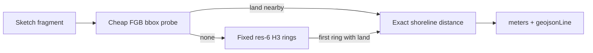
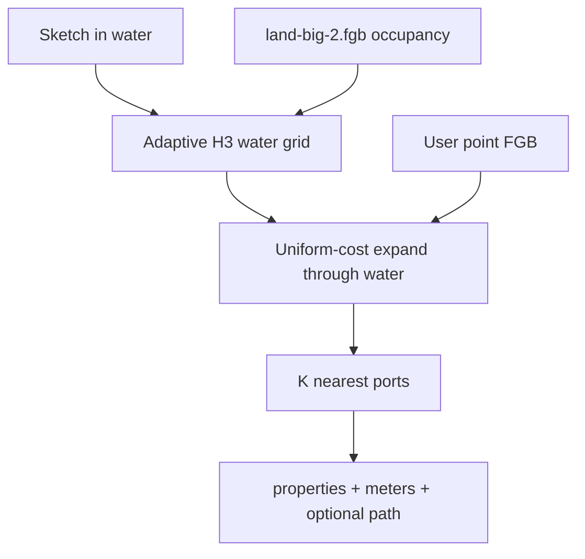

# Water-path nearest features (and better distance-to-shore)

## How distance-to-shore works today

The metric is geodesic, not a water path. It lives in [`packages/overlay-engine/src/calculateDistanceToShore.ts`](packages/overlay-engine/src/calculateDistanceToShore.ts) and is a first-class overlay metric (`distance_to_shore`).



- **Backing data:** hardcoded [`https://uploads.seasketch.org/land-big-2.fgb`](https://uploads.seasketch.org/land-big-2.fgb) (subdivided land polygons). Defaulted in [`packages/api/src/plugins/reportsPlugin.ts`](packages/api/src/plugins/reportsPlugin.ts) when the metric has no overlay URL. Same file is used as the `DIFFERENCE` clipping source in geography tests (`testing-land.fgb` is a related fixture).
- **Search:** `fgb-source` R-tree `search()` on a tight bbox; if empty, expand H3 rings at **resolution 6** (hex edge ~3.2 km) up to **50 rings** (~few hundred km), then fetch polygons and measure with Turf (`nearestPointOnLine` / segment-pair closest points).
- **Result:** `{ meters, geojsonLine }`. Fragments combine by taking the **minimum** meters ([`combineMetricsForFragments`](packages/overlay-engine/src/metrics/metrics.ts)).
- **Widget:** inline number today — slash command in [`packages/client/src/reports/widgets/widgets.tsx`](packages/client/src/reports/widgets/widgets.tsx), render/export in [`InlineMetric.tsx`](packages/client/src/reports/widgets/InlineMetric.tsx). `geojsonLine` is already on the metric value but is **not shown**. The new Distance to Shore Map widget will consume it.
- **Worker:** [`packages/overlay-worker/src/overlay-worker.ts`](packages/overlay-worker/src/overlay-worker.ts) loads the land FGB and calls `calculateDistanceToShore`. Geography subjects throw. Options such as `miminumDistanceMeters` are never passed.
- **Parameters already on the wire** (unused by shore): `maxResults`, `maxDistanceKm` on [`MetricDependencyParameters`](packages/overlay-engine/src/metrics/metrics.ts) — these are what the new metric will use.

### Problems to fix while generalizing H3

- **Early stop is wrong.** The first ring whose _bbox_ hits land is not necessarily the geodesic nearest shore. Continue until the next ring’s lower-bound distance exceeds the best exact distance found.
- **Fixed resolution + 50-ring cap.** Long offshore cases are slow or miss land. Use coarse cells in open ocean and refine near land.
- **Line/polygon origin coverage.** Lines only index vertices, so long edges skip cells. Cover edges (and polygons) properly.
- **Typo / dead options:** `miminumDistanceMeters`; debug `rings` built then discarded; `console.log` in the worker.

Distance-to-shore **stays geodesic** (shortest path _to_ land is a straight swim). It shares the improved occupancy + variable-res search, not the water-path graph.

## Implementation phases

Ship in three slices so shore improvements and the path map are usable before the new metric exists in Postgres or the report editor.

### Phase 1 — Distance to shore refactor + shore widgets

No new metric type and no `current.sql`.

- Extract H3 primitives from [`calculateDistanceToShore.ts`](packages/overlay-engine/src/calculateDistanceToShore.ts) (`bboxForCell`, occupancy vs land FGB, adaptive/variable-res expansion, geodesic nearest). Keep `calculateDistanceToShore` as a thin wrapper (`DistanceToShoreMetric` unchanged).
- Fix early-stop, line/polygon coverage, `miminumDistanceMeters` typo, worker `console.log`, pass options through [`overlay-worker.ts`](packages/overlay-worker/src/overlay-worker.ts).
- Tests against live [`land-big-2.fgb`](packages/overlay-engine/__tests__/constants.ts). Keep the existing cases and **add new sketches** where coverage is thin (see Tests). Expected `meters` must be independently computed (Python/Shapely/pyproj or GDAL against the same FGB), not copied from the current JS output. Throwaway scripts stay off-repo (`/tmp`); only GeoJSON fixtures + Vitest assertions are committed.
- Shared [`DistancePathMap`](packages/client/src/reports/widgets/DistancePathMap.tsx) + **Distance to Shore Map** block widget, slash command next to the existing inline shore metric, export/progress wiring. Consumes `geojsonLine` already on the metric.

### Phase 2 — `distance_to_features_over_water` calculation only

Engine, worker handler, and tests. **No client widgets. No database migrations.** Reports cannot request the metric yet.

- Publish Natural Earth 10m ports FGB to `ssn-tiles` root (see fixtures below).
- Implement water-path k-NN (`waterPathNearest`), TypeScript `MetricType` + value type + `combineMetricsForFragments` in overlay-engine, worker `case "distance_to_features_over_water"` (callable from unit tests / local invoke). Clamp `maxDistanceKm` in the engine.
- CDN tests (land + NE ports): island detour, coastal reachability, k-ordering, radius exclusion.
- Benchmark sweep → set `MAX_DISTANCE_TO_FEATURES_KM` for a ~10s miss case.

Leave for phase 3: [`packages/api/migrations/current.sql`](packages/api/migrations/current.sql), [`reportsPlugin.ts`](packages/api/src/plugins/reportsPlugin.ts) overlay-source rules / GraphQL comments, [`calculateSpatialMetricsBatch.ts`](packages/api/tasks/calculateSpatialMetricsBatch.ts) dispatch, and all feature-side UI.

### Phase 3 — DB + remaining widgets + wiring

- `alter type spatial_metric_type add value if not exists 'distance_to_features_over_water'` in `current.sql`.
- reportsPlugin (requires project overlay source), batch job dispatch, progress labels.
- Features **table**, inline nearest distance, **Distance to Features Map** (reuse `DistancePathMap`), slash commands on Point/MultiPoint layers, exporters. Widget max-distance UI capped at the phase-2 constant.
- API upsert test mirroring the shore case in [`bulkUpsertSpatialMetrics.test.ts`](packages/api/tests/bulkUpsertSpatialMetrics.test.ts). Browser verification of table + both maps.

## New metric: `distance_to_features_over_water`

Users enable reporting on a **point** overlay layer (Natural Earth ports, World Port Index 2019, or any project points). The report widget asks for the nearest **N** features, returning **selected columns + water-path distance**. No bundled port dataset — the layer is a normal SeaSketch overlay source (already subdivided to FlatGeobuf at upload time).



**Distance definition:** shortest path through **water cells**, land cells blocked. A port sitting on the coastline is reached via the adjacent water cell plus a short hop to the point (ports must remain reachable; blocking every hex that _touches_ land would trap harbors).

**Adaptive grid (the efficiency lever):**

- Start at coarse resolution (about H3 res 4, ~22 km edge) in open water.
- For each candidate cell, classify against the land FGB: `water` / `land` / `mixed` (R-tree `search()` first; fetch + intersect only on hits). Cache per job.
- `mixed` → replace with children down to a fine floor (about res 8, ~460 m) so channels stay passable.
- `land` → blocked. `water` → graph node. Neighbors include same-res hex neighbors and parent/child links at resolution boundaries (`h3-js` 4.3.0 already depends in overlay-engine).

**Search:** Dijkstra/uniform-cost from the sketch’s water cells. As cells are visited, `search()` the **point** FGB in that cell. First time a feature is reached, record path cost. Stop when `maxResults` are found and the frontier cost exceeds the Nth distance, or `maxDistanceKm` is exceeded.

**Time budget (~10s):** worst case is _no_ hit inside the radius (full expansion). Cap `maxDistanceKm` so that case stays around **10 seconds** on the overlay worker (10 GB ARM Lambda — not the 15-minute timeout). Omit or oversize → clamp to `MAX_DISTANCE_TO_FEATURES_KM` exported from overlay-engine. Default in slash commands = that cap (or a slightly smaller default if the bench suggests a nicer UX). Widget tooltip cannot exceed the cap.

The numeric cap is **not guessed in this plan**. A Vitest sweep against live `land-big-2.fgb` + Natural Earth ports (open-ocean miss vs coastal hit) records times at several radii; set the constant from the largest radius that stays near 10s, then keep the bench so it can be retuned when the grid or occupancy changes.

**Two sources in the worker:** `sourceUrl` = user points (hashed/cached like other overlay metrics); land URL stays the same global default as shore (implementation detail, not the overlay identity).

**Not in v1:** geography subjects (same gap as shore); CQL filters on ports; bundled WPI dataset.

## API / types / worker wiring

Follow the `ous_demographics` / `distance_to_shore` pattern. **TypeScript metric + worker case: phase 2. Postgres + reportsPlugin + batch dispatch: phase 3.**

- Add `distance_to_features_over_water` to Postgres `spatial_metric_type` in [`packages/api/migrations/current.sql`](packages/api/migrations/current.sql) (`alter type ... add value if not exists`) — **phase 3**.
- Extend [`MetricType`](packages/overlay-engine/src/metrics/metrics.ts), value type, `combineMetricsForFragments` (merge by feature id, keep closest, cap at `maxResults`, **keep `geojsonLine`**), empty-collection stub, and exports in [`packages/overlay-engine/src/index.ts`](packages/overlay-engine/src/index.ts).
- Value shape: `{ features: Array<{ __id, meters, properties, geojsonLine }>, exceededLimit: boolean }` — same `__id` / `includedColumns` convention as [`presence_table`](packages/overlay-engine/src/metrics/metrics.ts). `geojsonLine` is the **water-path** LineString (cell-center route, densified enough to look like a curve), not the geodesic chord.
- Parameters: existing `maxResults` (default 5, cap ~25), `maxDistanceKm` (required for this metric; **clamped to `MAX_DISTANCE_TO_FEATURES_KM`** in the engine even if the client sends more), `includedColumns`.
- [`reportsPlugin.ts`](packages/api/src/plugins/reportsPlugin.ts): this metric **does** require a project overlay source (unlike shore). Include it in GraphQL comments / progress labels — **phase 3**.
- [`calculateSpatialMetricsBatch.ts`](packages/api/tasks/calculateSpatialMetricsBatch.ts): dispatch like other overlay metrics (`sourceUrl` + `...parameters`) — **phase 3**.
- Worker `case "distance_to_features_over_water"`: load point FGB + land FGB; reject geography subjects; pass `maxResults` / `maxDistanceKm` / `includedColumns` — **phase 2** (tests invoke overlay-engine / worker directly).

## Report widgets

### Distance to Shore Map (phase 1)

- `DistanceToShoreMap` — metric `distance_to_shore`; one geodesic path (the combined closest fragment).
- Slash command next to the existing inline shore metric.
- Introduces shared [`DistancePathMap`](packages/client/src/reports/widgets/DistancePathMap.tsx) (new):

- Mapbox GL, already in the client. Quiet basemap such as `mapbox://styles/mapbox/light-v11` (ocean-readable, not satellite). Do **not** hook the project `MapContextManager` / [`useReportStyleToggle`](packages/client/src/reports/hooks/useReportStyleToggle.tsx) — this is an in-card map, not an overlay on the main project map.
- **Minimally interactive, not a static image:** pan + zoom; compact attribution; `cooperativeGestures` so scrolling the report does not steal the wheel. No rotation, no pitch, no layer picker, no drawing.
- Fit bounds to paths (and origin/destination points) with padding. Empty / zero-distance / Infinity: empty-state copy, no bogus world view.
- Path styling: LineString with a light casing + colored stroke; origin and destination points. Print: keep the map in the card; fit bounds before print.

Exports: JSON `extras` with the path FeatureCollection; CSV can omit geometry or include WKT if cheap.

### Table + inline + features map (phase 3)

Mirror [`IntersectingFeaturesList`](packages/client/src/reports/widgets/IntersectingFeaturesList.tsx) as a **block** widget:

- Slash command on **Point / MultiPoint** reporting layers in [`widgets.tsx`](packages/client/src/reports/widgets/widgets.tsx) (“Nearest features” / distance to nearest ports).
- Tooltip: N, max distance (slider/input **capped at `MAX_DISTANCE_TO_FEATURES_KM`**), columns, distance unit ([`UnitSelector`](packages/client/src/reports/widgets/UnitSelector.tsx)).
- Table sorted by water-path distance; column visibility from geostats (same pattern as intersecting features).
- Optional inline presentation: distance to the **nearest** one (reuse InlineMetric + unit selector), inserted from the same layer group.
- `DistanceToFeaturesMap` — reuse `DistancePathMap`; one water-path per returned feature (N lines, nearest emphasized). Slash command on the same point layers.
- Wire router, tooltip controls, [`ReportMetricsProgressDetails`](packages/client/src/reports/ReportMetricsProgressDetails.tsx), and CSV/JSON exporters ([`widgets/README.md`](packages/client/src/reports/widgets/README.md) export section). No edits to `packages/client/src/lang/*`.

## Implementation shape in overlay-engine

Extract shared primitives from `calculateDistanceToShore.ts` rather than growing that 1k-line file:

- `h3/bboxForCell.ts` — antimeridian-safe cell bbox (already implemented)
- `h3/landOccupancy.ts` — water / land / mixed vs land FGB
- `h3/adaptiveGrid.ts` — refine mixed cells, iterate neighbors across resolutions
- `h3/geodesicNearest.ts` — improved shore search — **phase 1**
- `h3/waterPathNearest.ts` — k-NN through water to point features; persist water-path `geojsonLine` — **phase 2**
- `calculateDistanceToShore.ts` becomes a thin wrapper so existing imports keep working — **phase 1**

On-demand occupancy from `land-big-2.fgb` is the v1 data strategy (no new global H3 mask). If jobs are too slow in open ocean, a compact precomputed occupancy file on `uploads.seasketch.org` is a follow-up — not required to ship.

## Public CDN fixtures (land + ports)

Overlay-engine tests should hit live objects on `uploads.seasketch.org`, which are keys in the `ssn-tiles` R2 bucket. Keys outside `projects/` are [public fixtures](packages/pmtiles-server/README.md) (no map-access token), same class as `land-big-2.fgb` and `eez-land-joined.fgb`.

**Land (already published):** [`https://uploads.seasketch.org/land-big-2.fgb`](https://uploads.seasketch.org/land-big-2.fgb) via [`landUrl`](packages/overlay-engine/__tests__/constants.ts).

**Ports (phase 2):** [Natural Earth 10m Ports](https://www.naturalearthdata.com/downloads/10m-cultural-vectors/ports/) v5.0.0 (point layer with `name`, `website`, `scalerank`, `natlscale`, `featurecla`, plus location/type attributes). Do **not** commit the shapefile. Convert once to FlatGeobuf (what `fgb-source` / overlay jobs already consume) and put it at the **bucket root**:

```bash
# Download + convert (ogr2ogr / GDAL)
curl -L -o /tmp/ne_10m_ports.zip \
  "https://naciscdn.org/naturalearth/10m/cultural/ne_10m_ports.zip"
unzip -o /tmp/ne_10m_ports.zip -d /tmp/ne_10m_ports
ogr2ogr -f FlatGeobuf -nlt POINT -lco SPATIAL_INDEX=YES \
  /tmp/ne-10m-ports.fgb /tmp/ne_10m_ports/ne_10m_ports.shp

# Upload from packages/pmtiles-server so wrangler uses the overlay-data-server account
cd packages/pmtiles-server
npx wrangler r2 object put ssn-tiles/ne-10m-ports.fgb \
  --file /tmp/ne-10m-ports.fgb \
  --remote \
  --content-type application/octet-stream
```

Public URL: `https://uploads.seasketch.org/ne-10m-ports.fgb`. Add `portsUrl` next to `landUrl` in [`packages/overlay-engine/__tests__/constants.ts`](packages/overlay-engine/__tests__/constants.ts). Points do not need the subdivision worker.

## Tests

- **Phase 1 — geodesic shore:** keep using live `land-big-2.fgb`. Existing cases in [`sketchFragmentOverlap.test.ts`](packages/overlay-engine/__tests__/overlapping-area-processor/sketchFragmentOverlap.test.ts) (on-land / Kanacea, midpoint-between-vertices, far offshore, antimeridian) stay as regression.

  Audit and fill gaps with **new committed sketch fixtures** (same folder as `Midpoint-test-4.geojson.json` / `Distance-test-3.geojson.json`) so the suite covers at least:
  - on-land → 0
  - closest point on a shoreline **edge**, not a vertex
  - long offset that old res-6 / 50-ring search would miss or be slow
  - antimeridian
  - a case where the first H3 ring that _bbox-hits_ land is **not** the geodesic nearest (early-stop bug)
  - LineString / polygon subjects whose closest shore is along an edge, not a vertex (origin coverage)

  **Expected distances:** do not treat the current `calculateDistanceToShore` result as ground truth. Independently measure geodesic nearest-edge distance to land polygons from `land-big-2.fgb` (e.g. download/range-read the FGB, bbox-filter, Shapely `distance` after a geographic/azimuthal projection, or GDAL/OGR). Use `/tmp` (or similar) for those scripts — **do not add them to the repo**. Paste the resulting meters into Vitest `toBeCloseTo` with a documented tolerance. Re-run the oracle if a fixture changes.

- **Phase 2 — water path:** land FGB as obstacles + **Natural Earth ports FGB** as the point source. Pick sketches where a real island sits between the origin and a named port so water-path is longer than geodesic; assert coastal ports remain reachable; k=3 ordering using NE `name` / `scalerank`; `maxDistanceKm` exclusion.
- **Phase 2 — runtime vs radius:** [`packages/overlay-engine/__tests__/distanceToFeaturesOverWater.bench.test.ts`](packages/overlay-engine/__tests__/distanceToFeaturesOverWater.bench.test.ts), same `measurePerformance` style as [`geographies.bench.test.ts`](packages/overlay-engine/__tests__/geographies.bench.test.ts). Sweep `maxDistanceKm` (e.g. 50 / 100 / 200 / 400 / 800) on (a) a coastal sketch that hits NE ports early and (b) an open-ocean sketch that misses until the cap. Log/assert times; use the miss case to set `MAX_DISTANCE_TO_FEATURES_KM` so the full expansion stays ~10s. Keep the bench so the cap can be retuned; do not treat it as a flaky CI gate on exact milliseconds (assert an upper bound with slack, or `it.skip` the tight bound in CI if variance is high and print a table instead).
- **Phase 2 — combine logic** (`combineMetricsForFragments` dedupe by `__id`) can stay in-memory with no FGB.
- **Phase 3 — API:** `getOrCreate` / batch upsert includes `distance_to_features_over_water` + overlay URL (mirror [`bulkUpsertSpatialMetrics.test.ts`](packages/api/tests/bulkUpsertSpatialMetrics.test.ts) shore test).

## Verification

- **Phase 1:** overlay-engine vitest for shore/H3; browser Distance to Shore Map on a real report (pan/zoom, path fits).
- **Phase 2:** overlay-engine vitest + bench against CDN land and NE ports (no report UI).
- **Phase 3:** client lint / live reload; browser table + Distance to Features Map; confirm a land-blocked geodesic neighbor is _not_ preferred over a water-reachable port.
