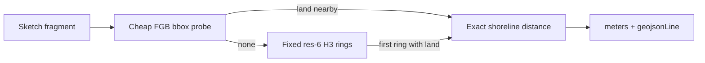
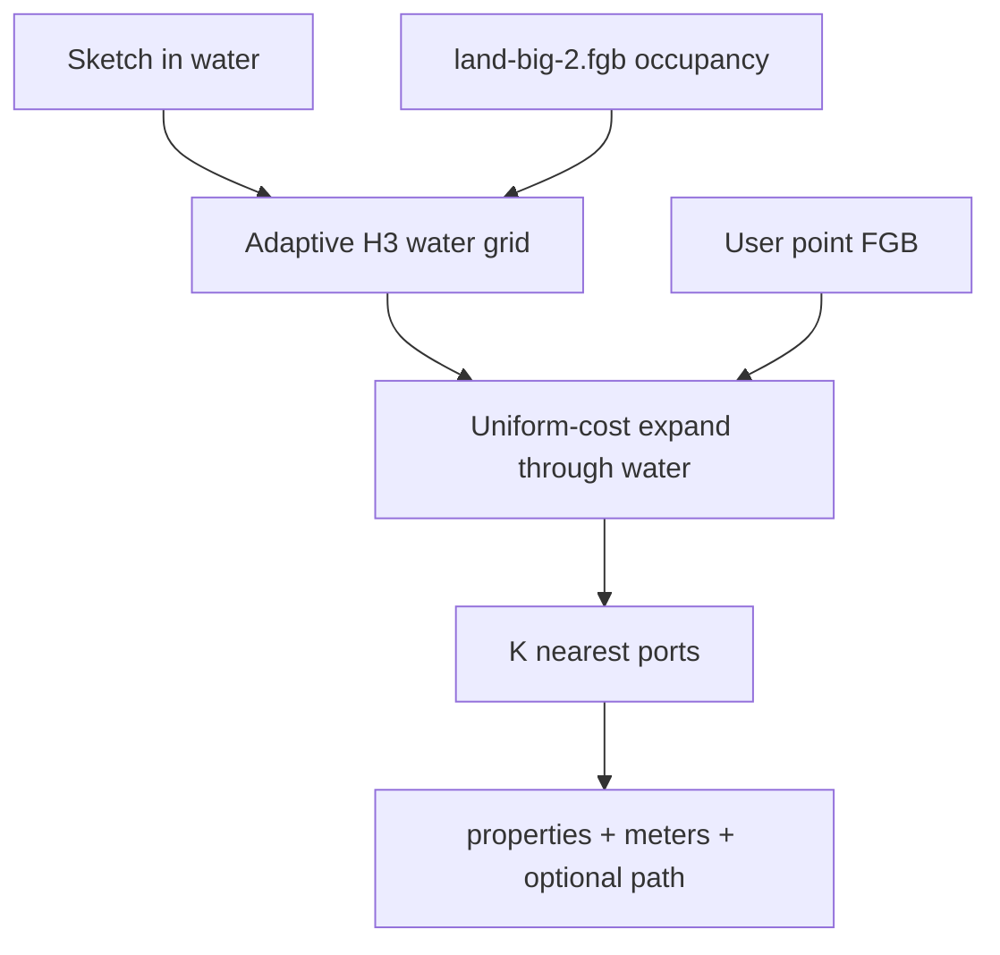

# Water-path nearest features (and better distance-to-shore)

## How distance-to-shore works today

The metric is geodesic, not a water path. It lives in [`packages/overlay-engine/src/calculateDistanceToShore.ts`](packages/overlay-engine/src/calculateDistanceToShore.ts) and is a first-class overlay metric (`distance_to_shore`).

```mermaid
flowchart LR
  sketch[Sketch fragment] --> cheap[Cheap FGB bbox probe]
  cheap -->|land nearby| exact[Exact shoreline distance]
  cheap -->|none| h3[Fixed res-6 H3 rings]
  h3 -->|first ring with land| exact
  exact --> result["meters + geojsonLine"]
```

- **Backing data:** hardcoded [`https://uploads.seasketch.org/land-big-2.fgb`](https://uploads.seasketch.org/land-big-2.fgb) (subdivided land polygons). Defaulted in [`packages/api/src/plugins/reportsPlugin.ts`](packages/api/src/plugins/reportsPlugin.ts) when the metric has no overlay URL. Same file is used as the `DIFFERENCE` clipping source in geography tests (`testing-land.fgb` is a related fixture).
- **Search:** `fgb-source` R-tree `search()` on a tight bbox; if empty, expand H3 rings at **resolution 6** (hex edge ~3.2 km) up to **50 rings** (~few hundred km), then fetch polygons and measure with Turf (`nearestPointOnLine` / segment-pair closest points).
- **Result:** `{ meters, geojsonLine }`. Fragments combine by taking the **minimum** meters ([`combineMetricsForFragments`](packages/overlay-engine/src/metrics/metrics.ts)).
- **Widget:** inline number — slash command in [`packages/client/src/reports/widgets/widgets.tsx`](packages/client/src/reports/widgets/widgets.tsx), render/export in [`InlineMetric.tsx`](packages/client/src/reports/widgets/InlineMetric.tsx). The Distance to Shore Map block widget shows `geojsonLine` on the shared path map.
- **Worker:** [`packages/overlay-worker/src/overlay-worker.ts`](packages/overlay-worker/src/overlay-worker.ts) loads the land FGB and calls `calculateDistanceToShore`. Geography subjects throw. Options such as `miminumDistanceMeters` are never passed.
- **Parameters already on the wire** (unused by shore): `maxResults`, `maxDistanceKm` on [`MetricDependencyParameters`](packages/overlay-engine/src/metrics/metrics.ts) — these are what the new metric will use.

### Problems to fix while generalizing H3

- **Early stop is wrong.** The first ring whose _bbox_ hits land is not necessarily the geodesic nearest shore. Continue until the next ring’s lower-bound distance exceeds the best exact distance found.
- **Fixed resolution + 50-ring cap.** Long offshore cases are slow or miss land. Use coarse cells in open ocean and refine near land.
- **Line/polygon origin coverage.** Lines only index vertices, so long edges skip cells. Cover edges (and polygons) properly.
- **Typo / dead options:** `miminumDistanceMeters`; debug `rings` built then discarded; `console.log` in the worker.

Distance-to-shore **stays geodesic** (shortest path _to_ land is a straight swim). It shares the improved occupancy + variable-res search, not the water-path graph.

## Implementation phases

Ship in three slices so shore improvements and the path map are usable before the new metric exists in Postgres or the report editor.

### Phase 1 — Distance to shore refactor + shore widgets

No new metric type and no `current.sql`.

- Extract H3 primitives from [`calculateDistanceToShore.ts`](packages/overlay-engine/src/calculateDistanceToShore.ts) (`bboxForCell`, occupancy vs land FGB, adaptive/variable-res expansion, geodesic nearest). Keep `calculateDistanceToShore` as a thin wrapper (`DistanceToShoreMetric` unchanged).
- Fix early-stop, line/polygon coverage, `miminumDistanceMeters` typo, worker `console.log`, pass options through [`overlay-worker.ts`](packages/overlay-worker/src/overlay-worker.ts).
- Tests against live [`land-big-2.fgb`](packages/overlay-engine/__tests__/constants.ts). Keep the existing cases and **add new sketches** where coverage is thin (see Tests). Expected `meters` must be independently computed (Python/Shapely/pyproj or GDAL against the same FGB), not copied from the current JS output. Throwaway scripts stay off-repo (`/tmp`); only GeoJSON fixtures + Vitest assertions are committed.
- Shared [`DistancePathMap`](packages/client/src/reports/widgets/DistancePathMap.tsx) + **Distance to Shore Map** block widget, slash command next to the existing inline shore metric, export/progress wiring. Consumes `geojsonLine` already on the metric.

### Phase 2 — World Ports library item + `distance_to_features_over_water` calculation

Engine, worker handler, tests, and the data-library listing. **No report widgets. No `current.sql`.** Reports cannot request the metric yet.

- Wire the **World Ports** data-library item (see below). Do not publish a separate Natural Earth ports file.
- Implement water-path k-NN (`waterPathNearest`), TypeScript `MetricType` + value type + `combineMetricsForFragments` in overlay-engine, worker `case "distance_to_features_over_water"` (callable from unit tests / local invoke). Clamp `maxDistanceKm` in the engine.
- Tests against live land FGB + the World Port Index FlatGeobuf already uploaded with that layer: island detour, coastal reachability, k-ordering, radius exclusion.
- Benchmark sweep → set `MAX_DISTANCE_TO_FEATURES_KM` for a ~10s miss case.

Leave for phase 3: [`packages/api/migrations/current.sql`](packages/api/migrations/current.sql), [`reportsPlugin.ts`](packages/api/src/plugins/reportsPlugin.ts) overlay-source rules / GraphQL comments, [`calculateSpatialMetricsBatch.ts`](packages/api/tasks/calculateSpatialMetricsBatch.ts) dispatch, and all feature-side UI.

### Phase 3 — DB + generic point widgets + Distance to Port presets

- `alter type spatial_metric_type add value if not exists 'distance_to_features_over_water'` in `current.sql`.
- reportsPlugin (requires a project overlay source — any point layer, including a copy of World Ports), batch job dispatch, progress labels.
- **Generic** inline distance-to-point and distance-to-point map, available on Point/MultiPoint reporting layers the way other overlay widgets are. A project with its own port dataset uses these and points them at that layer.
- **Distance to Port** and **Distance to Port Map** are those same widgets, preconfigured to the World Ports library layer. If that layer is already in the project, reference it. If not, confirm, add it, then insert the widget.
- Widget max-distance UI capped at the phase-2 constant. Exporters for both presentations.
- API upsert test mirroring the shore case in [`bulkUpsertSpatialMetrics.test.ts`](packages/api/tests/bulkUpsertSpatialMetrics.test.ts). Browser verification of the confirm-to-add flow, the inline metric, and the map.

## New metric: `distance_to_features_over_water`

The metric is not tied to one port dataset. It measures water-path distance from a sketch to the nearest points on **whatever point overlay layer the widget references**. World Ports is one such layer, offered from the data library. A project can use its own ports instead by pointing the generic distance-to-point widgets at that layer.

The first widgets show distance and the water-path to the **nearest** feature. The metric still returns up to **N** features (`maxResults`, selected columns, water-path distance) so a table can come later without a new calculation. The layer is a normal SeaSketch overlay source (already subdivided to FlatGeobuf at upload time). There is no ports file bundled inside the metric.

```mermaid
flowchart TD
  origin[Sketch in water] --> grid[Adaptive H3 water grid]
  landFgb["land-big-2.fgb occupancy"] --> grid
  grid --> astar[Uniform-cost expand through water]
  points[User point FGB] --> astar
  astar --> hits["K nearest ports"]
  hits --> out["properties + meters + optional path"]
```

**Distance definition:** shortest path through **water cells**, land cells blocked. A port sitting on the coastline is reached via the adjacent water cell plus a short hop to the point (ports must remain reachable; blocking every hex that _touches_ land would trap harbors).

**Adaptive grid (the efficiency lever):**

- Start at coarse resolution (about H3 res 4, ~22 km edge) in open water.
- For each candidate cell, classify against the land FGB: `water` / `land` / `mixed` (R-tree `search()` first; fetch + intersect only on hits). Cache per job.
- `mixed` → replace with children down to a fine floor (about res 8, ~460 m) so channels stay passable.
- `land` → blocked. `water` → graph node. Neighbors include same-res hex neighbors and parent/child links at resolution boundaries (`h3-js` 4.3.0 already depends in overlay-engine).

**Search:** Dijkstra/uniform-cost from the sketch’s water cells. As cells are visited, `search()` the **point** FGB in that cell. First time a feature is reached, record path cost. Stop when `maxResults` are found and the frontier cost exceeds the Nth distance, or `maxDistanceKm` is exceeded.

**Time budget (~10s):** worst case is _no_ hit inside the radius (full expansion). Cap `maxDistanceKm` so that case stays around **10 seconds** on the overlay worker (10 GB ARM Lambda — not the 15-minute timeout). Omit or oversize → clamp to `MAX_DISTANCE_TO_FEATURES_KM` exported from overlay-engine. Default in slash commands = that cap (or a slightly smaller default if the bench suggests a nicer UX). Widget tooltip cannot exceed the cap.

The numeric cap is **not guessed in this plan**. A Vitest sweep against live `land-big-2.fgb` + the World Port Index FlatGeobuf (open-ocean miss vs coastal hit) records times at several radii; set the constant from the largest radius that stays near 10s, then keep the bench so it can be retuned when the grid or occupancy changes.

**Two sources in the worker:** `sourceUrl` = user points (hashed/cached like other overlay metrics); land URL stays the same global default as shore (implementation detail, not the overlay identity).

**Not in v1:** geography subjects (same gap as shore); CQL filters on the point layer.

## API / types / worker wiring

Follow the `ous_demographics` / `distance_to_shore` pattern. **TypeScript metric + worker case: phase 2. Postgres + reportsPlugin + batch dispatch: phase 3.**

- Add `distance_to_features_over_water` to Postgres `spatial_metric_type` in [`packages/api/migrations/current.sql`](packages/api/migrations/current.sql) (`alter type ... add value if not exists`) — **phase 3**.
- Extend [`MetricType`](packages/overlay-engine/src/metrics/metrics.ts), value type, `combineMetricsForFragments` (merge by feature id, keep closest, cap at `maxResults`, **keep `geojsonLine`**), empty-collection stub, and exports in [`packages/overlay-engine/src/index.ts`](packages/overlay-engine/src/index.ts).
- Value shape: `{ features: Array<{ __id, meters, properties, geojsonLine }>, exceededLimit: boolean }` — same `__id` / `includedColumns` convention as [`presence_table`](packages/overlay-engine/src/metrics/metrics.ts). `geojsonLine` is the **water-path** LineString (cell-center route, densified enough to look like a curve), not the geodesic chord.
- Parameters: existing `maxResults` (default 5, cap ~25), `maxDistanceKm` (required for this metric; **clamped to `MAX_DISTANCE_TO_FEATURES_KM`** in the engine even if the client sends more), `includedColumns`.
- [`reportsPlugin.ts`](packages/api/src/plugins/reportsPlugin.ts): this metric **does** require a project overlay source (unlike shore). Include it in GraphQL comments / progress labels — **phase 3**.
- [`calculateSpatialMetricsBatch.ts`](packages/api/tasks/calculateSpatialMetricsBatch.ts): dispatch like other overlay metrics (`sourceUrl` + `...parameters`) — **phase 3**.
- Worker `case "distance_to_features_over_water"`: load point FGB + land FGB; reject geography subjects; pass `maxResults` / `maxDistanceKm` / `includedColumns` — **phase 2** (tests invoke overlay-engine / worker directly).

## Report widgets

### Distance to Shore Map (phase 1)

- `DistanceToShoreMap` — metric `distance_to_shore`; one geodesic path (the combined closest fragment).
- Slash command next to the existing inline shore metric.
- Introduces shared [`DistancePathMap`](packages/client/src/reports/widgets/DistancePathMap.tsx) (new):

- Mapbox GL, already in the client. Admin-chosen basemap on the widget: **Streets** (default for new widgets), Light, or Satellite. The sketch polygon is white on Satellite so it stays visible. Do **not** hook the project `MapContextManager` / [`useReportStyleToggle`](packages/client/src/reports/hooks/useReportStyleToggle.tsx) — this is an in-card map, not an overlay on the main project map. Viewers do not get a basemap switcher. Unit **None** hides the distance caption.
- **Minimally interactive, not a static image:** pan + zoom; compact attribution; `cooperativeGestures` so scrolling the report does not steal the wheel. No rotation, no pitch, no layer picker, no drawing.
- Fit bounds to paths (and origin/destination points) with padding. Empty / zero-distance / Infinity: empty-state copy, no bogus world view.
- Path styling: LineString with a light casing + colored stroke; origin and destination points. Print: keep the map in the card; fit bounds before print.

Exports: JSON `extras` with the path FeatureCollection; CSV can omit geometry or include WKT if cheap.

### Generic distance-to-point widgets (phase 3)

Two presentations of `distance_to_features_over_water`, reusable for any Point/MultiPoint reporting layer:

- **Inline distance to point** — distance to the nearest feature (InlineMetric + unit selector). Slash command on that layer, same place as other overlay inline metrics.
- **Distance to point map** — reuse `DistancePathMap`. Shows the water-path to the nearest feature (the same line the metric already stores). Slash command next to the inline one, same relationship as Distance to Shore vs Distance to Shore Map.

Tooltip: max distance (capped at `MAX_DISTANCE_TO_FEATURES_KM`), distance unit ([`UnitSelector`](packages/client/src/reports/widgets/UnitSelector.tsx)), and the same basemap choices as the shore map. `maxResults` stays on the metric for a later table; these two widgets use the nearest feature.

A project with a more accurate port dataset uses these widgets and points them at that layer. Nothing about them is World-Ports-specific.

### Distance to Port presets (phase 3)

**Distance to Port** and **Distance to Port Map** are those two widgets, inserted already pointed at the World Ports library layer (template id `WORLD_PORTS`). They are not a third widget implementation.

Placement matches shore: inline under sketch inline metrics, map under sketch block widgets, not buried inside a layer’s command group. They do not appear as a free choice of overlay until the layer is in the project.

**Layer already in the project.** Find the table-of-contents item whose `copiedFromDataLibraryTemplateId` is `WORLD_PORTS` and configure the widget’s overlay dependency to that item.

**Layer not in the project.** Before inserting, ask the author to confirm that World Ports will be added to the project’s data layers. On confirm, call `copyDataLibraryTemplateItem` (the same mutation as [Data Library → add to project](packages/client/src/admin/data/DataLibraryModal.tsx)), then insert the widget against the new item. Cancel leaves the report unchanged. This confirm-then-add step is the pattern for later widgets that require a particular library layer.

Wire router, tooltip controls, [`ReportMetricsProgressDetails`](packages/client/src/reports/ReportMetricsProgressDetails.tsx), and CSV/JSON exporters ([`widgets/README.md`](packages/client/src/reports/widgets/README.md) export section). No edits to `packages/client/src/lang/*`.

## World Ports data library item

Same kind of item as Seamounts: a layer that already lives in the superuser project, listed in the data library, copied into other projects with `copyDataLibraryTemplateItem`. Source: [NGA World Port Index](https://msi.nga.mil/Publications/WPI). The layer **World Port Index** is already uploaded on the local superuser project (`stable_id = 1TNhNALAq`). Do not upload it again and do not convert Natural Earth ports.

- **Template id:** `WORLD_PORTS`, on stable id `1TNhNALAq`. The golden snapshot seed in [`data-library.sql`](packages/api/snapshots/data-library.sql) inserts that layer and calls `assign_data_library_template_id`. The id is listed in [`snapshotTemplateIds.js`](packages/api/src/DataLibrary/snapshotTemplateIds.js). Do **not** put the assignment in `current.sql`.
- **Listing:** a `DataLibraryEntry` in [`DataLibraryModal.tsx`](packages/client/src/admin/data/DataLibraryModal.tsx), next to Seamounts. Title “World Ports”, short description, `templateId="WORLD_PORTS"`, source link to the NGA page, and a thumbnail.
- **What “add to project” copies:** the existing tiled layer, cartography, and FlatGeobuf. Reporting then uses that copy as a normal overlay source. No special worker URL.

## Implementation shape in overlay-engine

Extract shared primitives from `calculateDistanceToShore.ts` rather than growing that 1k-line file:

- `h3/bboxForCell.ts` — antimeridian-safe cell bbox (already implemented)
- `h3/landOccupancy.ts` — water / land / mixed vs land FGB
- `h3/adaptiveGrid.ts` — refine mixed cells, iterate neighbors across resolutions
- `h3/geodesicNearest.ts` — improved shore search — **phase 1**
- `h3/waterPathNearest.ts` — k-NN through water to point features; persist water-path `geojsonLine` — **phase 2**
- `calculateDistanceToShore.ts` becomes a thin wrapper so existing imports keep working — **phase 1**

On-demand occupancy from `land-big-2.fgb` is the v1 data strategy (no new global H3 mask). If jobs are too slow in open ocean, a compact precomputed occupancy file on `uploads.seasketch.org` is a follow-up — not required to ship.

## Point source for tests

Overlay-engine tests should hit the FlatGeobuf produced when World Port Index was uploaded, not a second ports file. Land stays [`https://uploads.seasketch.org/land-big-2.fgb`](https://uploads.seasketch.org/land-big-2.fgb) via [`landUrl`](packages/overlay-engine/__tests__/constants.ts).

Add `portsUrl` next to `landUrl` in [`packages/overlay-engine/__tests__/constants.ts`](packages/overlay-engine/__tests__/constants.ts), set to that layer’s FlatGeobuf URL (the `data_upload_outputs` row on stable id `1TNhNALAq`). Order and naming assertions use columns on that dataset (port name), not Natural Earth `name` / `scalerank`. Points are already subdivided by the upload pipeline.

## Tests

- **Phase 1 — geodesic shore:** keep using live `land-big-2.fgb`. Existing cases in [`sketchFragmentOverlap.test.ts`](packages/overlay-engine/__tests__/overlapping-area-processor/sketchFragmentOverlap.test.ts) (on-land / Kanacea, midpoint-between-vertices, far offshore, antimeridian) stay as regression.

  Audit and fill gaps with **new committed sketch fixtures** (same folder as `Midpoint-test-4.geojson.json` / `Distance-test-3.geojson.json`) so the suite covers at least:
  - on-land → 0
  - closest point on a shoreline **edge**, not a vertex
  - long offset that old res-6 / 50-ring search would miss or be slow
  - antimeridian
  - a case where the first H3 ring that _bbox-hits_ land is **not** the geodesic nearest (early-stop bug)
  - LineString / polygon subjects whose closest shore is along an edge, not a vertex (origin coverage)

  **Expected distances:** do not treat the current `calculateDistanceToShore` result as ground truth. Independently measure geodesic nearest-edge distance to land polygons from `land-big-2.fgb` (e.g. download/range-read the FGB, bbox-filter, Shapely `distance` after a geographic/azimuthal projection, or GDAL/OGR). Use `/tmp` (or similar) for those scripts — **do not add them to the repo**. Paste the resulting meters into Vitest `toBeCloseTo` with a documented tolerance. Re-run the oracle if a fixture changes.

- **Phase 2 — water path:** land FGB as obstacles + the **World Port Index FlatGeobuf** as the point source. Pick sketches where a real island sits between the origin and a named port so water-path is longer than geodesic; assert coastal ports remain reachable; k=3 ordering using the port-name column on that dataset; `maxDistanceKm` exclusion.
- **Phase 2 — runtime vs radius:** [`packages/overlay-engine/__tests__/distanceToFeaturesOverWater.bench.test.ts`](packages/overlay-engine/__tests__/distanceToFeaturesOverWater.bench.test.ts), same `measurePerformance` style as [`geographies.bench.test.ts`](packages/overlay-engine/__tests__/geographies.bench.test.ts). Sweep `maxDistanceKm` (e.g. 50 / 100 / 200 / 400 / 800) on (a) a coastal sketch that hits a World Port Index port early and (b) an open-ocean sketch that misses until the cap. Log/assert times; use the miss case to set `MAX_DISTANCE_TO_FEATURES_KM` so the full expansion stays ~10s. Keep the bench so the cap can be retuned; do not treat it as a flaky CI gate on exact milliseconds (assert an upper bound with slack, or `it.skip` the tight bound in CI if variance is high and print a table instead).
- **Phase 2 — combine logic** (`combineMetricsForFragments` dedupe by `__id`) can stay in-memory with no FGB.
- **Phase 3 — API:** `getOrCreate` / batch upsert includes `distance_to_features_over_water` + overlay URL (mirror [`bulkUpsertSpatialMetrics.test.ts`](packages/api/tests/bulkUpsertSpatialMetrics.test.ts) shore test).

## Verification

- **Phase 1:** overlay-engine vitest for shore/H3; browser Distance to Shore Map on a real report (pan/zoom, path fits).
- **Phase 2:** overlay-engine vitest + bench against CDN land and the World Port Index FlatGeobuf (no report UI). Data library: World Ports lists in the modal and “add to project” copies stable id `1TNhNALAq`.
- **Phase 3:** client lint / live reload. Browser: Distance to Port on a project that already has World Ports, and on one that does not (confirm adds the layer, then the widget is inserted). Same for the map. A custom point layer still gets the generic distance-to-point commands. Confirm a land-blocked geodesic neighbor is _not_ preferred over a water-reachable port.
