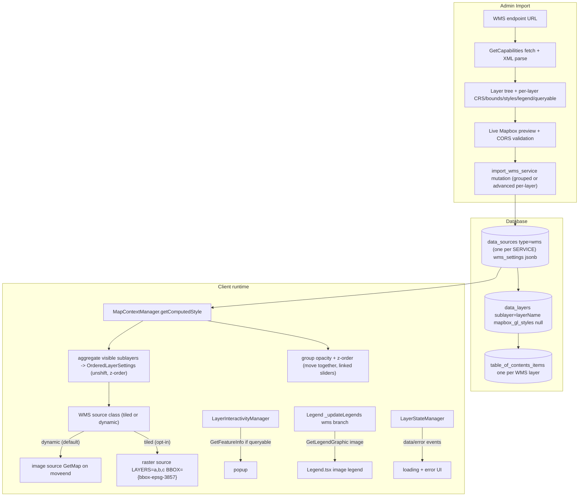

# WMS Overlay Support for SeaSketch

## Goal

Make OGC WMS a first-class overlay layer type that behaves like any other SeaSketch layer: admins browse a service catalog (or enter endpoints manually), pick layers, and each WMS layer appears individually in the overlay list with working legend, metadata, popups, z-order, and opacity, fetched as map images.

## Key architecture decisions

- **Grouped, shared-source model by default (mirrors ArcGIS dynamic map server).** One `data_source` per WMS _service_ (type `wms`), and one `data_layer` + TOC item per selected WMS _layer_, with the WMS layer name stored in the existing reserved `data_layers.sublayer` column (the schema comment already says this column is "For ARCGIS_MAPSERVER and eventually WMS sources"). At runtime the visible sublayers of a service are composited into a **single** `GetMap` request via the `LAYERS=` list, in z-order. This reuses the existing `ArcGISDynamicMapService` rendering path, the `customSources` registry, sublayer aggregation in `getComputedStyle()`, the image-legend pipeline, and `getComputedMetadata()` almost entirely.
- **Group behavior for z-order and opacity.** Because standard WMS `GetMap` has no per-layer opacity or per-layer z-interleaving in a single request, all sublayers of a service render as one composite image and behave as a group: they stay contiguous in the layer stack and **move together** in z-order, and their **opacity sliders are linked** (changing one sets them all and applies a single whole-image opacity). The WMS source's `getComputedMetadata().supportsDynamicRendering` advertises `{ layerOrder: true, layerVisibility: true, layerOpacity: false }` to drive this UI.
- **Advanced: independent per-layer import.** A clearly explained advanced option in the catalog browser imports each selected layer as its **own** `data_source` (still type `wms`, one sublayer each) instead of a shared one. Those layers then get fully independent z-order and opacity (each is its own composite-of-one). Default remains grouped.
- **Two source classes (tiled + dynamic), like the esri module; default dynamic.** Mirror `mapbox-gl-esri-sources`' split: a **`WMSTiledSource`** (Mapbox `raster` source whose tiles template carries `LAYERS=...&BBOX={bbox-epsg-3857}`; tiles rebuilt when the visible sublayer set changes) and a **`WMSDynamicSource`** (viewport `GetMap` image updated on `moveend`, like `ArcGISDynamicMapService`). No vector/feature class. SeaSketch defaults to **dynamic** (one request per view, robust against inefficient/poorly-cached services) and offers **tiled** as an opt-in for well-behaved, properly cache-headered services; mode is an editable per-service setting that selects which class is instantiated.
- **CORS: direct requests + validation (chosen).** No proxy. All requests (GetCapabilities, GetMap, GetFeatureInfo, GetLegendGraphic, MetadataURL) go directly from the browser. We validate CORS during import/preview and surface clear errors; runtime CORS failures flow into the existing layer error indicators. Schema/settings are designed so a proxy/credentials can be added later without rework.
- **Public services first.** No stored credentials in v1; `wms_settings` leaves room to add them later.
- **New, dedicated package — do not modify the battle-tested esri package.** Implement the WMS source in a **new** package `@seasketch/mapbox-gl-wms-source` ([packages/mapbox-gl-wms-source](packages/mapbox-gl-wms-source)). Do not add WMS code to [packages/mapbox-gl-esri-sources](packages/mapbox-gl-esri-sources). Shared-code judgment call (default: duplicate-if-small, avoid regressions):
  - The `CustomGLSource` contract and its small companion types (`ComputedMetadata`, `LegendItem`, `OrderedLayerSettings`, `DynamicRenderingSupportOptions`, etc.) are ~150 lines of pure TypeScript types — **duplicate** them into the new package. Structural typing keeps the WMS source classes assignable wherever the client expects a `CustomGLSource`.
  - The handful of pure helpers the dynamic-image pattern needs (lon/lat→Web Mercator, `blankDataUri`, the `moveend`→`updateImage` lifecycle) are also small enough to **copy**.
  - Only if duplication turns out to be substantial, extract a third tiny shared package (e.g. `@seasketch/mapbox-gl-source-common`) consumed by the new WMS package; refactor esri-sources to consume it **only** if clearly low-risk, otherwise leave esri-sources entirely untouched (it may keep its own copy). Avoid a combined/renamed package.
  - Reuse [@seasketch/metadata-parser](packages/metadata-parser) (separate existing package; already parses ISO-19139 + FGDC + ESRI → ProseMirror) for linked `MetadataURL` documents.
  - Replace the unused stub [packages/client/src/dataLayers/sourceTypes/WMSSource.ts](packages/client/src/dataLayers/sourceTypes/WMSSource.ts).

## Architecture overview

## Implementation phases

The work is split into two phases. **Phase 1 ships a complete, independently tested module with zero SeaSketch coupling; Phase 2 wires it into the app.**

- **Phase 1 — Standalone `@seasketch/mapbox-gl-wms-source` module:** sections **2** (library + two source classes), **2a** (README), **2b** (exported catalog/metadata/legend/interactivity helpers), **10** (example services), **11** (testing), **12** (playground + build). Deliverable: a published-shape package + README + playground + green test suite, usable in any Mapbox GL app.
- **Phase 2 — SeaSketch integration:** sections **1** (data model), **3 / 3a** (map rendering + grouped UX), **4** (legend), **5** (interactivity), **6** (metadata), **7** (import UI), **8** (layer editor), **9** (parity). A thin consumer of Phase 1: WMS protocol logic stays in the module; the client adds React/GraphQL/UI on top. Depends only on the finished Phase 1 package.

Section numbers below are grouped by topic for reference, not execution order; follow the phase grouping above (and the todos) for sequencing.

## 1. Data model (API)

Work only in [packages/api/migrations/current.sql](packages/api/migrations/current.sql) (never edit committed migrations or `schema.sql`).

- Add `wms` to the `data_source_types` lookup table (`insert into data_source_types ...`).
- **Shared source, sublayer per WMS layer (like arcgis-dynamic-mapserver):** one `data_sources` row (type `wms`) per service; one `data_layers` row per WMS layer with the WMS layer Name in `data_layers.sublayer` and `mapbox_gl_styles` null. One `table_of_contents_items` row per WMS layer. In advanced per-layer import, simply create N `data_sources` (one each) instead of one shared source — same row shapes otherwise.
- Add one column `data_sources.wms_settings jsonb` holding **service-level** WMS config: `version` (`1.1.1`|`1.3.0`), `crs` (default `EPSG:3857`), `imageFormat`, `requestMode` (`tiled`|`dynamic`), `tileSize`, `transparent`, `infoFormat`, `getMapUrl`/`getFeatureInfoUrl`/`getLegendGraphicUrl` (operation endpoints can differ from the capabilities URL), `capabilitiesUrl`, `vendorParams`, `supportedCrs`, `formats`. Per-layer details (advertised styles, `LegendURL`, `queryable`, bounds, scale hints, `MetadataURL`) are read from parsed capabilities at runtime via `getComputedMetadata()` (keyed by sublayer name), mirroring ArcGIS — no need to denormalize them per `data_layer`. Reuse existing `url`, `bounds`, `attribution`, `use_device_pixel_ratio`, `query_parameters`, `minzoom`/`maxzoom`, `tile_size`.
- Update `before_insert_or_update_data_sources_trigger()` (see [packages/api/schema.sql](packages/api/schema.sql) ~4273-4351): allow `url` (required), `query_parameters`, `use_device_pixel_ratio`, `tile_size`, `minzoom`/`maxzoom`, and `wms_settings` for type `wms`.
- Update `before_insert_or_update_data_layers_trigger()` (~4224-4265): allow `sublayer` for `wms` sources (currently only `arcgis-dynamic-mapserver` is permitted) and require `mapbox_gl_styles` null.
- Update `data_source_type(data_layer_id)` (~9679-9698): return `'wms'` for WMS sublayers. Decide whether a TOC pseudo-type (e.g. `wms-sublayer`) is warranted; likely not needed since WMS layers are all raster-style and share one editor path — returning `'wms'` keeps the client switch simple. (No `sublayer_type` split required.)
- **Critical:** add `wms_settings` (and any other new columns) to the column list copied by `publish_table_of_contents()` so settings survive publish.
- Add a batch import function `import_wms_service(projectId, items[], sources[])` mirroring `import_arcgis_services` (`schema.sql` ~13110-13255): create the `data_sources` row(s), one `data_layers` row per layer (`sublayer` set, null styles), TOC items via `import_subtree()` wrapped in a service-named folder when multiple, default interactivity = `ALL_PROPERTIES_POPUP` for queryable layers. Add composite input types analogous to `arcgis_import_item`/`arcgis_import_source`; include a flag for grouped vs per-layer.
- Add computed field `projects.imported_wms_services` (distinct `url` of overlay `wms` sources) to warn on re-import, mirroring `projects_imported_arcgis_services()`.
- Metadata strategy: align with ArcGIS dynamic — set `usesDynamicMetadata = true` for `wms` (extend `table_of_contents_items_uses_dynamic_metadata`, `schema.sql` ~22668-22681) so `getComputedMetadata()` supplies metadata, with the existing "convert to editable" path available. Enhance the generated metadata using [@seasketch/metadata-parser](packages/metadata-parser) when a layer exposes a CORS-fetchable `MetadataURL`.
- Regenerate `packages/api/generated-schema.gql` and run client `graphql:codegen`.

## 2. WMS source library (new package `@seasketch/mapbox-gl-wms-source`)

Create `packages/mapbox-gl-wms-source` (TypeScript build mirroring esri-sources' `tsconfig`/`package.json` conventions). Add it as a `packages/client` dependency. Contents:

- `CustomGLSource.ts`: **duplicated** copy of the contract + companion types from esri-sources, with `CustomSourceType` including `"WMSTiledSource"` and `"WMSDynamicSource"`. (Keeps esri-sources untouched; structural typing keeps the WMS classes assignable where the client expects a `CustomGLSource`.)
- `projection.ts` / `util.ts`: small **copied** helpers (lon/lat→Web Mercator, `blankDataUri`, viewport-image lifecycle).
- `WMSCapabilities.ts`: fetch + parse GetCapabilities XML for **1.1.1 and 1.3.0** (use `xml2js`/`fast-xml-parser`). Extract service info (title, abstract, access constraints, contact, fees), supported `GetMap`/`GetFeatureInfo` formats and max width/height, and a nested layer tree with per-layer `Name`, `Title`, `Abstract`, CRS/SRS list, geographic + projected bounding boxes, `Style`s (+ `LegendURL`), `queryable`, `MetadataURL`, scale hints, and dimensions (TIME/ELEVATION). Shared by both source classes.
- **Two `CustomGLSource` classes (mirroring esri's tiled/dynamic split; no vector class):**
  - `WMSTiledSource.ts`: emits a Mapbox `raster` source whose tiles template carries `LAYERS=<list>&STYLES=<list>&BBOX={bbox-epsg-3857}&WIDTH=...&HEIGHT=...&CRS=EPSG:3857`; rebuilds tiles on `updateLayers`. Best for properly cache-headered services.
  - `WMSDynamicSource.ts`: viewport single-image source `{ type: "image", url, coordinates }` updated on `moveend` (same approach as `ArcGISDynamicMapService`, reimplemented not imported). HiDPI doubles WIDTH/HEIGHT when enabled.
  - Shared behavior across both: `updateLayers(OrderedLayerSettings)` sets the ordered `LAYERS=`/`STYLES=` lists (empty → `blankDataUri`, no request); version-correct `getMapUrl`/`getFeatureInfoUrl`/`getLegendGraphicUrl` builders (1.1.1 `SRS`+`BBOX` minx,miny,maxx,maxy; 1.3.0 `CRS` + axis order — standardize on `EPSG:3857` to avoid 4326 lat/lon flips); `getComputedMetadata()` returns service bounds/attribution plus a `tableOfContentsItems` tree keyed by WMS layer name with per-layer legend, metadata, and queryable flag (same shape ArcGIS returns), with `supportsDynamicRendering = { layerOrder: true, layerVisibility: true, layerOpacity: false }`; must fire Mapbox `dataloading`/`data`/`error` on the prefixed source id; `getFeatureInfo(lngLat, viewport, queryLayers)` helper.
  - Factor shared logic into a small internal base/helpers module within the package to avoid duplication between the two classes.

## 2a. README (analogous to esri-sources)

Author `packages/mapbox-gl-wms-source/README.md` mirroring the structure of [packages/mapbox-gl-esri-sources/README.md](packages/mapbox-gl-esri-sources/README.md):

- Intro sentence ("Easily add OGC WMS services to Mapbox GL JS…").
- **Examples** links (to the playground / hosted demos).
- **WMS Tiled** section: explains tiled WMS and shows a plain Mapbox `raster` snippet using the `{bbox-epsg-3857}` token (mirroring esri's "you don't strictly need this module" framing), then the `WMSTiledSource` convenience class.
- **Dynamic WMS** section: explains viewport-image WMS, the `WMSDynamicSource` class, `updateLayers` for sublayer visibility/order, and `devicePixelRatio`/HiDPI behavior — paralleling esri's "ArcGIS Dynamic Map Services" section.
- **No vector/feature-layer section** (the deliberate scope difference from the esri module).

## 2b. Exported helper API (separation of concerns)

Beyond the two source classes, the module exports standalone, framework-agnostic functions so that catalog access, metadata, legends, and interactivity logic lives in the **well-tested module**, not the client. The SeaSketch client (Phase 2) becomes a thin consumer: it handles React/GraphQL/UI, but delegates all WMS protocol logic here. Proposed public surface (names indicative):

- **Catalog access:**
  - `normalizeWMSUrl(input)` → `{ getCapabilitiesUrl, baseUrl }` (accepts bare hosts, GetCapabilities URLs, or GetMap URLs with junk params).
  - `fetchCapabilities(url, { fetch?, version? })` → raw + parsed capabilities.
  - `parseCapabilities(xml)` → normalized `WMSServiceMetadata` (service info + supported formats/CRS + nested `WMSLayer` tree).
  - `getSupportedWebMercatorCrs(layer|service)`, `flattenLayers(tree)`, and helpers to detect named vs group-only layers — everything the catalog browser needs.
- **Metadata handling:**
  - `buildLayerMetadata(serviceMetadata, layerName)` → a normalized metadata model + a ProseMirror document (service title/abstract/attribution/CRS/access constraints). Depends on `@seasketch/metadata-parser` to fold in a layer's `MetadataURL` (ISO-19139/FGDC) when fetchable.
  - `fetchAndParseMetadataUrl(metadataUrl, { fetch? })` for the linked-document path.
- **Legends:**
  - `getLegendItems(serviceMetadata, layerName, { style? })` → `LegendItem[]`, preferring the capabilities `LegendURL` and falling back to a constructed `getLegendGraphicUrl(...)`.
  - `getLegendGraphicUrl(...)` version-correct builder.
- **Interactivity:**
  - `getFeatureInfoUrl(params)` version-correct builder (`X`/`Y` vs `I`/`J`, `QUERY_LAYERS`, `INFO_FORMAT`, BBOX/CRS, WIDTH/HEIGHT).
  - `parseFeatureInfo(response, infoFormat)` → normalized features/properties (JSON, GML, or HTML passthrough).
  - `identify(serviceMetadata, layers, lngLat, viewport, { fetch? })` convenience that combines URL build + fetch + parse.

All of these are pure or `fetch`-injectable, so they're exhaustively unit-tested against fixtures in Phase 1 and reused verbatim by the client in Phase 2.

## 3. Map rendering integration ([MapContextManager.ts](packages/client/src/dataLayers/MapContextManager.ts))

- Add `DataSourceTypes.Wms` to `sourceTypeIsCustomGLSource()` and `createCustomSource()` (~3737-3805), constructing the appropriate WMS source class — `WMSDynamicSource` or `WMSTiledSource` per `wms_settings.requestMode` — from the new package using `source.url` + `source.wmsSettings`. Widen the `customSources` registry typing to accept either package's implementations — define a local union/structural alias (e.g. `AnyCustomGLSource = CustomGLSource<any> | WMSDynamicSource | WMSTiledSource`) rather than adding WMS members to the esri package's `CustomSourceType`.
- Reuse the existing arcgis-dynamic sublayer-aggregation path in `getComputedStyle()` (~1796-1846): WMS layers with a `sublayer` accumulate into `customSources[source.id].sublayers` via `unshift` (z-order), then `customSource.updateLayers(sublayers)` + `getGLSource()` produce the single composite source per service. Add `Wms` alongside `ArcgisDynamicMapserver` in the relevant type checks (e.g. the opacity-skip block at ~1684-1695, since the composite uses group-level opacity, not per-layer paint opacity).
- Group opacity: apply a single opacity to the one composite raster/image layer per service (in dynamic mode, whole-image `raster-opacity`; tiled likewise). Since WMS can't vary opacity per sublayer in one request, the group shares one value (see grouped UX below).
- Loading/error: relies on the WMS source classes firing `data`/`dataloading`/`error` on the prefixed `overlay-{id}` source (tiled raster fires these natively; dynamic image mode fires them like `ArcGISDynamicMapService`).

## 3a. Grouped z-order & opacity UX

WMS sublayers of a shared service behave as a single unit:

- **Z-order grouping (mostly already present):** `getVisibleLayersByZIndex()` (~3120-3147) already groups sublayers of the same `dataSourceId` by their lowest z-index, so they render contiguously. Ensure end-user `moveLayerToTop`/`moveLayerToBottom` (~3265-3283) and the admin [ZIndexEditableList.tsx](packages/client/src/admin/data/ZIndexEditableList.tsx) move the **whole group** (apply the z override to all sibling sublayers, or present the group as one draggable unit). Within-group order maps to the `LAYERS=` draw order.
- **Linked opacity:** in `setLayerOpacity()` (~3285-3313), when the target layer is a grouped WMS sublayer (custom source with `supportsDynamicRendering.layerOpacity === false`), set the same opacity on **all** visible sublayers sharing that `data_source` and apply it once to the composite layer; broadcast so every sibling's slider reflects the shared value.
- **Visual indication:** in the overlay list / legend ([Legend.tsx](packages/client/src/dataLayers/Legend.tsx), [TableOfContentsItemMenu.tsx](packages/client/src/admin/data/TableOfContentsItemMenu.tsx)) show a subtle grouped indicator and explanatory copy (e.g. "Part of a WMS service — z-order and opacity apply to the whole group"). Drive this from `supportsDynamicRendering`.

## 4. Legend ([Legend.tsx](packages/client/src/dataLayers/Legend.tsx) + `_updateLegends`)

- Add a `wms` branch in `MapContextManager._updateLegends()` (~2878-3084) producing a `CustomGLSourceSymbolLegend`, with legend items resolved by the module's `getLegendItems()` (section 2b) — the client just renders them via the existing ArcGIS image-legend UI (`LegendImage`). Legend `` display does **not** require CORS, so legends render even from non-CORS servers.

## 5. Interactivity / GetFeatureInfo ([LayerInteractivityManager.ts](packages/client/src/dataLayers/LayerInteractivityManager.ts))

- Refactor the existing `identifyLayers` TODO ("only works with ArcGIS Server… support CustomGLSources more generally", ~601-603, [arcgis.ts](packages/client/src/admin/data/arcgis/arcgis.ts) ~1393-1434) to dispatch by source type. The WMS path delegates the protocol work to the module's `identify()` / `getFeatureInfoUrl()` + `parseFeatureInfo()` (section 2b) — the client only maps the normalized result into popups.
- Prefer `application/json` → property popup; fall back to `text/html` (render in popup) or GML — all handled by the module's `parseFeatureInfo`. Gate interactivity on the layer's `queryable` flag; surface CORS failures gracefully.

## 6. Metadata ([OverlayMetadataEditor.tsx](packages/client/src/admin/data/OverlayMetadataEditor.tsx))

- Align with ArcGIS dynamic: `wms` sources use dynamic metadata (`usesDynamicMetadata = true`). Metadata documents are produced by the module's `buildLayerMetadata()` (section 2b) — which builds a ProseMirror doc from capabilities (title, abstract, attribution, CRS, access constraints) and folds in a CORS-fetchable `MetadataURL` via `@seasketch/metadata-parser` — and surfaced through `getComputedMetadata()`. The existing "Convert to editable metadata" flow lets admins snapshot it for hand-editing, and reverting to `null` restores dynamic metadata — no new UI required.

## 7. Admin import / catalog browser

Add to the "Connect to data services" submenu in [TableOfContentsEditor.tsx](packages/client/src/admin/data/TableOfContentsEditor.tsx) (~805-851): "OGC WMS service…". Build `WMSCartModal` modeled on [ArcGISCartModal.tsx](packages/client/src/admin/data/arcgis/ArcGISCartModal.tsx):

- `WMSSearchPage`: URL entry → the module's `normalizeWMSUrl()` + `fetchCapabilities()`/`parseCapabilities()` (section 2b) do the protocol work. Reuse [useRecentServers.ts](packages/client/src/admin/data/arcgis/useRecentServers.ts) (already supports `type: "wms"`). Show a clear, actionable error when the server lacks CORS or returns invalid capabilities.
- Catalog: render the module's normalized `WMSServiceMetadata` layer tree (multi-select, per-layer CRS/queryable/styles via the module's helpers).
- Service import settings: WMS version, image format, CRS (intersection of server-supported and web-mercator), render mode (default dynamic; tiled opt-in), HiDPI, transparent, default style.
- Live preview using the WMS source classes + the shared [Legend.tsx](packages/client/src/dataLayers/Legend.tsx); validates CORS/format before import.
- **Advanced — independent layers toggle:** an off-by-default switch (with a thorough explanation, mirroring the existing "Display vectors instead of requesting images" switch in [ArcGISCartModal.tsx](packages/client/src/admin/data/arcgis/ArcGISCartModal.tsx) ~971-998) that imports each selected layer as its **own** WMS `data_source` (independent z-order and opacity) instead of one shared, grouped service. Copy explains the trade-off: grouped = single efficient request, shared z-order/opacity; independent = full per-layer control, one request per layer.
- **Advanced — manual endpoint mode:** manual entry of GetMap base URL + params (LAYERS, version, CRS, format, custom vendor params) for servers without usable capabilities, with a "Test / validate" button that probes a `GetMap` and reports CORS/content-type/errors.
- Import builds `items[]` + `sources[]` (with the grouped/per-layer flag) and calls the new `ImportWMSService` mutation (new `.graphql` file under [packages/client/src/queries](packages/client/src/queries), per AGENTS.md).

## 8. Layer "Edit" settings (the requested list)

In [LayerTableOfContentsItemEditor.tsx](packages/client/src/admin/data/LayerTableOfContentsItemEditor.tsx) add a `WMSLayerInfo` panel to the **Data Source** tab ([LayerInfoList.tsx](packages/client/src/admin/data/TableOfContentsItemEditor/LayerInfoList.tsx)) and gate the other tabs. Settings that live on the shared `data_source` (`wms_settings`) are **service-level** and apply to every sublayer of the service — surface a note that editing them affects all grouped layers. Admin-configurable service integration settings:

- WMS layer Name (the `sublayer`; read-only; editable in manual mode) — _per layer_
- Service endpoint + link to GetCapabilities — _service_
- WMS version (1.1.1 / 1.3.0) — _service_
- Request mode (Dynamic single-image [default] / Tiled) — _service_
- Image format (from server-advertised list) and Transparent on/off — _service_
- CRS/SRS (from supported list; default EPSG:3857) — _service_
- Selected STYLE (from this layer's advertised styles) — _per layer_ (parallels the `STYLES=` list)
- High-DPI requests (`use_device_pixel_ratio`) — _service_
- Tile size (256/512) for tiled mode — _service_
- Min/max zoom cap (seeded from scale hints) — _service_
- Custom vendor query params (e.g. TIME, ELEVATION, ENV, CQL*FILTER) — \_service*
- Re-validate / refresh-from-capabilities button — _service_
- **Settings tab:** title, attribution (override vs from-capabilities), ACL, geoprocessing reference id, comments, changelog — all reused as-is.
- **Style tab:** not editable (server-rendered); show a message like ArcGIS, with STYLE selection living in Data Source.
- **Interactivity tab:** GetFeatureInfo popups when queryable (INFO_FORMAT choice, optional template); disabled message when not queryable.
- **Metadata tab:** editable ProseMirror (seeded at import) + re-sync.

## 9. Feature-parity polish (so WMS is truly first-class)

- `humanizeSourceType()` and `isRemoteSource()` in [LayerInfoList.tsx](packages/client/src/admin/data/TableOfContentsItemEditor/LayerInfoList.tsx): add WMS (remote).
- Download: disabled for WMS (parity with `arcgis-raster-tiles`); exclude from [EnableDataDownload.tsx](packages/client/src/admin/data/EnableDataDownload.tsx).
- Bounds → set `data_sources.bounds` + per-sublayer `table_of_contents_items.bounds` from capabilities; "fit to bounds" works via existing TOC bounds.
- End-user move-to-front/back, reset layers, translation of title (`TranslatedPropControl`): reuse existing flows; opacity/z-order respect the grouped behavior from section 3a.
- Reports/sketching/geoprocessing: display + identify only (remote raster), same as ArcGIS raster; not analytical. No hosting quota; no upload/versioning.

## 10. Representative example services (real, authoritative, durable)

Curated ocean services spanning multiple server implementations and capability profiles. These drive both fixtures/tests and the playground. All are public, long-lived, authoritative sources (researched + verified):

- **EMODnet Bathymetry** — _GeoServer_ — `https://ows.emodnet-bathymetry.eu/wms` (WMS 1.3.0). EU authoritative bathymetry, ~99.97% monitored uptime. Raster products, grouped layers, GetFeatureInfo. Generally CORS-enabled. Good "happy path" GeoServer raster case.
- **Marine Regions / VLIZ** — _GeoServer_ — `https://geo.vliz.be/geoserver/MarineRegions/wms` (1.1.1 + 1.3.0). Vector-backed maritime boundaries (`eez`, `eez_boundaries`): exercises **queryable** layers, named **Styles + LegendURL**, and GetFeatureInfo in JSON/GML/HTML.
- **GEBCO** — _MapServer (`mapserv`)_ — `https://wms.gebco.net/mapserv?` (1.3.0). Authoritative global bathymetry (Seabed 2030). Exercises MapServer dialect and a real **negative-path** case: returns HTTP 403 when the `Accept` header doesn't allow `text/xml`, and CORS varies — ideal for error-handling/validation fixtures.
- **NOAA ENC Direct / USGS National Map** — _ArcGIS Server WMS_ — e.g. `https://basemap.nationalmap.gov/arcgis/services/USGSImageryOnly/MapServer/WMSServer?` or `https://encdirect.noaa.gov/arcgis/services/.../MapServer/WMSServer?`. Exercises Esri's `WMSServer` dialect (distinct from the ArcGIS REST that esri-sources already handles).
- **NASA GIBS** — _OnEarth (custom)_ — `https://gibs.earthdata.nasa.gov/wms/epsg3857/best/wms.cgi` (native EPSG:3857) and `.../epsg4326/...`. Ocean SST/chlorophyll (e.g. `GHRSST_L4_MUR_Sea_Surface_Temperature`, `VIIRS_SNPP_L2_Sea_Surface_Temp_Day`). Exercises **TIME dimension**, a **very large** capabilities doc (flat 1000+ layer list at 3857 vs hierarchical tree at 4326), `GetLegendGraphic`, and 1.1.x quirks.
- **NOAA ERDDAP CoastWatch** — _ERDDAP WMS_ — `https://coastwatch.noaa.gov/erddap/wms/jplMURSST41/request?` (1.1.0/1.1.1/1.3.0). SST with a **TIME dimension** and composited `Land`/`Coastlines`/`Nations` layers; per-dataset service endpoints.

Designated minimum coverage (satisfies "at least 2 different servers"): **GeoServer** (EMODnet + Marine Regions), **MapServer** (GEBCO), and **ArcGIS Server WMS** (NOAA/USGS), with **GIBS** and **ERDDAP** as bonus profiles for time dimensions and large catalogs.

## 11. Testing strategy (module-scoped; not the SeaSketch client)

Stack chosen for the standalone package (free of client legacy): **Vitest** (already present in the repo root via `@vitest/coverage-v8`; `@seasketch/metadata-parser` already uses it) + **fixture-driven, dependency-injected `fetch`**.

- **Architecture for testability:** keep all pure logic (capabilities XML → model, GetMap/GetFeatureInfo/GetLegendGraphic URL builders, projection/bbox math, version/axis-order handling, `LAYERS`/`STYLES` assembly) in side-effect-free functions. the exported helpers (section 2b) and the source classes accept an injectable `fetch` so tests run fully offline against fixtures.
- **Fixtures (`__fixtures__/`):** real captured responses per service — GetCapabilities XML (incl. a trimmed GIBS doc for the large-tree/time-dimension test), GetFeatureInfo samples (JSON, HTML, GML), and a GetLegendGraphic image. A refreshable `scripts/capture-fixtures.ts` re-fetches them so drift is easy to catch.
- **Unit tests:**
  - Capabilities parsing: 1.1.1 vs 1.3.0 differences (**axis order is the headline risk**), nested layer trees, group-only (un-named) layers, per-layer CRS lists, geographic vs projected bounds, Styles + LegendURL, `queryable`, scale hints, TIME/ELEVATION dimensions, attribution/contact/access-constraints.
  - URL builders: correct `BBOX`/`CRS`/`SRS`/`WIDTH`/`HEIGHT`, HiDPI doubling, `LAYERS`/`STYLES` ordering from `OrderedLayerSettings`, empty-list → `blankDataUri`, vendor-param passthrough, version-correct `GetFeatureInfo` (`X`/`Y` vs `I`/`J`) and `GetLegendGraphic`.
  - Both source classes against a **fake Map** stub (no WebGL/jsdom needed): `WMSTiledSource` raster-source shape + tile-template rebuild on `updateLayers`; `WMSDynamicSource` image-source shape + `moveend`→image-update lifecycle; `supportsDynamicRendering` flags; and that `data`/`dataloading`/`error` events fire on the prefixed source id.
  - GetFeatureInfo response parsing: JSON → properties; HTML passthrough; GML fallback; error/empty handling.
  - Error/negative paths: non-XML/403 (GEBCO Accept-header case), malformed capabilities, missing web-mercator CRS, CORS failure surfaced as `error`.
- **Coverage:** `@vitest/coverage-v8` with a meaningful threshold on the parser + URL builders.
- **Optional live smoke tests:** env-gated (`WMS_LIVE=1`, excluded from default CI) hitting the real endpoints to detect upstream drift; can run on a schedule.

## 12. Manual-testing playground + build/readiness

### Playground (improved successor to esri-sources' `examples/*.html`)

The esri package serves static HTML that loads a UMD `dist/bundle.js` via `http-server` (clunky, requires a rollup bundle). Replace with a **Vite** single-page app under `packages/mapbox-gl-wms-source/playground/` that imports the TypeScript source directly (instant HMR, no bundle step):

- Service picker preloaded with the curated services (section 10), grouped by server type, plus free-form URL entry + "Load capabilities".
- Capabilities-driven layer tree with checkboxes; live Mapbox GL preview via the WMS source classes (switchable between `WMSDynamicSource` and `WMSTiledSource`).
- Controls: render mode (dynamic/tiled), WMS version, image format, CRS, transparent, HiDPI, per-(sub)layer opacity, reorder.
- Click-to-`GetFeatureInfo` with response viewer; legend panel via `GetLegendGraphic`.
- **Live request log** (constructed URL, HTTP status, timing, CORS/error) — the key improvement for diagnosing real-server quirks.
- Mapbox token via `.env` (`VITE_MAPBOX_TOKEN`).
- Optional **dev-only** Vite `server.proxy` toggle to bypass CORS during manual testing (clearly labeled dev-only; production remains direct/no-proxy per the architecture decision). Lets you exercise non-CORS servers (e.g. GEBCO) locally.
- Script: `npm run playground` (vite dev server).

### Build / readiness for the client

Mirror the conventions of `@seasketch/mapbox-gl-esri-sources` / `@seasketch/metadata-parser` so the CRA client can consume it without transpiling `node_modules`:

- `package.json`: `name: "@seasketch/mapbox-gl-wms-source"`, a `version`, `main`/`module`/`types` → `dist/`, `files: ["dist"]`. Scripts: `build: "tsc -b"`, `watch: "tsc -b --watch"`, `test: "vitest run"`, `test:watch`, `playground: "vite"`, `capture-fixtures`. (Vite handles the playground, so **no rollup/UMD bundle is required** — simpler than esri-sources.)
- `tsconfig.json` mirroring esri-sources (`composite`, `declaration`, `outDir: dist`, exclude tests/playground).
- Register the package in [lerna.json](lerna.json) `packages` and add it as a dependency in [packages/client/package.json](packages/client/package.json); Lerna links the workspace copy. Ensure topological build order (the package builds before the client).
- **Ship compiled JS + `.d.ts`** in `dist`; CRA does not compile TS in `node_modules`. Avoid `import type` in anything the client transitively imports (per `AGENTS.md` gql-codegen/babel caveat) — moot for shipped JS, but keep source clean.
- Add a `prepare`/`prepublishOnly` build hook so the package is built on install/bootstrap.
- **CI (independent of the client):** typecheck + `vitest run` (+ coverage) + lint for the package as its own job, so module quality is enforced without depending on the heavy client build. A post-build check that `tsc` in the client resolves the new package's types confirms client-readiness.

## Risks / edge cases to handle explicitly

- **CRS / axis order:** standardize GetMap on `EPSG:3857`; handle 1.3.0 EPSG:4326 lat/lon axis flip if a server is 4326-only (dynamic mode with a caveat about mercator stretch at high latitudes; warn or block 4326-only servers in tiled mode).
- **CORS:** validate at import; runtime failures surface via existing error indicators; document the limitation in the import UI.
- **Tiled label clipping:** offer dynamic mode as the fix.
- **Capabilities variability:** be defensive parsing nested layers, group-only (un-named) layers, and missing bounds/styles.
- **Publish column list:** must include `wms_settings` or settings are lost on publish.
