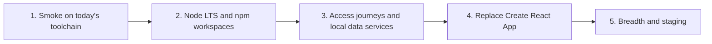

# Strategy

> Part of the [2026 campaign record](README.md). Status: design, started September 2026.

[Index](README.md)

## Goal

Four outcomes that only work together:

- A clean machine — a developer laptop, a GitHub Actions runner, or a cloud agent VM — can install, load a useful database, and start SeaSketch from documented commands.
- That default stack does not read credentials for, or write to, production systems.
- Browser tests cover the product's surface — access, authoring, data, and reports — and a failure blocks the merge. Every pull request runs the fast subset. The rest run on `master` or nightly until CI is fast enough to require them too. The production probe is a smaller read-only check of the live site.
- Large refactors of the monorepo layout and the client build can be implemented, and those tests show whether they work before they merge.

## Starting point (2026)

**Packaging.** Lerna 6 with a hand-maintained package list, roughly thirty `package-lock.json` files, and several real packages deliberately left out of Lerna to keep `lerna bootstrap` small. Every CI job, the deploy workflow, and the production GraphQL Docker image install through a different `lerna bootstrap --scope=…` list.

**Toolchain.** Node 23 in `.nvmrc` and in the production GraphQL image (`FROM node:23`). Node 23 reached end of life in June 2025. CDK-bundled Lambdas target Node 22. TypeScript is mostly 5.5; the API is on 5.8 and `pmtiles-server` on 7.

**Client.** Create React App 4 (`react-scripts` 4). The production build needs `--openssl-legacy-provider`. ESLint extends CRA's `react-app` config. The dev server, typecheck, and lint are what make the editor slow.

**Tests.** CI runs API Jest, client Jest, overlay-engine Vitest, GraphQL schema drift, generated Tailwind CSS, and a client production build, on every push. Nothing exercises the app in a browser. Cypress specs under `packages/client/cypress` are unmaintained and no longer runnable. The repo README still describes end-to-end tests as part of merging.

**Runtime.** VS Code tasks fire on folder open and start Postgres, Redis, the API, the client, and some watchers. `db:start` returns before Postgres accepts connections, so the API races the database. Spatial uploads, data tables, tiles, and overlay workers are started by hand or, when configured, point at production. Secrets live in per-package `.env` files, and several of those values are production credentials, including an Auth0 Management API client that can update production users.

**Deploy.** A manually dispatched workflow runs migrations, deploys the API with CDK, validates client operations against the live schema (`api_ready_gate`), then publishes the client. A client-only Cloudflare preview publishes a bundle against a shared API on every push. There is no staging environment.

## The deadlock

Two loops make a "finish A, then B" plan stall.

**Packaging and tests.** Replacing Lerna and Create React App changes install order, module format, environment variables, and the production bundle. Without an integration suite, the check is unit tests plus someone clicking around, and a packaging change turns into days of broken local development. But a large Playwright effort on today's CI pays a full Lerna bootstrap and a CRA production build for every run. The suite becomes too slow to gate pull requests, people stop trusting it, and the refactor is unprotected again.

**A local stack and tests.** Journeys for uploads, tiles, data tables, and reports need those services running, and today several of them are production. Building the whole local stack before any browser test is a long project with nothing guarding it. Writing those journeys against production makes CI and cloud agents share production buckets, queues, and Lambdas.

Neither loop resolves by waiting for one side to be done. The first slice has to be small enough that both sides fit inside it.

## Approach

Hold the risky axis still. Change one axis. Prove it with the slice you already have. Then change the next axis.

Phase 1 is allowed to be slow. Its job is to exist and to fail when the core app does not boot. Phase 2 makes that job cheap enough to keep and to grow. Phase 3 builds the gate multi-level admin work needs. Phase 4 is the dangerous compiler change, and it lands only while phase 3's journeys are already green. Phase 5 spends the speed we bought.

## Phases at a glance

| Phase | Changes | Holds still | Gate to leave the phase |
| --- | --- | --- | --- |
| 1. Smoke | Golden snapshot, root `setup` / `dev`, `E2E_TEST_MODE`, three `@smoke` journeys, required CI check | Lerna, CRA, deploy | PR smoke is required and green; a clean VM boots the core profile |
| 2. Workspaces | Node Active LTS everywhere; npm workspaces; production build paths moved onto the workspace; post-deploy production probe | CRA, product behavior | Smoke green on workspaces; a no-product-change deploy succeeds and passes the probe |
| 3. Journeys | Access and onboarding journeys; data profile (uploads, data tables, tiles, overlay/reports); Cypress removed | Bundler, workspace layout | Access journeys required; data-path packages testable without a deploy |
| 4. Client build | Replace CRA (Vite candidate); client tests and lint off CRA | Journey assertions, workspace layout | Same journeys green on the new dev server and production build |
| 5. Breadth | Authoring, data, and report journeys; scheduled probes; hosted staging; agent recipe | Decisions from 1–4 | Features ship with journeys; staging runs the same contract |

## Phase details

### Phase 1 — Smoke on the current toolchain

**Critical path**, in order:

1. The API boots with integrations unset. Auth0 management, Lambda ARNs, and queue URLs that are missing make their features unavailable instead of failing startup or calling production. ([local services](local-services.md), [Auth0](auth0.md))
   - Auth0 management: done, September 2026.
   - Lambda ARNs and queue URLs: done, September 2026. Unset targets already skipped or threw. The overlay-engine access token no longer reads the production secret when its ARN is unset outside production, and a screenshot job fails closed when its Lambda ARN is unset.
2. Golden database snapshot and `npm run setup`, which waits for Postgres, restores, and migrates forward. ([integration testing](integration-testing.md), [environment setup](env-setup.md))
   - Local create and restore: done, September 2026. `npm run snapshot:create` dumps a side database built from committed migrations, the graphile-worker schema, `demo-public`, two seed users, and a generated signing key. `npm run setup` restores that local file into an empty database and migrates forward. A database that already has migrations is left in place; `npm run setup -- --reset` replaces it. The dump is gitignored.
   - R2 fetch and the data library: done, October 2026. The dump also contains the `superuser` data-library templates copied from a developer's database. `npm run snapshot:publish` uploads it to `golden-snapshot/current/` in the private file-uploads bucket. `npm run setup` fetches that object when the local copy is missing or older.
3. `E2E_TEST_MODE` in the API. ([integration testing](integration-testing.md))
4. `packages/e2e` with three `@smoke` journeys.
5. A CI job that restores, builds, and runs `@smoke`, marked as a required status check on pull requests.

**Alongside, not blocking the gate:** the non-production Auth0 tenant ([Auth0](auth0.md)), the first slice of the secrets manifest and its fail-closed check ([secrets](secrets-management.md)), and the process manager behind `npm run dev` ([environment setup](env-setup.md)). They are phase 1 exit criteria because a cloud agent should not be handed secrets until they exist, but the smoke job does not wait for them.

**Holds still.** Lerna, Create React App, the deploy workflow, and every service outside the core profile.

**Exit.** A pull request cannot merge with failing smoke. The smoke job holds no Auth0 secrets. A clean VM — including a cloud agent — runs `setup` and `dev` without VS Code or a shell profile, using only non-production credentials. A person can open a fixture project by logging into the non-production tenant.

### Phase 2 — Node LTS and workspace packaging

Two separate changes, each its own pull request and its own production deploy.

**Node.** Move to the current Active LTS in `.nvmrc`, `engines`, CI, the production GraphQL image, and CDK Lambda targets. This is a runtime change in production, so it does not ride along with packaging.

**Workspaces.** npm workspaces, one root lockfile, one TypeScript for application packages, root scripts, and a policy for checked-in build output. The production build paths move with it: the deploy workflow's install steps, the GraphQL image's Lerna scope list, and the CDK Lambdas that bundle against per-package lockfiles. ([monorepo and build](monorepo-and-build-upgrade.md))

**Production probe.** This is the first phase that changes production artifacts, and staging does not exist yet. So the read-only `@production` probe (homepage, a public project, API health) lands here and runs after every deploy. ([integration testing](integration-testing.md))

**Holds still.** Create React App, product behavior, and the shape of the deploy workflow and CDK stacks. Only their install and bundling inputs change. Editor relief that needs no new bundler — TypeScript project references, ESLint caching — may land here.

**Exit.** Smoke is green on the workspace layout and its install step is materially shorter. A deploy with no product change succeeds through the normal workflow and passes the probe. Day-to-day `npm install` at the root replaces per-package bootstraps.

If this phase slips, new journeys do not pile onto the pull-request job. They run locally or nightly until install and build time can absorb them.

### Phase 3 — Access journeys and the local data profile

**Changes.** Browser coverage for access and onboarding; the data profile (spatial uploads, data-table processing, tiles, and the overlay worker behind reports) running locally; development buckets and queues so those services do not write production. Cypress is removed once its scenarios are ported. ([integration testing](integration-testing.md), [local services](local-services.md))

**Holds still.** The client bundler and the workspace layout.

**Exit.** Access, invite, and project-entry journeys are required on pull requests. The permission matrix lives in API tests; browser tests cover what each kind of person can see. A change to spatial uploads, data tables, or report calculation can be tried without deploying a Lambda.

This is the gate to have in place before large multi-level admin changes merge.

### Phase 4 — Client build replacement

**Changes.** Replace Create React App; Vite is the candidate. Client unit tests and ESLint move off CRA's configuration. The same smoke and phase 3 journeys run against the new dev server and the new production build. ([monorepo and build](monorepo-and-build-upgrade.md))

**Holds still.** Journey assertions and the workspace layout. A pull request in this phase does not restructure packages.

**Exit.** Smoke and access journeys are green on the new build. The client preview workflow has published the new build to a real host before the first production deploy. `--openssl-legacy-provider` is gone. The client dev server and the CI client build are materially faster.

### Phase 5 — Breadth and staging

**Changes.** Authoring, data, and report journeys; the production probe on a schedule as well as after deploy; a hosted staging environment that runs the same contract with its own database and secrets; an agent recipe for adding journeys with a change.

**Holds still.** Decisions from phases 1–4. New journeys use the existing profiles, tags, and teardown rules.

**Exit.** Feature pull requests include journeys without new harness work. Staging is an isolated stack, not the client-only preview.

## Risk before staging exists

Phases 2 and 4 change production artifacts before phase 5 provides staging. The mitigations are what already exists plus what phase 2 adds:

- Smoke runs against the client production build, not only the dev server.
- The client preview workflow publishes each build to a real host.
- The deploy workflow's `api_ready_gate` already refuses to publish a client whose operations the live API rejects.
- From phase 2, the `@production` probe runs after every deploy.
- Rollback is re-running the deploy workflow on the previous commit, as the repo README describes.

If a specific change needs more than that, pull the staging work forward for it. Staging is last because it is the most expensive item, not because it matters least.

## Rules

- A pull request changes one axis. Node, workspaces, and the client bundler never share a pull request. A journey and a large refactor share one only when the journey is the characterization test for that refactor.
- The smoke check exists before phase 2 and stays required. It is not skipped to make a migration look green.
- A journey depends only on services the root start command runs for its profile. A journey that needs a production Lambda is not a local test.
- The default configuration never points at production. A production override is explicit, per integration ([local services](local-services.md)), and absent from CI.
- Agents are normal consumers of the contract. Commands are non-interactive, logs are attributable to a service, and failure paths are written down. Agents may restore the golden snapshot; they may not publish one unless the task is a snapshot refresh.
- Choices left open — the process manager, the exact Vite setup — are settled by a short spike at the start of the phase that needs them, against the criteria in the topic file, and then recorded there.
- When a choice would force a fork to run a second production SeaSketch, prefer "same revision, different configuration" ([second production install](second-install.md)).

## What this campaign leaves alone

- API Jest, client unit tests, and overlay-engine Vitest remain the broad suites. Browser tests stay few and high-value.
- The deploy workflow's structure and the CDK stacks' resources. Phase 2 changes how they install and bundle; it does not redesign deployment.
- The client preview workflow keeps publishing a bundle. It is not turned into staging.
- We do not write a process supervisor, a secrets store, or a test framework.
- We do not replay the full migration history on every CI run or new laptop once a snapshot exists.
- We do not stand up a second production site.

## How topic files are organized

Each topic file has the same sections: **Intent**, **Starting point (2026)**, the design itself, **Decisions**, **Open questions** (each tagged with the phase whose spike resolves it), and **Exit criteria** by phase.

*Starting point* stays the baseline. It is not edited as work lands. *Decisions* are accepted choices; a choice that has shipped gets the month, and one without a month is still open. A met exit criterion is marked *Done, <month>* in place, not struck through. A *Progress* table is only for a decision that is partly shipped. Resolved open questions move into *Decisions* ([keeping this record](README.md#keeping-this-record)).
