# Timeslider UI References

Companion to [Temporal Data in SeaSketch](temporal-data.md). The scoping doc asks several UI questions that schemas alone cannot answer: instant vs range, what happens when a new temporal layer is toggled, how extent and resolution adapt, whether aggregation is a data property or a view, and how to show coverage so users do not land on an empty map. This note reviews prominent timesliders with those questions in mind.

Screenshots are from public apps or vendor documentation (August 2026).

## Google Earth

Google Earth is the reference the scoping doc starts from. It actually has **two** time UIs.

**Historical imagery** (below) is a single-thumb slider over discrete available dates. Light-blue segments mark where imagery exists; gaps are empty. Plus/minus zoom the *timeline*, not the map, so a multi-decade domain can be inspected at month resolution. Tick marks are denser in recent years. The current date is shown on the thumb and again as “Imagery Date” in the status bar.

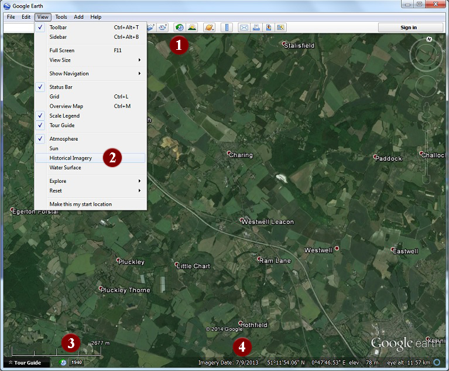

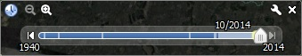

The **KML feature timeslider** (not pictured; see [KML Time and Animation](https://developers.google.com/kml/documentation/time)) appears automatically when any Feature has a `TimeStamp` or `TimeSpan`. Behavior differs by encoding:

- `TimeStamp` uses a moving *window* so several placemarks can be on screen at once (GPS tracks, tagged sharks).
- `TimeSpan` uses a pointer with instant transitions between contiguous overlays (annual rasters, ground overlays).
- Extent is the min/max of Features in the file (or the selected folder, if “Restrict time to currently selected folder” is on).
- Show Time can be Automatic, Always, or off.

**Unique / relevant:** discrete-vs-continuous coverage painted on the track; timeline zoom; two interaction modes that match SeaSketch’s layer-level annual rasters vs feature-level tracks; folder-scoped time as one answer to “what happens when I toggle another layer.”

## ArcGIS Pro

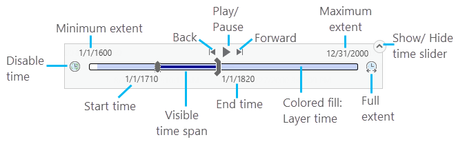

Desktop GIS with the richest “map clock.” Dual thumbs define a visible span inside a larger full extent. A colored fill on the track is the union of layer time extents; unfilled gaps have no data. Either thumb can be disabled (all time before / after a date). Full extent can be all time-aware layers, **only visible layers**, a specific layer, or a custom range. Time can be turned off without removing layers. The Time ribbon separately sets step, snapping, playback, and time zone.

**Unique / relevant:** visible-layers lock is the most direct answer to adaptive extent; gap fill is the most direct answer to “toggled a layer and nothing shows”; disable-time vs hide-slider are distinct.

## ArcGIS Online / JavaScript TimeSlider

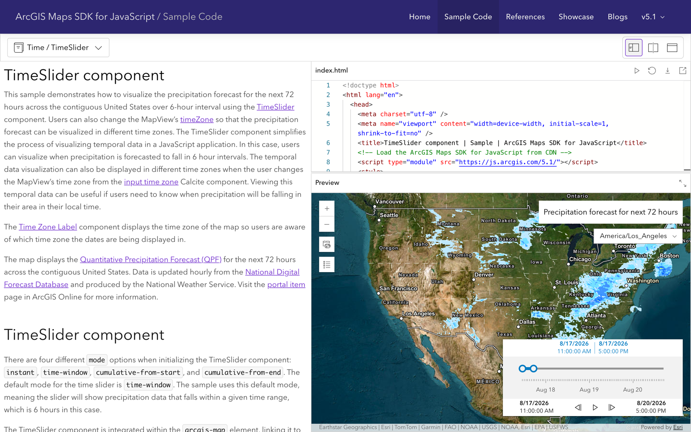

The web widget used by Map Viewer. Four **modes**: `instant`, `time-window` (default, shown), `cumulative-from-start`, `cumulative-from-end`. Stops can be a regular interval (here, 6-hour forecast steps) or irregular dates. Map Viewer also offers “show features progressively” (start pinned, end walks forward). Time zone is a first-class control. The slider appears when the map has time-enabled visible layers; it can be hidden without disabling time.

**Unique / relevant:** named modes cover instant vs range vs “accumulate over time” without inventing new widgets. Cumulative-from-start is a plausible default for monitoring (show everything up to year Y). Interval length is a map setting, not inferred from string precision.

## QGIS Temporal Controller

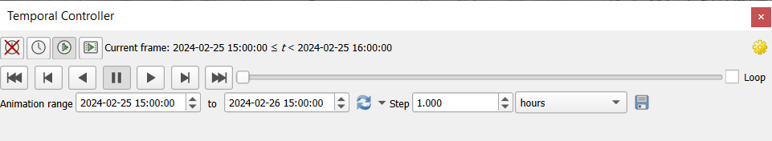

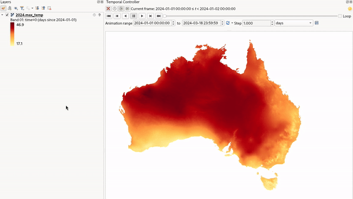

A docked panel, not an overlay. Three navigation modes: off, **fixed range**, and **animated** (play through steps). The current frame is spelled out as an interval with explicit bounds (`2024-01-01 00:00:00 ≤ t < 2024-01-02 00:00:00`). Step is a number plus a unit (hours, days, years, or “source timestamps” for irregular WMS-T granules). “Set to full range” reads extents from temporal layers. Each layer has its own Temporal tab (single field, start+end, fixed range, **fixed time range per band**). The screenshot above is the GMW-style case: one raster, one band per day, the controller steps the map clock and the renderer picks the overlapping band.

**Unique / relevant:** per-band time is exactly the 42-band mangrove / CRW cube; inclusive/exclusive bounds are visible to the user; “source timestamps” avoids empty frames on irregular series; layer config is separate from the map clock (SeaSketch admin vs viewer).

## NASA Worldview

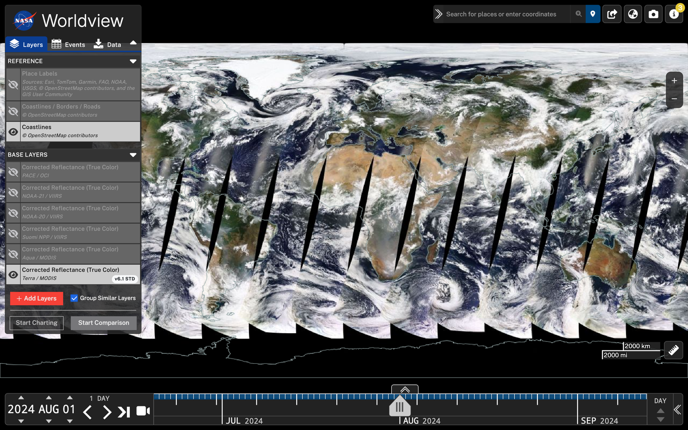

Production UI over daily (and finer) GIBS imagery. A large date readout with year/month/day steppers sits next to play/step controls. The timeline itself can be scaled (`DAY` on the right). A thin availability strip above the track shows where the active layers have data. Comparison and charting are separate tools, not packed into the slider. Default is “latest available,” not “today.”

**Unique / relevant:** date-templated rasters (one instant at a time) rather than a window; availability ticks; latest-available default; timeline scale independent of the data’s native day step. Closest analogue to scrubbing a multi-band COG or date-param tile URL.

## CesiumJS

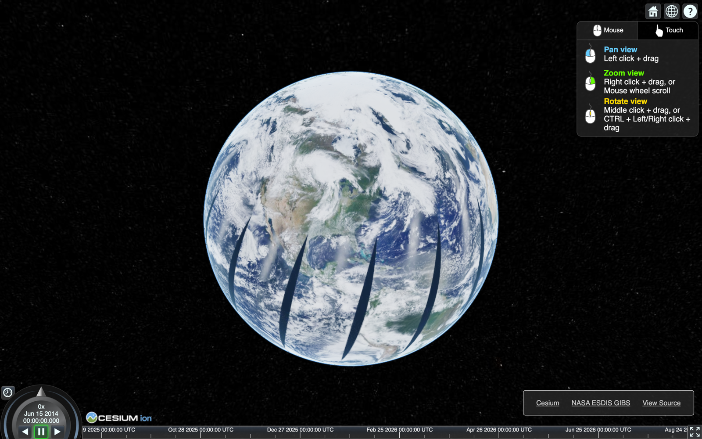

Built for time-dynamic scenes (CZML tracks, satellites). An animation “shuttle” shows the exact clock (down to milliseconds) and play/step/speed; a separate bottom timeline is a zoomable overview of the full interval. Clock can be clamped, loop, or follow wall-clock time. The timeline is a *scene clock*, not a layer filter — imagery and entities subscribe to it.

**Unique / relevant:** best prior art for future vessel/animal tracks; sub-second precision we probably do not want as the default SeaSketch step; split “now” vs “domain” is useful when GFW (2012–present) and a 3-year mangrove stack share the map.

## Kepler.gl

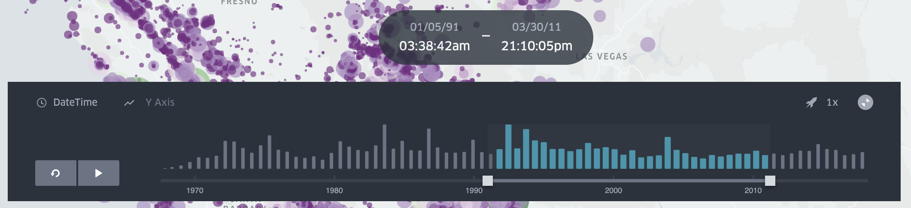

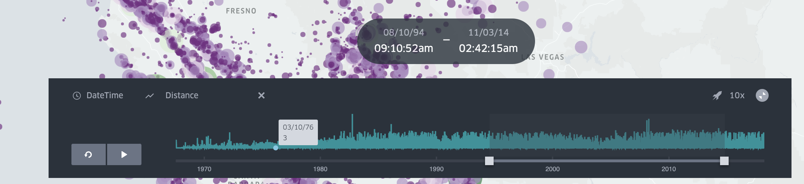

A time **filter** on a timestamp column, not a map clock. The track is a histogram of feature counts (or a chosen numeric field — distance vs time in the second screenshot). Dual thumbs set a rolling window; play walks that window along the domain. The timeline can be zoomed; a “Showing… Reset” control returns to the full domain.

**Unique / relevant:** histogram-in-the-slider is the pattern GFW also uses, and the one the scoping doc wants for Data Tables. Custom Y-axis is a step toward “stats in the slider” without a separate chart widget. Window-plus-play matches GPS/AIS tracks better than a single thumb.

## Global Fishing Watch

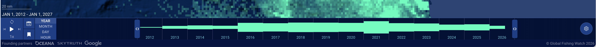

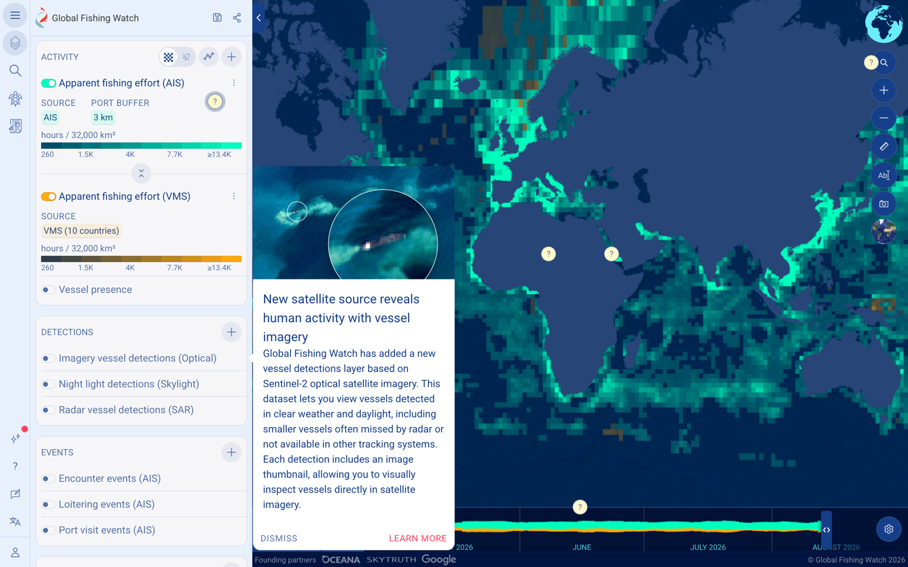

Closest product analogue for SeaSketch (Waitt / MPA monitoring). Dual-thumb range, play, speed, loop. **YEAR / MONTH / DAY / HOUR** changes aggregation of the same 4Wings source, not which file is loaded. The track contains an effort histogram. In the full map, colored lanes under the axis follow the visible activity layers (AIS vs VMS). Settings (gear) hold the rest.

**Unique / relevant:** aggregation as a view; stats drawn in the slider; per-layer coverage lanes; decade-scale domain with hour drill-down. This is the model for Data Tables (surveys recorded to the day, compared by year) and for not exploding GFW into 15 yearly layers.

## Common themes and what to take for SeaSketch

**Almost everyone auto-shows a slider** when something temporal is visible, and lets you hide it without deleting the data. ArcGIS Pro is the only one that cleanly separates “time filtering on/off” from “slider chrome shown/hidden.”

**Instant vs window vs cumulative are different products, not just thumb count.** Google Earth already splits TimeStamp (window) from TimeSpan (pointer). Esri names four modes. SeaSketch will have both annual rasters (one instant or one year span per layer/band) and tracks/tables (windows). One slider can support this if *mode* is derived from the visible sources — e.g. a single mangrove year → instant/year span; GFW or a Data Table → window; “show change since start” → cumulative.

**Paint coverage on the track.** This is the practical fix for “I toggled Mangroves 1985 and the map is blank.” Variants: GE’s available-date segments, Pro’s layer-extent fill, Worldview’s ticks, Kepler/GFW histograms, GFW’s per-layer color lanes. For SeaSketch, a minimum is: mark each visible source’s extent on the axis, and snap or warn when the current clock misses them. A histogram is justified for Data Tables and GFW; not for a handful of annual rasters.

**Extent should follow visible layers, with memory.** Default full extent = union of *currently visible* temporal sources (Pro, GE folder restrict). When the user adds GFW, expand; when they turn it off, shrink again unless they have manually zoomed/panned the timeline (Kepler’s “Showing… Reset” is a good pattern for “you are zoomed into a subset”). On first toggle of a lone “Mangroves 2020,” jump the clock to 2020. On a second year, expand the domain but keep the current clock if it still intersects; if not, jump to the newly added source. That is more predictable than always jumping to “latest.”

**Resolution is two knobs.** (1) *Step / native spacing* — years for GMW bands, hours for tracks (QGIS step, Worldview DAY, Esri interval). (2) *Aggregation view* — GFW YEAR/MONTH/DAY/HOUR, Data Table “treat as year.” SeaSketch should store native precision on the source, pick a default step from the coarsest visible native precision, and only show an aggregation control when the source actually supports it (GFW, Data Tables). Do not offer hourly ticks for a 42-band annual COG.

**Playback is table stakes** (play, step, speed, optional loop). Cache frames if animation is a goal (Pro’s advice). Export-to-GIF (QGIS) is out of scope unless it comes cheaply.

**Stats in the slider are special, not general.** GFW and Kepler put a series on the track because the backend can aggregate globally, cheaply. Overlay-area reports (GMW km², DHW min/max/avg) belong in report widgets, not the map clock — they are sketch- or geography-scoped. The slider can still show *coverage and counts*; leave zonal stats to reports.

**The map clock is one clock.** Cesium and QGIS make this explicit: layers subscribe to a shared temporal range. SeaSketch should do the same (one current instant or span), and let layer-level vs feature-level vs band-level metadata all filter against it. Mixing GFW (2012–present, aggregatable) with three mangrove years then becomes an extent/resolution problem, not a second slider.

**Precision and bounds need a rule.** QGIS showing `start ≤ t < end` is worth copying in admin, if not in the viewer. Pick inclusive start / exclusive end and snap thumbs to the native step so “2020” cannot land between years.

**Do not pack Worldview, GFW, and Kepler into one chrome.** A compact overlay (GE / Esri / SeaSketch map footer) with: thumbs, play, date readout, coverage marks, and a overflow for step, aggregation, and mode, is enough. Histogram and aggregation controls appear only when a visible source provides them.
